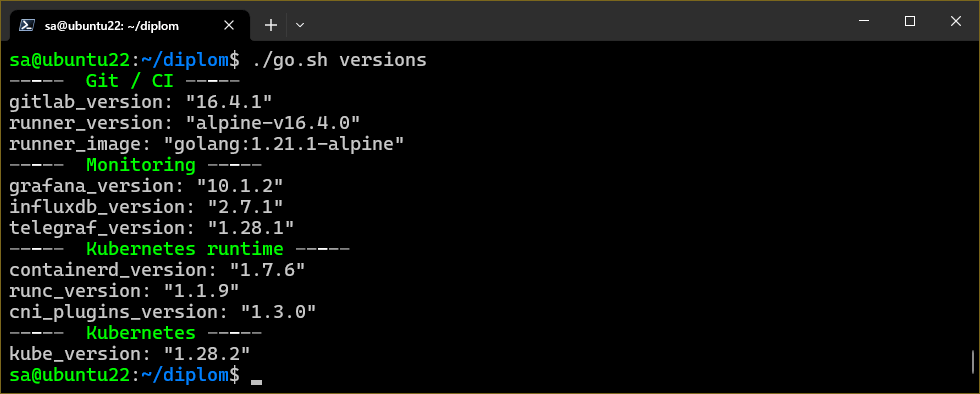

# Дипломный проект

<details>
<summary>Постановка задачи</summary>

### Цели:

1. Подготовить облачную инфраструктуру на базе облачного провайдера Яндекс.Облако.
1. Запустить и сконфигурировать Kubernetes кластер.
1. Установить и настроить систему мониторинга.
1. Настроить и автоматизировать сборку тестового приложения с использованием Docker-контейнеров.
1. Настроить CI для автоматической сборки и тестирования.
1. Настроить CD для автоматического развёртывания приложения.

---
### Создание облачной инфраструктуры

Для начала необходимо подготовить облачную инфраструктуру в Яндекс.Облаке при помощи **Terraform**.

Предварительная подготовка к установке и запуску Kubernetes кластера.

1. Создайте сервисный аккаунт, который будет в дальнейшем использоваться **Terraform** для работы с инфраструктурой с необходимыми и достаточными правами. Не стоит использовать права суперпользователя
1. Подготовьте [backend](https://www.terraform.io/docs/language/settings/backends/index.html) для **Terraform**:  
   а. Рекомендуемый вариант: [Terraform Cloud](https://app.terraform.io/)  
   б. Альтернативный вариант: S3 bucket в созданном Яндекс.Облако аккаунте
1. Настройте [workspaces](https://www.terraform.io/docs/language/state/workspaces.html)  
   а. Рекомендуемый вариант: создайте два workspace: *stage* и *prod*. В случае выбора этого варианта все последующие шаги должны учитывать факт существования нескольких workspace.  
   б. Альтернативный вариант: используйте один workspace, назвав его *stage*. Пожалуйста, не используйте workspace, создаваемый **Terraform**-ом по-умолчанию (*default*).
1. Создайте VPC с подсетями в разных зонах доступности.
1. Убедитесь, что теперь вы можете выполнить команды `terraform destroy` и `terraform apply` без дополнительных ручных действий.
1. В случае использования [Terraform Cloud](https://app.terraform.io/) в качестве [backend](https://www.terraform.io/docs/language/settings/backends/index.html) убедитесь, что применение изменений успешно проходит, используя web-интерфейс Terraform cloud.

Ожидаемые результаты:

1. **Terraform** сконфигурирован и создание инфраструктуры посредством **Terraform** возможно без дополнительных ручных действий.
1. Полученная конфигурация инфраструктуры является предварительной, поэтому в ходе дальнейшего выполнения задания возможны изменения.

---
### Создание Kubernetes кластера

На этом этапе необходимо создать [Kubernetes](https://kubernetes.io/ru/docs/concepts/overview/what-is-kubernetes/)
кластер на базе предварительно созданной инфраструктуры.
Требуется обеспечить доступ к ресурсам из Интернета.

Это можно сделать двумя способами:

1. Рекомендуемый вариант: самостоятельная установка **Kubernetes** кластера.  
  а. При помощи **Terraform** подготовить как минимум 3 виртуальных машины **Compute Cloud** для создания **Kubernetes**-кластера. Тип виртуальной машины следует выбрать самостоятельно с учётом требовании к производительности и стоимости. Если в дальнейшем поймете, что необходимо сменить тип инстанса, используйте **Terraform** для внесения изменений.  
  б. Подготовить **ansible** конфигурации, можно воспользоваться, например [Kubespray](https://kubernetes.io/docs/setup/production-environment/tools/kubespray/)  
  в. Задеплоить **Kubernetes** на подготовленные ранее инстансы, в случае нехватки каких-либо ресурсов вы всегда можете создать их при помощи **Terraform**.
1. Альтернативный вариант: воспользуйтесь сервисом [Yandex Managed Service for Kubernetes](https://cloud.yandex.ru/services/managed-kubernetes)  
  а. С помощью terraform resource для [kubernetes](https://registry.terraform.io/providers/yandex-cloud/yandex/latest/docs/resources/kubernetes_cluster) создать региональный мастер kubernetes с размещением нод в разных 3 подсетях  
  б. С помощью terraform resource для [kubernetes node group](https://registry.terraform.io/providers/yandex-cloud/yandex/latest/docs/resources/kubernetes_node_group)

Ожидаемый результат:

1. Работоспособный **Kubernetes** кластер.
1. В файле `~/.kube/config` находятся данные для доступа к кластеру.
1. Команда `kubectl get pods --all-namespaces` отрабатывает без ошибок.

---
### Создание тестового приложения

Для перехода к следующему этапу необходимо подготовить тестовое приложение,
эмулирующее основное приложение разрабатываемое вашей компанией.

Способ подготовки:

1. Рекомендуемый вариант:  
   а. Создайте отдельный **git** репозиторий с простым **nginx** конфигом, который будет отдавать статические данные.  
   б. Подготовьте **Dockerfile** для создания образа приложения.  
1. Альтернативный вариант:  
   а. Используйте любой другой код, главное, чтобы был самостоятельно создан **Dockerfile**.

Ожидаемый результат:

1. **Git** репозиторий с тестовым приложением и **Dockerfile**.
1. Регистр с собранным **docker image**. В качестве регистра может быть [DockerHub](https://hub.docker.com/) или [Yandex Container Registry](https://cloud.yandex.ru/services/container-registry), созданный также с помощью **terraform**.

---
### Подготовка cистемы мониторинга и деплой приложения

Уже должны быть готовы конфигурации для автоматического создания облачной инфраструктуры и поднятия **Kubernetes** кластера.  
Теперь необходимо подготовить конфигурационные файлы для настройки нашего **Kubernetes** кластера.

Цель:
1. Задеплоить в кластер [prometheus](https://prometheus.io/), [grafana](https://grafana.com/), [alertmanager](https://github.com/prometheus/alertmanager), [экспортер](https://github.com/prometheus/node_exporter) основных метрик **Kubernetes**.
1. Задеплоить тестовое приложение, например, [nginx](https://www.nginx.com/) сервер отдающий статическую страницу.

Рекомендуемый способ выполнения:
1. Воспользовать пакетом [kube-prometheus](https://github.com/prometheus-operator/kube-prometheus), который уже включает в себя [Kubernetes оператор](https://operatorhub.io/) для [grafana](https://grafana.com/), [prometheus](https://prometheus.io/), [alertmanager](https://github.com/prometheus/alertmanager) и [node_exporter](https://github.com/prometheus/node_exporter). При желании можете собрать все эти приложения отдельно.
1. Для организации конфигурации использовать [qbec](https://qbec.io/), основанный на [jsonnet](https://jsonnet.org/). Обратите внимание на имеющиеся функции для интеграции **helm** конфигов и [helm charts](https://helm.sh/)
1. Если на первом этапе вы не воспользовались [Terraform Cloud](https://app.terraform.io/), то задеплойте в кластер [atlantis](https://www.runatlantis.io/) для отслеживания изменений инфраструктуры.

Альтернативный вариант:
1. Для организации конфигурации можно использовать [helm charts](https://helm.sh/)

Ожидаемый результат:
1. **Git** репозиторий с конфигурационными файлами для настройки **Kubernetes**.
2. **Http** доступ к **web** интерфейсу **grafana**.
3. Дашборды в **grafana** отображающие состояние **Kubernetes** кластера.
4. **Http** доступ к тестовому приложению.

---
### Установка и настройка CI/CD

Осталось настроить **CI/CD** систему для автоматической сборки **docker image** и деплоя приложения при изменении кода.

Цель:

1. Автоматическая сборка **docker образа** при коммите в репозиторий с тестовым приложением.
1. Автоматический деплой нового **docker** образа.

Можно использовать [teamcity](https://www.jetbrains.com/ru-ru/teamcity/), [jenkins](https://www.jenkins.io/), [GitLab CI](https://about.gitlab.com/stages-devops-lifecycle/continuous-integration/) или GitHub Actions.

Ожидаемый результат:

1. Интерфейс **CI/CD** сервиса доступен по **http**.
1. При любом коммите в репозиторие с тестовым приложением происходит сборка и отправка в регистр **Docker** образа.
1. При создании тега (например, `v1.0.0`) происходит сборка и отправка с соответствующим **label** в регистр, а также деплой соответствующего **Docker** образа в кластер **Kubernetes**.

---
### Что необходимо для сдачи задания?

1. Репозиторий с конфигурационными файлами **Terraform** и готовность продемонстрировать создание всех ресурсов с нуля.
1. Пример **pull request** с комментариями созданными **atlantis**'ом или снимки экрана из **Terraform Cloud**.
1. Репозиторий с конфигурацией **ansible**, если был выбран способ создания **Kubernetes** кластера при помощи **ansible**.
1. Репозиторий с **Dockerfile** тестового приложения и ссылка на собранный **docker image**.
1. Репозиторий с конфигурацией **Kubernetes** кластера.
1. Ссылка на тестовое приложение и веб интерфейс Grafana с данными доступа.
1. Все репозитории рекомендуется хранить на одном ресурсе (**github, gitlab**)

</details>

## Состав инфраструктуры

Проект составлен с учётом двух рабочих пространств:
- Основное или полное: `prod`
- Тестовое или сокращённое: `stage`

Рабочие пространство разделены как инфраструктурно на уровне **Terraform**, так и на уровне пространства имён кластера **Kubernetes**.

### Схема инфраструктуры рабочего пространства `prod`


### Схема инфраструктуры рабочего пространства `stage`


> Исходный код схем расположен в каталоге  [schema_source](./schema_source) в файлах формата **draw.io**

Инфраструктура создаётся **Terraform** провайдером Яндекс.Облака.
В зависимости от рабочего пространства создаются от 7 до 10 виртуальных машин с различными характеристиками.
В каждом из рабочих пространств только одна из машин имеет внешний IP адрес - это SSH бастион.

Из схем видно, что инфраструктура условно делится на две части: основная (может быть фиксированной для всех рабочих пространств) и **Kubernetes** кластер. В рамках кода реализован сценарий основных частей, зависимых от **Kubernetes** кластера, то есть машины основной части создаются вместе с машинами **Kubernetes** кластера в рамках одного рабочего пространства **Terraform** за одно применение **apply**.
> Идея для улучшения. В реальном применении более логичен сценарий, когда основная часть независима от кластера **Kubernetes** и имеется в единственном экземпляре, то есть основные машины создаются отдельно своим **Terraform** проектом, машины кластера **Kubernetes** своим.

> Исходных код **Terraform** расположен в каталоге [tf](./tf)

Перечень и назначение файлов **Terraform**:
- `main.tf` - Базовая информация Terraform - используемый провайдер, его параметры, а также настройка хранилища состояний. В качестве хранилища состояний выбран S3 бакет, расположенный в Яндекс.Облаке. Часть параметров хранилища вынесено за пределы файла и указывается при инициализации Terraform в командной строке;
- `variables.tf` - Список переменных, позволяющих модифицировать инфраструктуру в зависимости от выбранного окружения/рабочего пространства (workspace). В основном содержит настройку машин кластера Kubernetes - число используемых нод (отдельно для master и worker) и список подсетей среди которых будут распределяться ноды;
- `network.tf` - Объекты основной сети, подсетей и виртуальный роутер для направления исходящего трафика на бастион;
- `vm-instance/main.tf` - Модуль создания объектов виртуальной машины. Используется для сокращения и удобства кода. Практически полностью настраивается переменными, включая выделение внешнего IP адреса, открытый SSH ключ, имя пользователя и опцию прерываемой машины. Имеет выходные параметры - внутренний и внешний IP адреса;
- `vm-disk.tf` - Объекты образов, используемых при создании виртуальных машин. Прописан только один образ - **Debian 12**. Для SSH бастиона используется специальный образ с функциями [NAT](https://cloud.yandex.ru/marketplace?tab=software&search=NAT);
- `vm-main.tf` - Объекты виртуальных машин, реализующих систему контроля версий, непрерывной интеграции и доставки CI/CD, маршрутизации трафика и мониторинга основных машин;
- `vm-kube.tf` - Объекты виртуальных машин кластера **Kubernetes**; число управляющих машин и рабочих нод зависит от рабочего пространства и задаётся в локальных параметрах; Машины распределяются по списку подсетей по очереди. Например, распределение 5 рабочих нод по списку подсетей (A,B,C) будет следующим A=(1,4), B=(2,5), C=(3). Управляющие ноды распределяются аналогично.

Состав ПО основной части инфраструктуры:
- `SSH Бастион` - Является единственным узлом, доступным из сети интернет. Управляет маршрутизацией входящего и исходящего трафика, обеспечивая доступ к внутренним ресурсам. В качестве балансировщика используется **HAProxy**. Настраивается в автоматическом режиме через **Ansible** (playbook [configure_bastion.yml](./ansible/playbook/configure_bastion.yml));
- `podman` - Аркестратор для запуска остального ПО в виде контейнеров; устанавливается на машинки, требующие контейнеризации (`vm-1`, `vm-2` и `vm-3`);
- `GitLab` - Комплексное решение для хранения исходного кода на основе **Git**, непрерывной интеграции/сборки и доставки/deploy приложения в кластер **Kubernetes**. Разделён на две машинки - непосредственно сам **GitLab** разворачивается в виде **podman** контейнера на `vm-1`, а сборщик/runner размещён на `vm-3` по причинам большого потребления ОЗУ одним **GitLab** и необходимости доступа к **Kubernetes** кластеру для runner;
- `InfluxDB` - СУБД временных рядов. Используется для хранения метрик с основных машин. Установлен в качестве **podman** контейнера на машинку `vm-2`;
- `Grafana` - Система визуализации. Используется для отображения и контроля метрик с основных машин. Развёрнута в **podman** контейнере на машинке `vm-2`;
- `Telegraf` - Программа экспорта метрик. Используется для сбора и передачи метрик с основных машин в базу данных **InfluxDB**. Устанавливается на все машинки, с которых нужно собирать данные, а именно: `vm-1`, `vm-2` и `vm-3`;
- `HAProxy` - Балансировщик. Используется для управления трафиком на бастионе (`bastion`) и proxy кластера **Kubernetes** (`vm-3`);
- `qbec` - Утилита развёртывания/deploy приложения в кластер **Kubernetes**. Устанавливается на машинку `vm-3` вместе с **GitLab runner**.

В состав ПО кластера **Kubernetes** входят базовый комплект утилит **Kubernetes** для управления кластером (kubelet, kubectl, kubeadm) и их зависимости (containerd, runc, cni plugins). Также в кластере разворачивается стэк [Kube-Prometheus](https://github.com/prometheus-operator/kube-prometheus).

## Автоматизация разворачивания инфраструктуры

Инфраструктура базируется на виртуальных машинах Яндекс.Облака. Непосредственно сами машинки создаются **Terraform** через предоставленный Яндексом провайдер. Настройка машинок и установка на них программного обеспечения осуществляется средствами **Ansible**.

Команды **Terraform** и запуска **Ansible playbook** вынесены во вспомогательный **bash** скрипт [go.sh](./go.sh), в котором среди прочего реализовано:
- Проверка установленных утилит **Ansible**, **Terraform**, **YC CLI**;
- Автоматическая установка/обновление **Ansible**;
- Автоматическая установка/обновление **YC CLI**;
- Автоматическая настройка окружения пользователя на использование зеркал Яндекса для загрузки с них **Terraform** и провайдеров; Установка **Terraform**;
- Создлание переменных окружения **Terraform** для подключения к облаку на основе данных **YC CLI**;
- Создание и уничтожение сервисного аккаунта на Яндекс.Облаке, включая назначение ролей, прав и ключей доступа, для использования в **Terraform** вместа root токена;
- Автоматическое генерирование пар ключей для (бастиона, основных машин, машин кластера **Kubernetes**) если их нет; Сохраняются в каталог `secrets``;
- Создание и уничтожение S3 хранилища на Яндекс.Облаке для хранения в нём состояния **Terraform**;
- Автоматическое определение внешнего IP адреса SSH бастиона для динамического inventory **Ansible**; Никакие IP адреса нигде прописывать не нужно;
- Автоматическое определение рабочего пространства Terraform для некоторых playbook **Ansible**;
- Поддержка отладки на локальных виртуальных машинках (параметр `is_local_vm`, при этом для структуры используется файл **secrets/yc_local**, являющийся выводом `yc compute instance list --format json` с изменённым IP адресом бастиона на локальный);
- Исполнение команд **Terraform** в упрощённом виде;
- Исполнение как одиночных, так и серии playbook **Ansible**;
- Автоматическое восстановление работы остановленных машинок Яндекс.Облака (нужно только для прерываемых); Файлы проекта написаны таким образом, что все машинки, кроме SSH бастиона, могут быть остановлены и перезапущены без негативных последствий для функционирования, то есть для экономии средств их можно создавать прерываемыми;
- Вывод списка версий используемого ПО на основе переменных из inventory **Ansible**;
- Исполнение команд или подключение к терминалу любой из машинок проекта используя SSH-туннелирование;
- Уничтожение инфраструктуры и чистка каталогов от временных файлов.

Основные команды скрипты [go.sh](./go.sh)


Версии используемого ПО


---

Внимание!
Изначально инфраструктура разворачивается с чистой установкой **GitLab**.  
После выполнения [playbook](./ansible/playbook/install_gitlab.yml) разворачивания **GitLab** (отработки команды `./go.sh i_gitlab`) в выводе **Ansible** будет написан пароль для инициализации учётной записи администратора. Необходимо вручную авторизоваться по адресу <IPбастиона>:<порт GitLab> и произвести настройку **GitLab**, включающую:
- Регистрацию токена для добавления runner; Данный токен нужно прописать в переменную `runner_token` файла [Ansible/Inventory/Group_vars/Runner.yml](./ansible/inventory/group_vars/runner.yml)
- Регистрацию пользователя и настройка прав доступа;
- Создание проекта или группы и проекта в ней (желательно от пользователя);
- Наполнить репозиторий проекта исходным кодом приложения;

Только после получения токена регистрации runner в интерфейсе **GitLab** (включая обновление переменной **Ansible**) можно устанавливать runner. (команда `./go.sh i_runner`)

Когда проект настроен можно создать резервную копию **GitLab** командой `./go.sh gl_backup`. При этом будет запущен соответствующий [playbook](./ansible/playbook/backup_create.yml), который инициализирует создание резервной копии через GitLab и загрузит её на рабочую машину в каталог [Ansible/Playbook/Files](./ansible/playbook/files/) с именем `_gitlab_<версия>_backup.tar`

При повторном создании инфраструктуры на этапе установки **GitLab** соответствующая его версии резервная копия будет автоматически восстановлена.

> Для ручного запуска восстановления **GitLab** из резервной копии можно воспользоваться командой `./go.sh gl_restore`

## Состав и описание скриптов Ansible

Для установки и настройки программ на машинках инфраструктуры используется следующие файлы Ansible

### Основные playbook и подключаемые задачи [Ansible/Playbook](./ansible/playbook/)
- [bootstrap_hosts](./ansible/playbook/bootstrap_hosts.yml) - Содержит несколько play, включая тагетированные, для настройки локальных машинок аля машинки Яндекс.Облака, обновления кэша пакетных менеджеров и установленных в системе пакетов, перезагрузка хоста если требуется и обновление списка известных хостов; Использует playbook формирования динамического inventory для опередения хостов кластера **Kubernetes**;
- [configure_yc+tf](./ansible/playbook/configure_yc+tf.yml) - Используется только для настройки рабочей машины, а именно конфигурирования окружения пользователя для использования зеркал Яндекса, установки агента **YC CLI** и **Terraform**;
- [dynamic_inv](./ansible/playbook/dynamic_inv.yml) - Запрашивает у **YC CLI** список доступных хостов кластера **Kubernetes** текущего рабочего пространства (workspace) и на его основе формирует список хостов для inventory - формирует группы `kube_master`, `kube_worker` и `kube_nodes`;
- [ssh_add_fp](./ansible/playbook/ssh_add_fp.yml) - Используется для настройки рабочей машины, а именно добавлению хостов проекта в список известных; Использует динамический inventory для определения хостов кластера **Kubernetes**;
- [ssh_clear_fp](./ansible/playbook/ssh_add_fp.yml) - Используется для настройки рабочей машины, а именно удалению хостов проекта из список известных перед их уничтожением; Использует динамический inventory для определения хостов кластера **Kubernetes**;
- [configure_bastion](./ansible/playbook/configure_bastion.yml) - Настройка SSH бастиона;
- [install_podman](./ansible/playbook/install_podman.yml) - Устанавливает **podman**, разрешает запуск контейнеров без авторизации пользователя и перезапускает машинку;
- [install_influxdb](./ansible/playbook/install_influxdb.yml) - Устанавливает **InfluxDB**. В ходе установки ищет существующие токены доступа, если их нет, создаёт; После получения токенов доступа подготавливает готовые конфигурационные файлы для **Grafana** и **Telegraf** (настройка подключения к базе);
- [install_grafana](./ansible/playbook/install_grafana.yml) - Устанавливает и конфигурирует **Grafana**;
- [install_telegraf](./ansible/playbook/install_telegraf.yml) - Устанавливает **Telegraf** и настраивает экспорт метрик; при изменении конфигурационного файла перезапускает контейнер **Telegraf**;
- [install_gitlab](./ansible/playbook/install_gitlab.yml) - Устанавливает **GitLab**, по окончании импортирует playbook восстановления из резервной копии;
- [install_runner](./ansible/playbook/install_runner.yml) - Устанавливает **GitLab runner** и регистрирует его в нашем **GitLab** на основе токена из переменных inventory; Создаёт файл списка **registry** на основе файла `secrets/registry` - в нём будет содержаться список registry, куда нужно будет загружать подготовленные **Docker** образы; устанавливает для пользователя runner файлы проекта qbec из [Templates/App](./ansible/playbook/templates/app/) - это сделано для того, чтобы вручную не прописывать в проект адреса и порты кластера; Так как в шаблонах не мало файлов в playbook используется модуль поиска файлов и каталогов, поэтому файлы с оригинальным расширением; Используется динамический inventory для определения хостов кластера **Kubernetes**;
- [backup_create](./ansible/playbook/backup_create.yml) - Создание резервной копии GitLab и загрузка её на рабочую машину;
- [backup_restore](./ansible/playbook/backup_restore.yml) - Восстановление **GitLab** из резервной копии с рабочей машины;
- [install_kube-prereq](./ansible/playbook/install_kube-prereq.yml) - Настройка машинок в соответствии с требованиями **Kubernetes** (отключение swap и так далее), устанавливает зависимости (containerd, runc и сетевые плагины); Дополнительно на proxy кластера устанавливается `kubectl` и при необходимости `qbec` и `helm` (если версии соответствующих приложений заданы в переменных, то установка выполняется. **Helm** по умолчанию не используется), а также настраивается **HAProxy** как балансировщик запросов к приложению и мониторингу **Kube-Prometheus**;
- [install_kube-cluster](./ansible/playbook/install_kube-cluster.yml) - Разворачиввет кластера **Kubernetes** на соответствующих машинках используя `kudeadm`; Использует playbook динамического inventory для определения хостов кластера; При существовании кластера выполняет его сброс; Настройка осуществляется с первой Master ноды, где происходит инициализация кластера с получением команд пополнения кластера; далее подключаются остальные **Control Plane**, после чего в кластер добавляются рабочие ноды; После инициализации основной **Control Plane** применяется список предустановочных манифестов - параметр `kube_manifests` из [inventory/group_vars/kube_nodes](./ansible/inventory/group_vars/kube_nodes.yml);
- [install_kube-finalize](./ansible/playbook/install_kube-finalize.yml) - Создаёт единый конфигурационный файл подключения к кластерам на основе нескольких (при одновременной работе обоих пространств `stage` и `prod`) и сохраняет его на proxy кластера, где расположен **GitLab runner**, который в свою очередь используя qbec смог бы подключиться к кластеру **Kubernetes**;
- [install_kube-prometheus](./ansible/playbook/install_kube-prometheus.yml) - Устанавливает на прокси кластера дистрибутив **GoLang**, исходный код проекта **Kube-Prometheus** и необходимые компоненты (jq, jsonnet-bundler), запускает сборку магифестов и применяет их на нашем кластере **Kubernetes**;
- [tasks_containerd](./ansible/playbook/tasks_containerd.yml) - Набор задач (tasks) для установки **containerd** и его зависимостей;
- [tasks_kube-tools](./ansible/playbook/tasks_kube-tools.yml) - Набор задач (tasks) для настройки в системе репозиториев **Kubernetes** и устаановки из них утилит `kubeadm`, `kubelet` и `kubectl` заданной версии;
- [tasks_go-installer](./ansible/playbook/tasks_go-install.yml) - Набор задач (tasks) для установки приложения-компонента Go; Блок вынесен в отдельный файл, для того, чтобы можно было его использовать при в цикле **loop**;
- [tasks_helm](./ansible/playbook/tasks_helm.yml) - Набор задач (tasks) для установки **Helm**;
- [tasks_qbec](./ansible/playbook/tasks_qbec.yml) - Набор задач (tasks) для установки **qbec**;
> Описание этапов смотрите в комментариях к соответствующим playbook

### Файлы описания хостов и состава групп [Ansible/Inventory](./ansible/inventory/)
- [hosts](./ansible/inventory/hosts.yml) - Основной inventory: Содержит список групп и хостов, включая SSH бастион, переменные портов, используемых приложением и файлы ключей для подключения по SSH; IP адрес, порт и пользователь бастиона берётся из переменных inventory, которые в свою очередь читаются из переменных окружения;
- [podman](./ansible/inventory/podman.yml) - Загрушка, создающая группу хостов, где необходимо установить podman - включает группы `gitlab`, `runner, `grafana, `influxdb` и `telegraf`;
- [kube_nodes](./ansible/inventory/kube_nodes.yml) - Загрушка, создающая одну группу из двух: `node_master`` и `node_worker``;

### Файлы переменных [Ansible/Inventory/Group_Vars](./ansible/inventory/group_vars/)
- [all](./ansible/inventory/group_vars/all.yml) - Основные переменные, содержащие в основном данные о SSH бастионе - какой испольузется IP адрес, порт, пользователь, для каких хостов какие ключи и номера портов для доступа к интерфейсам **GitLab**, **Git**, **InfluxDB**, **Grafana** (основная и кластера), статистики **HAProxy** (основная и proxy кластера), порты приложения в разных рабочих пространствах, а также логин и пароль доступа к статистике **HAProxy**;
- [influxdb](./ansible/inventory/group_vars/influxdb.yml) - Версия **InfluxDB**, логин и пароль администратора по умолчанию, название организации, имя бакета и другие параметры;
- [grafana](./ansible/inventory/group_vars/grafana.yml) - Версия **Grafana**, логин и пароль администратора по умолчанию, логин и пароль создаваемого пользователя и другие параметры;
- [telegraf](./ansible/inventory/group_vars/telegraf.yml) - Версия **Telegraf** и путь расположения;
- [gitlab](./ansible/inventory/group_vars/gitlab.yml) - Версия **GitLab** и другие мене интересные параметры; проект написан с учётом возможности обновления версии **GitLab** - для этого нужно изменить переменную версии (только в сторону увеличения) и выполнить команду `./go.sh i_gitlab`;
- [runner](./ansible/inventory/group_vars/runner.yml) - Токен регистрации runner, имя runner в системе (влияет на идентификацию в playbook) и другие параметры;
- [kube_nodes](./ansible/inventory/group_vars/kube_nodes.yml) - Версия **Kubernetes**, список предустанавливаемых манифестов, диапазон сетевых адресов машин кластера, порт API сервера, версии и адреса загрузки компонетов;
> Подробное описание всех переменных смотрите в комментариях соответствующих файлов

### Файлы шаблонов: [Ansible/Playbooks/Templates](./ansible/playbook/templates/)
- [app](./ansible/playbook/templates/app/) - Каталог проекта разворачивания (deploy) приложения в кластере **Kubernetes**; В шаблоне подставляется IP адрес proxy кластера **Kubernetes** и порт его API сервера в соответствующем рабочем пространстве;
- [haproxy_bastion.cfg.jinja2](./ansible/playbook/templates/haproxy_bastion.cfg.jinja2) - Шаблон файла настроек **HAProxy** SSH бастиона; Генерируются все записи **frontend** (что из приходящего принимаем) и **backend** (куда направляем);
- [haproxy_kubeapi.cfg.jinja2](./ansible/playbook/templates/haproxy_kubeapi.cfg.jinja2) - Шаблон файла настроек **HAProxy** proxy кластера **Kubernetes**; Также генерируются все записи **frontend** и **backend**; По сути является балансировщиком нагрузки (распределяет запросы по доступным управляющим нодам);
- [telegraf.conf.jinja2](./ansible/playbook/templates/telegraf.conf.jinja2) - Шаблон конфигурационного файла **Telegraf**; Помимо параметризируемого источника вывода (настройки подключения к СУБД **InfluxDB**) преднастроены собираемые метрики; На основе шаблона генерируется готовый конфигйрационный файл, сохраняемый под именем `_telegraf.conf` в каталог файлов;
- [grafana.ini.jinja2](./ansible/playbook/templates/grafana.ini.jinja2) - Шаблон конфигурационного файла **Grafana** основной группы машинок; Параметризируется логин и пароль администратора по умолчанию;
- [grafana-ds-influxdb.yml.jinja2](./ansible/playbook/templates/grafana-ds-influxdb.yml.jinja2) - Шаблон конфигурационного файл системы **Grafana active provisioning**, позволяющей в автоматическом режиме произвести настройку источника данных, в данном случае СУБД **InfluxDB**, развёрнутую на одной из машинок; На основе шаблона генерируется готовый конфигйрационный файл, сохраняемый под именем `_grafana-ds-influxdb.yml` в каталог файлов;
- [gitlab.rb.jinja2](./ansible/playbook/templates/gitlab.rb.jinja2) - Шаблон конфигурационного файл **GitLab**; В основном предназначен для задаётся парамтер внешнего url **GitLab**, на основе которого система генерирует большинство ссылок web интерфейса - в качестве значения используется IP адрес бастиона и отведённый для **GitLab** порт; В угоду сокращению потребления оперативной памяти сокращено число активный рабочих потоков, скорректированы некоторые другие параметры;
- [registry_list.jinja2](./ansible/playbook/templates/registry_list.jinja2) - Шаблон файла со списком **registry**, куда будут загружаться Docker образы; Формируется на основе списка из файла `secrets/registry`; Используется в CI/CD при сборке приложения;
- [grafana-kube.service.jinja2](./ansible/playbook/templates/grafana-kube.service.jinja2) - Шаблон сервисного файла, запускающего проброс порта сервиса **Grafana** из кластера **Kubernetes** стэка **Kube-Prometheus**;

### Готовые файлы [Ansible/Playbook/Files](./ansible/playbook/files/)
- [grafana-db-home.json](./ansible/playbook/files/grafana-db-home.json) - Файл системы **Grafana active provisioning**, позволяющей в автоматическом режиме произвести настройку начальной страницы **Grafana**;
- [grafana-db-hosts.json](./ansible/playbook/files/grafana-db-home.json) - Файл экспорта настроенной доски (dashboard) отображения основных метрик машин, с которых **Telegraf** собираем метрики (`vm-1`, `vm-2` и `vm-3`);
- [grafana-db-hosts.yml](./ansible/playbook/files/grafana-db-home.yml) - Файл системы **Grafana active provisioning**, позволяющей в автоматическом режиме произвести настройку **dashboard**, в даннном случае доску `hosts`;
- `_telegraf.conf` - Готовый конфигурационный файл **Telegraf**; Является генерируемым, может быть удалён;
- `_grafana-ds-influxdb.yml` - Готовый файл настройки источника данных для **Grafana**; Является генерируемым, может быть удалён;
- `_kube_admin.conf` - Временный файл с полными правами доступа к кластеру **Kubernetes**, загружаемый из основной **Control Plane**;
- `_kube_join_controlplane` - Временный файл команды подключения к кластеру **Kubernetes** дополнительных **Control Plane**;
- `_kube_join_worker` - Временный файл команды подключения к кластеру **Kubernetes** рабьочих нод;
- `_gitlab_<версия>_backup.tar` - Файлы резервных копий **GitLab**, где вместо `<версия>` указывается версия **GitLab** с которой создана копия; Используется для сохранения и восстановления состояния **GitLab**, например, при пересоздании инфраструктуры;

### Файлы проекта [QBEC](./ansible/playbook/templates/app/)
- [qbec.yaml](./ansible/playbook/templates/app/qbec.yaml) - Основной файл проекта **qbec**; Содержим имя проета и используемые прастранства имён: `stage` и `prod` с настройками подключения к соответствующему кластеру **Kubernetes** (в проекте используется один);
- [params.libsonnet](./ansible/playbook/templates/app/params.libsonnet) - Стандартный файл **qbec** используемый без модификации - подключает внешние файлы окружений из каталога `environments`;
- [base.libsonnet](./ansible/playbook/templates/app/environments/base.libsonnet) - Базовые настройки для всех окружений;
- [environments/stage.libsonnet](./ansible/playbook/templates/app/environments/stage.libsonnet) - Уникальные настройки окружения `stage` (Главное отличие - использование 4 реплик приложения);
- [environments/prod.libsonnet](./ansible/playbook/templates/app/environments/prod.libsonnet) - Уникальные настройки окружения `prod` (Главное отличие - использование 6 реплик приложения и ограничение использования ресурсов);
- [components/namespace.jsonnet](./ansible/playbook/templates/app/components/namespace.jsonnet) - Создание в кластере **Kubernetes** пространства имён, идентичного названию окружения;
- [components/frontend.jsonnet](./ansible/playbook/templates/app/components/frontend.jsonnet) - Создание в кластере **Kubernetes** deploy приложения и сервиса доступа к нему;

## Приложение [API Server](./app_project/)

Простейший API сервер на языке **GoLang**, обрабатывающий HTTP запросы:
- По **url** `/uuid` - выводит информации по текущему экземпляру сервера. В ответном JSON блоке содержатся поля `Version` текущей версия прилоежния и `UUId` со значением уникального идентификатора экземпляра;
- По **url** `/ip` - выводит информацию о доступных приложению IP адресов. В ответном JSON блоке только списка IP адресов;
- По **url** `/task/<id>` выводит в лог число `<id>`. В ответном JSON блоке результат преобразования `<id>` в число
- По **url** `/wait` замораживает выполнение приложения от 1 до 5 секунд. В ответном JSON блоке включается время начала и окончания заморозки в формате ISO и Unix Timestamp
- На остальные **url** в ответный JSON блок включается путь и HTTP метод запроса

Приложение, по умолчанию, принимает соединения со всех адресов по порту **8080** (`0.0.0.0:8080`).

Изменить прослушиваемый порт и принимамые адреса можно
параметром запуска `-addr` (например, `apiserver --addr 127.0.0.1:80`),
либо переменной окружения `API_BIND` (например, `export API_BIND=:8090`)

Исходный код представлен в единственном файле: [apiserver.go](./app_project/src/apiserver.go)

Для проверки функционирования приложения в рамках кластера реализована идентификация каждого конкретного экземпляра уникальным UUID, который генерируется при старте приложения и не меняется до его завершения. Генерирование UUID выполняется внешним пакетом `github.com/google/uuid`, поэтому требуется инициализация **GoLang** проекта (`go mod init`) с генерированием файла зависимостей (`go mod tidy`) - пример использования приведён ниже.

Пример `Dockerfile` для сборки приложения по исходному коду:
```dockerfile
FROM docker.io/golang:alpine AS compile-image
WORKDIR /src
ADD src/apiserver.go __version__ ./
RUN go mod init apiserver && go mod tidy && go build -ldflags="-X 'main.Version=$(cat __version__)'"

FROM docker.io/alpine
RUN apk --no-cache add curl
COPY --from=compile-image /src/apiserver /apiserver
ENTRYPOINT ["/apiserver"]
```

Компиляция приложения осуществляется в **podman** контейнере на основе docker образа [docker.io/golang](https://hub.docker.com/_/golang) средствами **GitLab CI**. Исполняемый файл упаковывается в docker образ на основе [docker.io/alpine](https://hub.docker.com/_/alpine) также средствами **GitLab CI** либо и спользованием артефактов по [Dockerfile-art](./app_project/Dockerfile-art), либо по исходному коду по [Dockerfile-full](./app_project/Dockerfile-full); В проекте использование сборки образа по исходному коду закомментировано и не используется, оставлено в качестве примера.

## Сборка и доставка приложения

Компиляция приложения, сборка готового docker образа, разрованивания в кластере **Kubernetes** и удаление из него может быть выполнено исключительно в интерфейсе **GitLab**, для чего разработан план сборки (pipeline), представленный в файле [.gitlab-ci.yml](./app_project/.gitlab-ci.yml).

В плане сборки используются следующие этапы:
1. Компиляция (`compile`)
1. Сборки docker образа (`build`), включая выгрузку на **DockerHub**
1. Разворачивание в кластере **Kubernetes** (`deploy`)
1. Удаление из кластера **Kubernetes** (`clean`)

Для каждого из окружений `stage` и `prod` реализованы отдельные шаги.


## Справочные материалы

### Документация Яндекс.Облака и Terraform
1. Описание [платформ](https://cloud.yandex.ru/docs/compute/concepts/vm-platforms) и допустимые [конфигурации](https://cloud.yandex.ru/docs/compute/concepts/performance-levels)
1. Описание [Terraform провайдера](https://terraform-provider.yandexcloud.net//index)
1. [Создание авторизованных ключей](https://cloud.yandex.ru/docs/iam/operations/authorized-key/create) для доступа через сервисный аккаунт
1. Зеркало дистрибутивов [Terraform](https://hashicorp-releases.yandexcloud.net/terraform/)
1. Документация по языку [Terraform](https://developer.hashicorp.com/terraform/language)

### Документация GitLab
1. Ключевые слова [CI/CD](https://docs.gitlab.com/ee/ci/yaml/)
1. Предопределённые переменные [CI/CD](https://docs.gitlab.com/ee/ci/variables/predefined_variables.html)

### Документация Kubernetes и связанного с ним
1. Установка [kubeadm](https://kubernetes.io/docs/setup/production-environment/tools/kubeadm/install-kubeadm/)
1. [Отказоустойчивый кластер](https://kubernetes.io/docs/setup/production-environment/tools/kubeadm/high-availability/)
1. Репозиторий Kubeadm: [Советы по отказоустойчивости кластера](https://github.com/kubernetes/kubeadm/blob/main/docs/ha-considerations.md#options-for-software-load-balancing)
1. Допусимые [Container runtimes](https://kubernetes.io/docs/setup/production-environment/container-runtimes/)
1. Репозиторий [containerd](https://github.com/containerd/containerd/blob/main/docs/getting-started.md)

<details>
<summary>Всякая всячина</summary>

### Подсказки разной степени полезности
1. Статья: [How to Install Kubernetes Cluster on Debian 11 with Kubeadm](https://www.linuxtechi.com/install-kubernetes-cluster-on-debian/)
1. Статья: [Install Kubernetes Cluster with Ansible on Ubuntu in 5 minutes](https://www.linuxsysadmins.com/install-kubernetes-cluster-with-ansible/)
1. Статья: [Разворачиваем кластер Kubernetes на Debian](https://unlix.ru/разворачиваем-кластер-kubernetes-на-debian/)
1. Статья: [Бекенды для хранения состояния Terraform](https://ru.hexlet.io/courses/terraform-basics/lessons/remote-state/theory_unit)

### Полезные команды

Получение хэша сертификата
```console
openssl x509 -pubkey -in /etc/kubernetes/pki/ca.crt \
    | openssl rsa -pubin -outform der 2>/dev/null \
    | openssl dgst -sha256 -hex | sed 's/^.* //'
```

</details>
