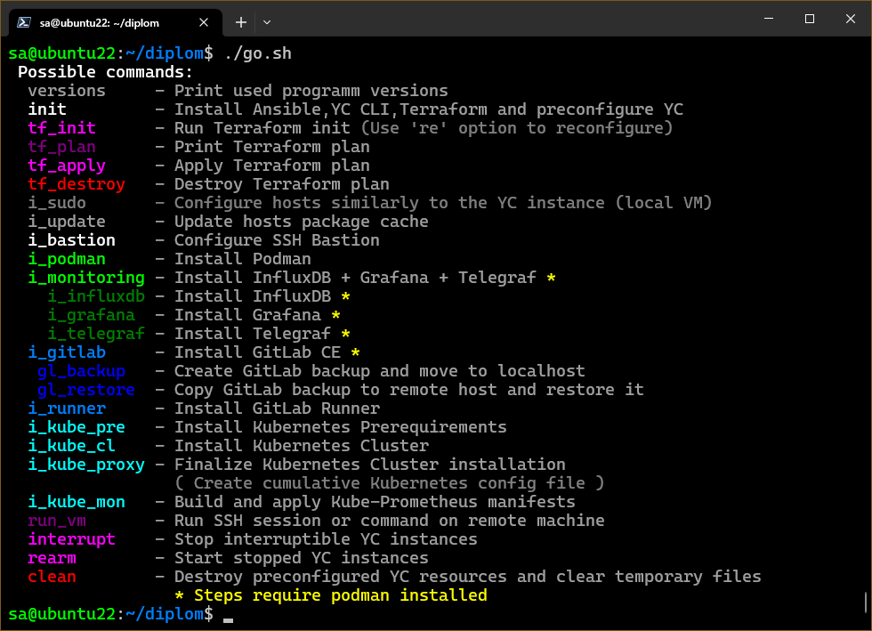
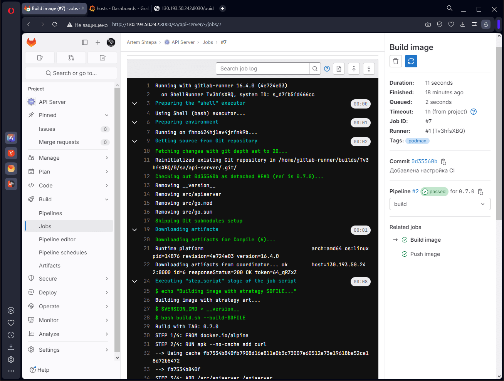

# Дипломный проект

<details>
<summary>Постановка задачи</summary>

## Цели

1. Подготовить облачную инфраструктуру на базе облачного провайдера Яндекс.Облако.
1. Запустить и сконфигурировать Kubernetes кластер.
1. Установить и настроить систему мониторинга.
1. Настроить и автоматизировать сборку тестового приложения с использованием Docker-контейнеров.
1. Настроить CI для автоматической сборки и тестирования.
1. Настроить CD для автоматического развёртывания приложения.

---

## Создание облачной инфраструктуры

Для начала необходимо подготовить облачную инфраструктуру в Яндекс.Облаке при помощи **Terraform**.

Предварительная подготовка к установке и запуску Kubernetes кластера.

1. Создайте сервисный аккаунт, который будет в дальнейшем использоваться **Terraform** для работы с инфраструктурой с необходимыми и достаточными правами. Не стоит использовать права суперпользователя
1. Подготовьте [backend](https://www.terraform.io/docs/language/settings/backends/index.html) для **Terraform**:  
   а. Рекомендуемый вариант: [Terraform Cloud](https://app.terraform.io/)  
   б. Альтернативный вариант: S3 bucket в созданном Яндекс.Облако аккаунте
1. Настройте [workspaces](https://www.terraform.io/docs/language/state/workspaces.html)  
   а. Рекомендуемый вариант: создайте два workspace: *stage* и *prod*. В случае выбора этого варианта все последующие шаги должны учитывать факт существования нескольких workspace.  
   б. Альтернативный вариант: используйте один workspace, назвав его *stage*. Пожалуйста, не используйте workspace, создаваемый **Terraform**-ом по-умолчанию (*default*).
1. Создайте VPC с подсетями в разных зонах доступности.
1. Убедитесь, что теперь вы можете выполнить команды `terraform destroy` и `terraform apply` без дополнительных ручных действий.
1. В случае использования [Terraform Cloud](https://app.terraform.io/) в качестве [backend](https://www.terraform.io/docs/language/settings/backends/index.html) убедитесь, что применение изменений успешно проходит, используя web-интерфейс Terraform cloud.

Ожидаемые результаты:

1. **Terraform** сконфигурирован и создание инфраструктуры посредством **Terraform** возможно без дополнительных ручных действий.
1. Полученная конфигурация инфраструктуры является предварительной, поэтому в ходе дальнейшего выполнения задания возможны изменения.

---

## Создание Kubernetes кластера

На этом этапе необходимо создать [Kubernetes](https://kubernetes.io/ru/docs/concepts/overview/what-is-kubernetes/)
кластер на базе предварительно созданной инфраструктуры.
Требуется обеспечить доступ к ресурсам из Интернета.

Это можно сделать двумя способами:

1. Рекомендуемый вариант: самостоятельная установка **Kubernetes** кластера.  
  а. При помощи **Terraform** подготовить как минимум 3 виртуальных машины **Compute Cloud** для создания **Kubernetes**-кластера. Тип виртуальной машины следует выбрать самостоятельно с учётом требовании к производительности и стоимости. Если в дальнейшем поймете, что необходимо сменить тип инстанса, используйте **Terraform** для внесения изменений.  
  б. Подготовить **ansible** конфигурации, можно воспользоваться, например [Kubespray](https://kubernetes.io/docs/setup/production-environment/tools/kubespray/)  
  в. Задеплоить **Kubernetes** на подготовленные ранее инстансы, в случае нехватки каких-либо ресурсов вы всегда можете создать их при помощи **Terraform**.
1. Альтернативный вариант: воспользуйтесь сервисом [Yandex Managed Service for Kubernetes](https://cloud.yandex.ru/services/managed-kubernetes)  
  а. С помощью terraform resource для [kubernetes](https://registry.terraform.io/providers/yandex-cloud/yandex/latest/docs/resources/kubernetes_cluster) создать региональный мастер kubernetes с размещением нод в разных 3 подсетях  
  б. С помощью terraform resource для [kubernetes node group](https://registry.terraform.io/providers/yandex-cloud/yandex/latest/docs/resources/kubernetes_node_group)

Ожидаемый результат:

1. Работоспособный **Kubernetes** кластер.
1. В файле `~/.kube/config` находятся данные для доступа к кластеру.
1. Команда `kubectl get pods --all-namespaces` отрабатывает без ошибок.

---

## Создание тестового приложения

Для перехода к следующему этапу необходимо подготовить тестовое приложение,
эмулирующее основное приложение разрабатываемое вашей компанией.

Способ подготовки:

1. Рекомендуемый вариант:  
   а. Создайте отдельный **git** репозиторий с простым **nginx** конфигом, который будет отдавать статические данные.  
   б. Подготовьте **Dockerfile** для создания образа приложения.  
1. Альтернативный вариант:  
   а. Используйте любой другой код, главное, чтобы был самостоятельно создан **Dockerfile**.

Ожидаемый результат:

1. **Git** репозиторий с тестовым приложением и **Dockerfile**.
1. Регистр с собранным **docker image**. В качестве регистра может быть [DockerHub](https://hub.docker.com/) или [Yandex Container Registry](https://cloud.yandex.ru/services/container-registry), созданный также с помощью **terraform**.

---

## Подготовка cистемы мониторинга и деплой приложения

Уже должны быть готовы конфигурации для автоматического создания облачной инфраструктуры и поднятия **Kubernetes** кластера.  
Теперь необходимо подготовить конфигурационные файлы для настройки нашего **Kubernetes** кластера.

Цель:

1. Задеплоить в кластер [prometheus](https://prometheus.io/), [grafana](https://grafana.com/), [alertmanager](https://github.com/prometheus/alertmanager), [экспортер](https://github.com/prometheus/node_exporter) основных метрик **Kubernetes**.
1. Задеплоить тестовое приложение, например, [nginx](https://www.nginx.com/) сервер отдающий статическую страницу.

Рекомендуемый способ выполнения:

1. Воспользовать пакетом [kube-prometheus](https://github.com/prometheus-operator/kube-prometheus), который уже включает в себя [Kubernetes оператор](https://operatorhub.io/) для [grafana](https://grafana.com/), [prometheus](https://prometheus.io/), [alertmanager](https://github.com/prometheus/alertmanager) и [node_exporter](https://github.com/prometheus/node_exporter). При желании можете собрать все эти приложения отдельно.
1. Для организации конфигурации использовать [qbec](https://qbec.io/), основанный на [jsonnet](https://jsonnet.org/). Обратите внимание на имеющиеся функции для интеграции **helm** конфигов и [helm charts](https://helm.sh/)
1. Если на первом этапе вы не воспользовались [Terraform Cloud](https://app.terraform.io/), то задеплойте в кластер [atlantis](https://www.runatlantis.io/) для отслеживания изменений инфраструктуры.

Альтернативный вариант:

1. Для организации конфигурации можно использовать [helm charts](https://helm.sh/)

Ожидаемый результат:

1. **Git** репозиторий с конфигурационными файлами для настройки **Kubernetes**.
2. **Http** доступ к **web** интерфейсу **grafana**.
3. Дашборды в **grafana** отображающие состояние **Kubernetes** кластера.
4. **Http** доступ к тестовому приложению.

---

## Установка и настройка CI/CD

Осталось настроить **CI/CD** систему для автоматической сборки **docker image** и деплоя приложения при изменении кода.

Цель:

1. Автоматическая сборка **docker образа** при коммите в репозиторий с тестовым приложением.
1. Автоматический деплой нового **docker** образа.

Можно использовать [teamcity](https://www.jetbrains.com/ru-ru/teamcity/), [jenkins](https://www.jenkins.io/), [GitLab CI](https://about.gitlab.com/stages-devops-lifecycle/continuous-integration/) или GitHub Actions.

Ожидаемый результат:

1. Интерфейс **CI/CD** сервиса доступен по **http**.
1. При любом коммите в репозиторие с тестовым приложением происходит сборка и отправка в регистр **Docker** образа.
1. При создании тега (например, `v1.0.0`) происходит сборка и отправка с соответствующим **label** в регистр, а также деплой соответствующего **Docker** образа в кластер **Kubernetes**.

---

## Что необходимо для сдачи задания?

1. Репозиторий с конфигурационными файлами **Terraform** и готовность продемонстрировать создание всех ресурсов с нуля.
1. Пример **pull request** с комментариями созданными **atlantis**'ом или снимки экрана из **Terraform Cloud**.
1. Репозиторий с конфигурацией **ansible**, если был выбран способ создания **Kubernetes** кластера при помощи **ansible**.
1. Репозиторий с **Dockerfile** тестового приложения и ссылка на собранный **docker image**.
1. Репозиторий с конфигурацией **Kubernetes** кластера.
1. Ссылка на тестовое приложение и веб интерфейс Grafana с данными доступа.
1. Все репозитории рекомендуется хранить на одном ресурсе (**github, gitlab**)

</details>

## Состав инфраструктуры

Проект составлен с учётом двух рабочих пространств:

- Основное или полное: `prod`
- Тестовое или сокращённое: `stage`

Рабочие пространства разделены как инфраструктурно на уровне **Terraform**, так и на уровне пространства имён кластера **Kubernetes**.

### Схема инфраструктуры рабочего пространства `prod`


### Схема инфраструктуры рабочего пространства `stage`


> Исходный код схем расположен в каталоге  [schema_source](./schema_source) в файлах формата **draw.io**

Инфраструктура создаётся **Terraform** провайдером Яндекс.Облака.
В зависимости от рабочего пространства создаются от 7 до 10 виртуальных машин с различными характеристиками.
В каждом из рабочих пространств только одна из машин имеет внешний IP адрес - это SSH бастион.

Из схем видно, что инфраструктура условно делится на две части: основная (может быть фиксированной для всех рабочих пространств) и кластер **Kubernetes**. В рамках проекта реализован сценарий основных частей, зависимых от кластера **Kubernetes**, то есть машинки основной части создаются вместе с машинками кластера **Kubernetes** в рамках одного рабочего пространства **Terraform** за одно применение **apply**.
> Идея для улучшения. В реальном применении более логичен сценарий, когда основная часть независима от кластера **Kubernetes** и имеется в единственном экземпляре, то есть основные машины создаются отдельно своим **Terraform** проектом, машины кластера **Kubernetes** своим.
> Исходный код **Terraform** расположен в каталоге [tf](./tf)

### Перечень и назначение файлов **Terraform**

- [main.tf](./tf/main.tf) - Базовая информация **Terraform**: используемый провайдер, его параметры, а также настройка хранилища состояний. В качестве хранилища состояний выбран **S3 бакет**, расположенный в Яндекс.Облаке. Часть параметров хранилища вынесена за пределы tf файла и указывается при инициализации **Terraform** в командной строке;
- [variables.tf](./tf/variables.tf) - Список переменных, позволяющих модифицировать инфраструктуру в зависимости от выбранного окружения/рабочего пространства (workspace). В основном содержит настройку машинок кластера **Kubernetes**: число используемых нод (отдельно для master и worker) и список подсетей, среди которых будут распределяться ноды;
- [network.tf](./tf/network.tf) - Объекты основной сети, подсетей и виртуальный роутер для направления исходящего трафика на бастион;
- [vm-instance/main.tf](./tf/vm-instance/main.tf) - Модуль создания объектов виртуальной машинки. Используется для сокращения и читабельности кода. Практически полностью настраивается переменными, включая выделение внешнего IP адреса, открытый SSH ключ, имя пользователя и опцию прерываемой машины. Имеет выходные параметры: внутренний и внешний IP адреса;
- [vm-disk.tf](./tf/vm-disk.tf) - Объекты образов, используемых при создании виртуальных машинок. Прописаны два диска: один для SSH бастиона на основе предварительно настроенного [NAT](https://cloud.yandex.ru/marketplace?tab=software&search=NAT) и второй для всех остальных машинок на основе **Debian 12**;
- [vm-main.tf](./tf/vm-main.tf) - Объекты виртуальных машинок, реализующих систему контроля версий, непрерывной интеграции и доставки CI/CD, маршрутизации трафика и мониторинга основных машинок;
- [vm-kube.tf](./tf/vm-kube.tf) - Объекты виртуальных машинок кластера **Kubernetes**; число управляющих и рабочих нод зависит от рабочего пространства **Terraform** и задаётся в локальных параметрах; Машинки распределяются по списку подсетей по очереди. Например, распределение 5 рабочих нод по списку подсетей (A,B,C) будет следующим A=(1,4), B=(2,5), C=(3). Управляющие ноды распределяются аналогично.

### Состав ПО основной части инфраструктуры

- `SSH Бастион` - Является единственным узлом, доступным из сети интернет. Управляет маршрутизацией входящего и исходящего трафика, обеспечивая доступ к внутренним ресурсам. В качестве балансировщика используется **HAProxy**;
- `podman` - Оркестратор для запуска остального ПО в виде контейнеров; устанавливается на машинки, требующие контейнеризации (`vm-1`, `vm-2` и `vm-3`);
- `GitLab` - Комплексное решение для хранения исходного кода на основе **Git**, непрерывной интеграции/сборки и доставки/deploy приложения в кластер **Kubernetes**. Разделён на две машинки: непосредственно сам **GitLab** разворачиваемый в виде **podman** контейнера на `vm-1` и сборщик/runner размещённый на `vm-3` по причинам большого потребления ОЗУ одним **GitLab** и необходимости доступа к кластеру **Kubernetes**;
- `InfluxDB` - СУБД временных рядов. Используется для хранения метрик с основных машин. Устанавливается в качестве **podman** контейнера на машинку `vm-2`;
- `Grafana` - Система визуализации. Используется для отображения и контроля метрик с основных машинок. Развёрнута в **podman** контейнере на машинке `vm-2`;
- `Telegraf` - Программа экспорта метрик. Используется для сбора и передачи метрик с основных машин в базу данных **InfluxDB**. Устанавливается на все машинки, с которых нужно собирать данные, а именно: `vm-1`, `vm-2` и `vm-3`;
- `HAProxy` - Балансировщик. Используется для управления трафиком на бастионе (`bastion`) и proxy кластера **Kubernetes** (`vm-3`);
- `qbec` - Утилита развёртывания/deploy приложения в кластер **Kubernetes**. Устанавливается на машинку `vm-3` вместе с **GitLab runner**.

В состав ПО кластера **Kubernetes** входят базовый комплект утилит **Kubernetes** для управления кластером (kubelet, kubectl, kubeadm) и их зависимости (containerd, runc, cni plugins). Также в кластере разворачивается стек [Kube-Prometheus](https://github.com/prometheus-operator/kube-prometheus).

## Автоматизация разворачивания инфраструктуры

Инфраструктура базируется на виртуальных машинках Яндекс.Облака. Непосредственно сами машинки создаются **Terraform** через предоставленный Яндексом провайдер. Настройка машинок и установка на них программного обеспечения осуществляется средствами **Ansible**.

Команды **Terraform** и запуска playbook **Ansible** вынесены во вспомогательный **bash** скрипт [go.sh](./go.sh), в котором реализовано:

- Проверка установленных утилит **Ansible**, **Terraform**, **YC CLI**;
- Автоматическая установка/обновление **Ansible** и **YC CLI**;
- Автоматическая настройка окружения пользователя на использование зеркал Яндекса для загрузки с них **Terraform** и провайдера; Установка **Terraform**;
- Создание переменных окружения **Terraform** для подключения к облаку на основе данных **YC CLI**;
- Создание и уничтожение сервисного аккаунта на Яндекс.Облаке, включая назначение ролей, прав и ключей доступа для использования в **Terraform** вместо root токена;
- Автоматическое генерирование пар ключей для бастиона, основных и машинок кластера **Kubernetes** если их нет; Сохраняются в каталог `secrets`;
- Создание и уничтожение S3 хранилища на Яндекс.Облаке для хранения в нём состояния **Terraform**;
- Автоматическое определение внешнего IP адреса SSH бастиона для динамического inventory **Ansible**; Никакие IP адреса нигде прописывать не нужно;
- Автоматическое определение рабочего пространства **Terraform** для некоторых playbook **Ansible**;
- Поддержка отладки на локальных виртуальных машинках (параметр `is_local_vm`, при этом для структуры используется файл **secrets/yc_local**, являющийся выводом `yc compute instance list --format json` с изменённым IP адресом бастиона на локальный);
- Исполнение команд **Terraform** в упрощённом виде;
- Запуск как одиночных, так и серии playbook **Ansible**;
- Автоматическое восстановление работы остановленных машинок Яндекс.Облака; Файлы проекта написаны таким образом, что все машинки, кроме SSH бастиона, могут быть остановлены и перезапущены без негативных последствий для функционирования, то есть для экономии средств их можно создавать прерываемыми;
- Автоматическая остановка машинок Яндекс.Облака, созданных прерываемыми;
- Вывод списка версий используемого ПО на основе переменных из inventory **Ansible**;
- Исполнение команд или подключение к терминалу любой из машинок проекта используя SSH-туннелирование;
- Уничтожение инфраструктуры и чистка каталогов от временных файлов.

Основные команды скрипта [go.sh](./go.sh)


Версии используемого ПО


---

Внимание!
Изначально инфраструктура разворачивается с чистой установкой **GitLab**.  
После выполнения [playbook](./ansible/playbook/install_gitlab.yml) разворачивания **GitLab** (отработки команды `./go.sh i_gitlab`) в выводе **Ansible** будет написан пароль для инициализации учётной записи администратора. Необходимо вручную авторизоваться по адресу <IPбастиона>:<порт GitLab> и произвести настройку **GitLab**, включающую:

- Регистрацию токена для добавления runner; Данный токен нужно прописать в переменную `runner_token` файла [Ansible/Inventory/Group_vars/Runner.yml](./ansible/inventory/group_vars/runner.yml);
- Регистрацию пользователя и настройка прав доступа;
- Создание проекта или группы и проекта в ней (желательно от пользователя);
- Наполнить репозиторий проекта исходным кодом приложения.

Только после получения токена регистрации runner в интерфейсе **GitLab** и обновления переменной [runner_token](./ansible/inventory/group_vars/runner.yml) можно устанавливать runner. (команда `./go.sh i_runner`)

Для сохранения состояния **GitLab** можно создать его резервную копию командой `./go.sh gl_backup`. При этом будет запущен соответствующий [playbook](./ansible/playbook/backup_create.yml), который инициализирует создание резервной копии через сам **GitLab**, а после его создания загрузит на рабочую машину в каталог [Ansible/Playbook/Files](./ansible/playbook/files/) с именем `_gitlab_<версия>_backup.tar`, где вместо `<версия>` будет подставлена текущая версия **GitLab**.

При повторном создании инфраструктуры на этапе установки **GitLab** если существует соответствующая его версии резервная копия, то восстановление будет запущено автоматически.

> Для ручного запуска восстановления **GitLab** из резервной копии можно воспользоваться командой `./go.sh gl_restore`

## Состав и описание скриптов Ansible

Для установки и настройки программ на машинках инфраструктуры используется следующие файлы **Ansible**

### Основные playbook и подключаемые задачи [Ansible/Playbook](./ansible/playbook/)

- [bootstrap_hosts.yml](./ansible/playbook/bootstrap_hosts.yml) - Содержит несколько play, включая маркированные тегами, для настройки локальных машинок аля compute instance Яндекс.Облака, обновления кэша пакетных менеджеров и установленных в системе пакетов, перезагрузки ОС если требуется и обновление списка известных хостов; Использует playbook формирования динамического inventory для определения хостов кластера **Kubernetes**;
- [configure_yc+tf.yml](./ansible/playbook/configure_yc+tf.yml) - Используется только для настройки рабочей машины, а именно конфигурирования окружения пользователя для использования зеркал Яндекса, установки агента **YC CLI** и **Terraform**;
- [dynamic_inv.yml](./ansible/playbook/dynamic_inv.yml) - Запрашивает у **YC CLI** список доступных машинок кластера **Kubernetes** текущего рабочего пространства (workspace) и на его основе формирует список хостов для inventory - формирует группы `kube_master`, `kube_worker` и `kube_nodes`;
- [ssh_add_fp.yml](./ansible/playbook/ssh_add_fp.yml) - Используется для настройки рабочей машины, а именно добавлению хостов проекта в список известных; Использует динамический inventory для определения хостов кластера **Kubernetes**;
- [ssh_clear_fp.yml](./ansible/playbook/ssh_add_fp.yml) - Используется для настройки рабочей машины, а именно удаления хостов проекта из списка известных перед их уничтожением; Использует динамический inventory для определения хостов кластера **Kubernetes**;
- [configure_bastion.yml](./ansible/playbook/configure_bastion.yml) - Настройка SSH бастиона;
- [install_podman.yml](./ansible/playbook/install_podman.yml) - Устанавливает **podman**, разрешает запуск контейнеров без авторизации пользователя и перезапускает машинку;
- [install_influxdb.yml](./ansible/playbook/install_influxdb.yml) - Устанавливает **InfluxDB**. В ходе установки ищет существующие токены доступа, если их нет, создаёт; После получения токенов доступа подготавливает готовые конфигурационные файлы для **Grafana** и **Telegraf** (настройка подключения к СУБД);
- [install_grafana.yml](./ansible/playbook/install_grafana.yml) - Устанавливает и конфигурирует **Grafana**;
- [install_telegraf.yml](./ansible/playbook/install_telegraf.yml) - Устанавливает **Telegraf** и настраивает экспорт метрик; при изменении конфигурационного файла перезапускает контейнер **Telegraf**;
- [install_gitlab.yml](./ansible/playbook/install_gitlab.yml) - Устанавливает **GitLab**, по окончании импортирует playbook восстановления из резервной копии;
- [install_runner.yml](./ansible/playbook/install_runner.yml) - Устанавливает **GitLab runner** и регистрирует его в **GitLab** на основе токена из переменных inventory; При помощи **iptables** настраивает маршрутизацию с внешнего IP адреса бастиона на локальный порт **GitLab**; Создаёт файл списка **registry** на основе файла `secrets/registry` - в нём будет содержаться список registry, куда нужно будет загружать подготовленные **Docker** образы; устанавливает для пользователя runner файлы проекта qbec из [Templates/App](./ansible/playbook/templates/app/) - это сделано для того, чтобы вручную не прописывать в проект адреса и порты кластера; Так как в шаблонах много элементов, в playbook используется модуль поиска файлов и каталогов и файлы имеют оригинальное расширение (остальные заканчиваются на jinja2); Используется динамический inventory для определения хостов кластера **Kubernetes**;
- [backup_create.yml](./ansible/playbook/backup_create.yml) - Создание резервной копии **GitLab** и загрузка её на рабочую машину;
- [backup_restore.yml](./ansible/playbook/backup_restore.yml) - Восстановление **GitLab** из резервной копии с рабочей машины;
- [install_kube-prereq.yml](./ansible/playbook/install_kube-prereq.yml) - Настройка машинок в соответствии с требованиями **Kubernetes** (отключение swap и так далее), устанавливает зависимости (containerd, runc и сетевые плагины); Дополнительно на proxy кластера устанавливается `kubectl` и при необходимости `qbec` и `helm` (если версии соответствующих приложений заданы в переменных, то установка выполняется. **Helm** по умолчанию не используется), а также настраивается **HAProxy** как балансировщик запросов к приложению и мониторингу **Kube-Prometheus**;
- [install_kube-cluster.yml](./ansible/playbook/install_kube-cluster.yml) - Разворачивает кластер **Kubernetes** на соответствующих машинках используя `kudeadm`; Использует playbook динамического inventory для определения хостов кластера; При существовании кластера выполняет его сброс; Настройка осуществляется с первого в группе `kube_master` хоста, где происходит инициализация кластера с получением команд пополнения кластера; далее подключаются остальные **Control Plane**, после чего в кластер добавляются рабочие ноды; После инициализации основной **Control Plane** применяется список предварительно заданных манифестов - параметр `kube_manifests` из [inventory/group_vars/kube_nodes](./ansible/inventory/group_vars/kube_nodes.yml);
- [install_kube-finalize.yml](./ansible/playbook/install_kube-finalize.yml) - Создаёт единый конфигурационный файл подключения к кластерам **Kubernetes** на основе нескольких (при одновременной работе обоих пространств `stage` и `prod`) и сохраняет его на proxy кластера, где расположен **GitLab runner**, который в свою очередь используя **qbec** смог бы подключиться к кластеру **Kubernetes**;
- [install_kube-prometheus.yml](./ansible/playbook/install_kube-prometheus.yml) - Устанавливает на proxy кластера дистрибутив **GoLang**, исходный код проекта **Kube-Prometheus** и необходимые компоненты (jq, jsonnet-bundler), запускает сборку манифестов и применяет их на кластере **Kubernetes**;
- [tasks_containerd.yml](./ansible/playbook/tasks_containerd.yml) - Набор задач (tasks) для установки **containerd** и его зависимостей;
- [tasks_kube-tools.yml](./ansible/playbook/tasks_kube-tools.yml) - Набор задач (tasks) для настройки в системе репозиториев **Kubernetes** и установки из них утилит `kubeadm`, `kubelet` и `kubectl` заданной версии;
- [tasks_go-installer.yml](./ansible/playbook/tasks_go-install.yml) - Набор задач (tasks) для установки приложения-компонента Go; Блок вынесен в отдельный файл, для того, чтобы можно было его использовать в цикле **loop**;
- [tasks_helm.yml](./ansible/playbook/tasks_helm.yml) - Набор задач (tasks) для установки **Helm**;
- [tasks_qbec.yml](./ansible/playbook/tasks_qbec.yml) - Набор задач (tasks) для установки **qbec**.
  
> Описание этапов смотрите в комментариях к соответствующим playbook

### Файлы описания хостов и состава групп [Ansible/Inventory](./ansible/inventory/)

- [hosts.yml](./ansible/inventory/hosts.yml) - Основной inventory: Содержит список групп и хостов, включая SSH бастион, переменные портов, используемых приложением и файлы ключей для подключения по SSH; IP адрес, порт и пользователь бастиона берётся из переменных inventory, которые в свою очередь читаются из переменных окружения;
- [podman.yml](./ansible/inventory/podman.yml) - Заглушка, создающая группу хостов, где необходимо установить podman - включает группы `gitlab`, `runner`, `grafana`, `influxdb` и `telegraf`;
- [kube_nodes.yml](./ansible/inventory/kube_nodes.yml) - Заглушка, создающая одну группу из двух: `node_master` и `node_worker`.

### Файлы переменных [Ansible/Inventory/Group_Vars](./ansible/inventory/group_vars/)

- [all.yml](./ansible/inventory/group_vars/all.yml) - Основные переменные, содержащие в основном данные о SSH бастионе - какой используется IP адрес, порт, пользователь, для каких хостов какие ключи, номера портов для доступа к интерфейсам **GitLab**, **Git**, **InfluxDB**, **Grafana** (основная и кластера), статистики **HAProxy** (основная и proxy кластера) и порты приложения в разных рабочих пространствах, а также логин и пароль доступа к статистике **HAProxy**;
- [influxdb.yml](./ansible/inventory/group_vars/influxdb.yml) - Версия **InfluxDB**, логин и пароль администратора по умолчанию, название организации, имя bucket и другие параметры;
- [grafana.yml](./ansible/inventory/group_vars/grafana.yml) - Версия **Grafana**, логин и пароль администратора по умолчанию, логин и пароль создаваемого пользователя и другие параметры;
- [telegraf.yml](./ansible/inventory/group_vars/telegraf.yml) - Версия **Telegraf** и путь расположения;
- [gitlab.yml](./ansible/inventory/group_vars/gitlab.yml) - Версия **GitLab** и другие менее интересные параметры; проект написан с учётом возможности обновления версии **GitLab** - для этого нужно изменить переменную версии (только в сторону увеличения) и выполнить команду `./go.sh i_gitlab`;
- [runner.yml](./ansible/inventory/group_vars/runner.yml) - Токен регистрации runner, имя runner в системе (влияет на идентификацию в playbook) и другие параметры;
- [kube_nodes.yml](./ansible/inventory/group_vars/kube_nodes.yml) - Версия **Kubernetes**, список манифестов, применяемых при создании кластера, диапазон сетевых адресов машинок кластера, порт API сервера, версии и адреса загрузки компонентов.
  
> Подробное описание всех переменных смотрите в комментариях соответствующих файлов

### Файлы шаблонов: [Ansible/Playbooks/Templates](./ansible/playbook/templates/)

- [app](./ansible/playbook/templates/app/) - Каталог проекта разворачивания (deploy) приложения в кластере **Kubernetes**; В шаблон подставляется IP адрес proxy кластера **Kubernetes** и порт его API сервера в соответствующем рабочем пространстве;
- [haproxy_bastion.cfg.jinja2](./ansible/playbook/templates/haproxy_bastion.cfg.jinja2) - Шаблон файла настроек **HAProxy** SSH бастиона; Генерируются все записи **frontend** (что из входящих принимаем) и **backend** (куда направляем);
- [haproxy_kubeapi.cfg.jinja2](./ansible/playbook/templates/haproxy_kubeapi.cfg.jinja2) - Шаблон файла настроек **HAProxy** proxy кластера **Kubernetes**; Также генерируются все записи **frontend** и **backend**; По сути является балансировщиком нагрузки (распределяет запросы по доступным управляющим нодам);
- [telegraf.conf.jinja2](./ansible/playbook/templates/telegraf.conf.jinja2) - Шаблон конфигурационного файла **Telegraf**; Помимо параметризируемого источника вывода (настройки подключения к СУБД **InfluxDB**) преднастроены собираемые метрики; На основе шаблона генерируется готовый конфигурационный файл, сохраняемый под именем `_telegraf.conf` в каталог файлов;
- [grafana.ini.jinja2](./ansible/playbook/templates/grafana.ini.jinja2) - Шаблон конфигурационного файла **Grafana** основной группы машинок; Параметризируется логин и пароль администратора по умолчанию;
- [grafana-ds-influxdb.yml.jinja2](./ansible/playbook/templates/grafana-ds-influxdb.yml.jinja2) - Шаблон конфигурационного файл системы **Grafana active provisioning**, позволяющей в автоматическом режиме произвести настройку источника данных, в данном случае СУБД **InfluxDB**, развёрнутую на одной из машинок; На основе шаблона генерируется готовый конфигурационный файл, сохраняемый под именем `_grafana-ds-influxdb.yml` в каталог файлов;
- [gitlab.rb.jinja2](./ansible/playbook/templates/gitlab.rb.jinja2) - Шаблон конфигурационного файл **GitLab**; В основном предназначен для задания параметра внешнего url **GitLab**, на основе которого система генерирует большинство ссылок web интерфейса - в качестве значения используется IP адрес бастиона и отведённый для **GitLab** порт; В угоду уменьшения потребления оперативной памяти сокращено число активный рабочих потоков, скорректированы некоторые другие параметры;
- [registry_list.jinja2](./ansible/playbook/templates/registry_list.jinja2) - Шаблон файла со списком **registry**, куда будут загружаться Docker образы; Формируется на основе списка из файла `secrets/registry`; Используется в CI/CD при сборке приложения;
- [grafana-kube.service.jinja2](./ansible/playbook/templates/grafana-kube.service.jinja2) - Шаблон сервисного файла, запускающего проброс порта сервиса **Grafana** из кластера **Kubernetes** стека **Kube-Prometheus**.

### Готовые файлы [Ansible/Playbook/Files](./ansible/playbook/files/)

- [grafana-db-home.json](./ansible/playbook/files/grafana-db-home.json) - Файл системы **Grafana active provisioning**, позволяющей в автоматическом режиме произвести настройку начальной страницы **Grafana**;
- [grafana-db-hosts.json](./ansible/playbook/files/grafana-db-home.json) - Файл экспорта настроенной доски (dashboard) отображения основных метрик машинок, с которых **Telegraf** собираем метрики (`vm-1`, `vm-2` и `vm-3`);
- [grafana-db-hosts.yml](./ansible/playbook/files/grafana-db-home.yml) - Файл системы **Grafana active provisioning**, позволяющей в автоматическом режиме произвести настройку **dashboard**, в данном случае доску `hosts`;
- `_telegraf.conf` - Готовый конфигурационный файл **Telegraf**; Является генерируемым, может быть удалён;
- `_grafana-ds-influxdb.yml` - Готовый файл настройки источника данных для **Grafana**; Является генерируемым, может быть удалён;
- `_kube_admin.conf` - Временный файл с полными правами доступа к кластеру **Kubernetes**, загружаемый из основной **Control Plane** ноды при создании кластера;
- `_kube_join_controlplane` - Временный файл команды подключения к кластеру **Kubernetes** дополнительных **Control Plane**;
- `_kube_join_worker` - Временный файл команды подключения к кластеру **Kubernetes** рабочих нод;
- `_gitlab_<версия>_backup.tar` - Файлы резервных копий **GitLab**, где вместо `<версия>` указывается версия **GitLab** с которой совместима копия; Используется для сохранения и восстановления состояния **GitLab**, например, при пересоздании инфраструктуры.

### Файлы проекта [QBEC](./ansible/playbook/templates/app/)

- [qbec.yaml](./ansible/playbook/templates/app/qbec.yaml) - Основной файл проекта **qbec**; Содержит имя проекта и используемые пространства имён: `stage` и `prod` с настройками подключения к соответствующему кластеру **Kubernetes** (в проекте используется один);
- [params.libsonnet](./ansible/playbook/templates/app/params.libsonnet) - Стандартный файл **qbec** используемый без модификации - подключает внешние файлы окружений из каталога `environments`;
- [base.libsonnet](./ansible/playbook/templates/app/environments/base.libsonnet) - Базовые настройки для всех окружений;
- [environments/stage.libsonnet](./ansible/playbook/templates/app/environments/stage.libsonnet) - Уникальные настройки окружения `stage` (Главное отличие - использование 4 реплик приложения);
- [environments/prod.libsonnet](./ansible/playbook/templates/app/environments/prod.libsonnet) - Уникальные настройки окружения `prod` (Главное отличие - использование 6 реплик приложения и ограничение использования ресурсов);
- [components/namespace.jsonnet](./ansible/playbook/templates/app/components/namespace.jsonnet) - Создание в кластере **Kubernetes** пространства имён, идентичного названию окружения;
- [components/frontend.jsonnet](./ansible/playbook/templates/app/components/frontend.jsonnet) - Создание в кластере **Kubernetes** deploy приложения и сервиса доступа к нему.

## Приложение [API Server](./app_project/)

Простейший API сервер на языке **GoLang**, обрабатывающий HTTP запросы:

- По **url** `/uuid` - выводит информации по текущему экземпляру сервера. В ответном JSON блоке содержатся поля `Version` текущей версия приложения и `UUId` со значением уникального идентификатора экземпляра;
- По **url** `/ip` - выводит информацию о доступных приложению IP адресов. В ответном JSON блоке только списка IP адресов;
- По **url** `/task/<id>` выводит в лог число `<id>`. В ответном JSON блоке результат преобразования `<id>` в число;
- По **url** `/wait` замораживает выполнение приложения от 1 до 5 секунд. В ответном JSON блоке включается время начала и окончания заморозки в формате ISO и Unix Timestamp;
- На остальные **url** в ответный JSON блок включается путь и метод HTTP запроса.

Приложение, по умолчанию, принимает соединения со всех адресов по порту **8080** (`0.0.0.0:8080`).

Изменить прослушиваемый порт и принимаемые адреса можно параметром запуска `-addr` (например, `apiserver --addr 127.0.0.1:80`), либо переменной окружения `API_BIND` (например, `export API_BIND=:8090`)

Исходный код представлен в единственном файле: [apiserver.go](./app_project/src/apiserver.go)

Для проверки функционирования приложения в рамках кластера реализована идентификация каждого конкретного экземпляра уникальным UUID, который генерируется при старте приложения и не меняется до его завершения. Генерирование UUID выполняется внешним пакетом `github.com/google/uuid`, поэтому требуется инициализация **GoLang** проекта (`go mod init`) с генерированием файла зависимостей (`go mod tidy`) - пример использования приведён ниже.

Пример `Dockerfile` для сборки приложения по исходному коду:

```dockerfile
FROM docker.io/golang:alpine AS compile-image
WORKDIR /src
ADD src/apiserver.go __version__ ./
RUN go mod init apiserver && go mod tidy && go build -ldflags="-X 'main.Version=$(cat __version__)'"

FROM docker.io/alpine
RUN apk --no-cache add curl
COPY --from=compile-image /src/apiserver /apiserver
ENTRYPOINT ["/apiserver"]
```

В примере использована конструкция `-ldflags`, позволяющая заменить переменную внутри исходного кода приложения на нужное значение, в данном случае значению переменной `main.Version` присваивается содержимое файла `__version__`, куда предварительно сохраняется идентификатор коммита (хэш коммита, тег или модификация ближайшего тега).

Компиляция приложения осуществляется в **podman** контейнере на основе docker образа [docker.io/golang](https://hub.docker.com/_/golang) средствами **GitLab CI**. Исполняемый файл упаковывается в docker образ на основе [docker.io/alpine](https://hub.docker.com/_/alpine) также средствами **GitLab CI** либо с использованием артефактов по [Dockerfile-art](./app_project/Dockerfile-art), либо по исходному коду по [Dockerfile-full](./app_project/Dockerfile-full);
> В проекте использование сборки образа по исходному коду закомментировано и не используется, оставлено в качестве примера.

## Сборка и доставка приложения

Компиляция приложения, сборка готового docker образа, разворачивания в кластере **Kubernetes** и удаление из него может быть выполнено исключительно в интерфейсе **GitLab**, для чего разработан план сборки (pipeline), представленный в файле [.gitlab-ci.yml](./app_project/.gitlab-ci.yml).

В плане сборки используются следующие этапы:

1. Компиляция (`compile`)
1. Сборки docker образа (`build`), включая выгрузку на **DockerHub**
1. Разворачивание в кластере **Kubernetes** (`deploy`)
1. Удаление из кластера **Kubernetes** (`clean`)

Для каждого из окружений `stage` и `prod` реализованы отдельные шаги.


> Подробное описание этапов смотрите в комментариях к файлу [.gitlab-ci.yml](./app_project/.gitlab-ci.yml)

---

## Исполнение проекта

### 1. Инициализация утилит на рабочей машине, включая создание сервисного аккаунта и S3 хранилища

Команда скрипта: `./go.sh init`
<details>
<summary>Лог подготовки рабочей машины</summary>

```console
sa@ubuntu22:~/diplom$ ./go.sh init
 Install YC CLI and Terraform...

PLAY [Configure Terraform for Yandex CLI] ********************************************

TASK [Gathering Facts] ***************************************************************
ok: [localhost]

TASK [Create terraform provider link to Yandex Mirror] *******************************
ok: [localhost]

TASK [Get latest YC CLI version] *****************************************************
ok: [localhost]

TASK [Check YC CLI installation] *****************************************************
fatal: [localhost]: FAILED! => {"changed": false, "cmd": "yc --version | grep 0.111.0", "delta": "0:00:00.057315", "end": "2023-10-01 20:04:00.196308", "msg": "non-zero return code", "rc": 1, "start": "2023-10-01 20:04:00.138993", "stderr": "", "stderr_lines": [], "stdout": "", "stdout_lines": []}
...ignoring

TASK [Try update YC CLI] *************************************************************
changed: [localhost]

TASK [Check Terraform installation] **************************************************
ok: [localhost]

TASK [Download Terraform from Yandex Mirror] *****************************************
skipping: [localhost]

PLAY RECAP ***************************************************************************
localhost                  : ok=6    changed=1    unreachable=0    failed=0    skipped=1    rescued=0    ignored=1

 Create service account...
done (1s)
id: ajefd5r5audvnogta4oo
folder_id: b1gss48frgkqdrle16h1
created_at: "2023-10-01T17:03:33.050628237Z"
name: sa-diplom

 Add access rights...
done (2s)
effective_deltas:
  - action: ADD
    access_binding:
      role_id: editor
      subject:
        id: ajefd5r5audvnogta4oo
        type: serviceAccount

 Grant access rights to folder...
done (3s)
effective_deltas:
  - action: ADD
    access_binding:
      role_id: editor
      subject:
        id: ajefd5r5audvnogta4oo
        type: serviceAccount

 Generate account access file...
id: ajep8q49l9kp9s97i170
service_account_id: ajefd5r5audvnogta4oo
created_at: "2023-10-01T17:03:42.422254002Z"
key_algorithm: RSA_2048

 Generate access key for service account...
 Create S3 storage...
sa@ubuntu22:~/diplom$
```
> Запечатлён момент обновления утилиты управления облачными ресурсами Яндекс.Облака YC CLI
</details>

### 2. Инициализация Terraform

Команда скрипта: `./go.sh tf_init`
<details>
<summary>Лог подготовки рабочей машины</summary>

```console
sa@ubuntu22:~/diplom$ ./go.sh tf_init

Initializing the backend...

Successfully configured the backend "s3"! Terraform will automatically
use this backend unless the backend configuration changes.
Initializing modules...
- vm-bastion in vm-instance
- vm-kube-master in vm-instance
- vm-kube-worker in vm-instance
- vm-main-1 in vm-instance
- vm-main-2 in vm-instance
- vm-main-3 in vm-instance

Initializing provider plugins...
- Finding latest version of yandex-cloud/yandex...
- Installing yandex-cloud/yandex v0.99.1...
- Installed yandex-cloud/yandex v0.99.1 (unauthenticated)

Terraform has created a lock file .terraform.lock.hcl to record the provider
selections it made above. Include this file in your version control repository
so that Terraform can guarantee to make the same selections by default when
you run "terraform init" in the future.

╷
│ Warning: Incomplete lock file information for providers
│
│ Due to your customized provider installation methods, Terraform was forced to calculate lock file checksums locally
│ for the following providers:
│   - yandex-cloud/yandex
│
│ The current .terraform.lock.hcl file only includes checksums for linux_amd64, so Terraform running on another
│ platform will fail to install these providers.
│
│ To calculate additional checksums for another platform, run:
│   terraform providers lock -platform=linux_amd64
│ (where linux_amd64 is the platform to generate)
╵

Terraform has been successfully initialized!

You may now begin working with Terraform. Try running "terraform plan" to see
any changes that are required for your infrastructure. All Terraform commands
should now work.

If you ever set or change modules or backend configuration for Terraform,
rerun this command to reinitialize your working directory. If you forget, other
commands will detect it and remind you to do so if necessary.
Created and switched to workspace "stage"!

You're now on a new, empty workspace. Workspaces isolate their state,
so if you run "terraform plan" Terraform will not see any existing state
for this configuration.
Created and switched to workspace "prod"!

You're now on a new, empty workspace. Workspaces isolate their state,
so if you run "terraform plan" Terraform will not see any existing state
for this configuration.
sa@ubuntu22:~/diplom$
```
</details>

### 3. Создание виртуальных машинок в Яндекс.Облаке

Команда скрипта: `./go.sh tf_apply`
<details>
<summary>Лог создания инфраструктуры <strong>Terraform</strong></summary>

```console
sa@ubuntu22:~/diplom$ ./go.sh tf_apply

Terraform used the selected providers to generate the following execution plan. Resource actions are indicated with the
following symbols:
  + create

Terraform will perform the following actions:

  # yandex_compute_image.nat-disk will be created
  + resource "yandex_compute_image" "nat-disk" {
      + created_at      = (known after apply)
      + folder_id       = (known after apply)
      + id              = (known after apply)
      + min_disk_size   = (known after apply)
      + name            = "prod-nat-disk"
      + os_type         = (known after apply)
      + pooled          = (known after apply)
      + product_ids     = (known after apply)
      + size            = (known after apply)
      + source_disk     = (known after apply)
      + source_family   = "nat-instance-ubuntu"
      + source_image    = (known after apply)
      + source_snapshot = (known after apply)
      + source_url      = (known after apply)
      + status          = (known after apply)
    }

  # yandex_compute_image.os-disk will be created
  + resource "yandex_compute_image" "os-disk" {
      + created_at      = (known after apply)
      + folder_id       = (known after apply)
      + id              = (known after apply)
      + min_disk_size   = (known after apply)
      + name            = "prod-disk"
      + os_type         = (known after apply)
      + pooled          = (known after apply)
      + product_ids     = (known after apply)
      + size            = (known after apply)
      + source_disk     = (known after apply)
      + source_family   = "debian-12"
      + source_image    = (known after apply)
      + source_snapshot = (known after apply)
      + source_url      = (known after apply)
      + status          = (known after apply)
    }

  # yandex_vpc_network.net-master will be created
  + resource "yandex_vpc_network" "net-master" {
      + created_at                = (known after apply)
      + default_security_group_id = (known after apply)
      + folder_id                 = (known after apply)
      + id                        = (known after apply)
      + labels                    = (known after apply)
      + name                      = "prod-network"
      + subnet_ids                = (known after apply)
    }

  # yandex_vpc_route_table.net-router will be created
  + resource "yandex_vpc_route_table" "net-router" {
      + created_at = (known after apply)
      + folder_id  = (known after apply)
      + id         = (known after apply)
      + labels     = (known after apply)
      + name       = "prod-router"
      + network_id = (known after apply)

      + static_route {
          + destination_prefix = "0.0.0.0/0"
          + next_hop_address   = "192.168.1.10"
        }
    }

  # yandex_vpc_subnet.subnet-kube-a will be created
  + resource "yandex_vpc_subnet" "subnet-kube-a" {
      + created_at     = (known after apply)
      + folder_id      = (known after apply)
      + id             = (known after apply)
      + labels         = (known after apply)
      + name           = "prod-subnet-kube-a"
      + network_id     = (known after apply)
      + route_table_id = (known after apply)
      + v4_cidr_blocks = [
          + "192.168.10.0/24",
        ]
      + v6_cidr_blocks = (known after apply)
      + zone           = "ru-central1-a"
    }

  # yandex_vpc_subnet.subnet-kube-b will be created
  + resource "yandex_vpc_subnet" "subnet-kube-b" {
      + created_at     = (known after apply)
      + folder_id      = (known after apply)
      + id             = (known after apply)
      + labels         = (known after apply)
      + name           = "prod-subnet-kube-b"
      + network_id     = (known after apply)
      + route_table_id = (known after apply)
      + v4_cidr_blocks = [
          + "192.168.20.0/24",
        ]
      + v6_cidr_blocks = (known after apply)
      + zone           = "ru-central1-b"
    }

  # yandex_vpc_subnet.subnet-kube-c will be created
  + resource "yandex_vpc_subnet" "subnet-kube-c" {
      + created_at     = (known after apply)
      + folder_id      = (known after apply)
      + id             = (known after apply)
      + labels         = (known after apply)
      + name           = "prod-subnet-kube-c"
      + network_id     = (known after apply)
      + route_table_id = (known after apply)
      + v4_cidr_blocks = [
          + "192.168.30.0/24",
        ]
      + v6_cidr_blocks = (known after apply)
      + zone           = "ru-central1-c"
    }

  # yandex_vpc_subnet.subnet-main will be created
  + resource "yandex_vpc_subnet" "subnet-main" {
      + created_at     = (known after apply)
      + folder_id      = (known after apply)
      + id             = (known after apply)
      + labels         = (known after apply)
      + name           = "prod-subnet-main"
      + network_id     = (known after apply)
      + route_table_id = (known after apply)
      + v4_cidr_blocks = [
          + "192.168.1.0/24",
        ]
      + v6_cidr_blocks = (known after apply)
      + zone           = "ru-central1-a"
    }

  # module.vm-bastion.yandex_compute_instance.vm-instance will be created
  + resource "yandex_compute_instance" "vm-instance" {
      + created_at                = (known after apply)
      + description               = "SSH Bastion"
      + folder_id                 = (known after apply)
      + fqdn                      = (known after apply)
      + gpu_cluster_id            = (known after apply)
      + hostname                  = (known after apply)
      + id                        = (known after apply)
      + metadata                  = {
          + "ssh-keys" = <<-EOT
                ubuntu:ssh-ed25519 AAAAC3NzaC1lZDI1NTE5AAAAIPWs1RosxW6ZgLd/LNG7BoCuuUyXg5Gd6jm9KDK6upUq key_bastion
            EOT
        }
      + name                      = "prod-bastion"
      + network_acceleration_type = "standard"
      + platform_id               = "standard-v2"
      + service_account_id        = (known after apply)
      + status                    = (known after apply)
      + zone                      = "ru-central1-a"

      + boot_disk {
          + auto_delete = true
          + device_name = "ubuntu"
          + disk_id     = (known after apply)
          + mode        = (known after apply)

          + initialize_params {
              + block_size  = (known after apply)
              + description = (known after apply)
              + image_id    = (known after apply)
              + name        = (known after apply)
              + size        = 8
              + snapshot_id = (known after apply)
              + type        = "network-hdd"
            }
        }

      + network_interface {
          + index              = (known after apply)
          + ip_address         = "192.168.1.10"
          + ipv4               = true
          + ipv6               = (known after apply)
          + ipv6_address       = (known after apply)
          + mac_address        = (known after apply)
          + nat                = true
          + nat_ip_address     = (known after apply)
          + nat_ip_version     = (known after apply)
          + security_group_ids = (known after apply)
          + subnet_id          = (known after apply)
        }

      + resources {
          + core_fraction = 5
          + cores         = 2
          + memory        = 0.5
        }

      + scheduling_policy {
          + preemptible = false
        }
    }

  # module.vm-kube-master[0].yandex_compute_instance.vm-instance will be created
  + resource "yandex_compute_instance" "vm-instance" {
      + created_at                = (known after apply)
      + description               = "Kube Master 1"
      + folder_id                 = (known after apply)
      + fqdn                      = (known after apply)
      + gpu_cluster_id            = (known after apply)
      + hostname                  = (known after apply)
      + id                        = (known after apply)
      + metadata                  = {
          + "ssh-keys" = <<-EOT
                debian:ssh-ed25519 AAAAC3NzaC1lZDI1NTE5AAAAII8MW1FNBoK7ThSpd4Pcyss5wLFp3YDp9A47djOxX+8c key_kube
            EOT
        }
      + name                      = "prod-kube-master-1"
      + network_acceleration_type = "standard"
      + platform_id               = "standard-v2"
      + service_account_id        = (known after apply)
      + status                    = (known after apply)
      + zone                      = "ru-central1-a"

      + boot_disk {
          + auto_delete = true
          + device_name = "debian"
          + disk_id     = (known after apply)
          + mode        = (known after apply)

          + initialize_params {
              + block_size  = (known after apply)
              + description = (known after apply)
              + image_id    = (known after apply)
              + name        = (known after apply)
              + size        = 30
              + snapshot_id = (known after apply)
              + type        = "network-hdd"
            }
        }

      + network_interface {
          + index              = (known after apply)
          + ip_address         = "192.168.10.51"
          + ipv4               = true
          + ipv6               = (known after apply)
          + ipv6_address       = (known after apply)
          + mac_address        = (known after apply)
          + nat                = false
          + nat_ip_address     = (known after apply)
          + nat_ip_version     = (known after apply)
          + security_group_ids = (known after apply)
          + subnet_id          = (known after apply)
        }

      + resources {
          + core_fraction = 5
          + cores         = 2
          + memory        = 2
        }

      + scheduling_policy {
          + preemptible = true
        }
    }

  # module.vm-kube-master[1].yandex_compute_instance.vm-instance will be created
  + resource "yandex_compute_instance" "vm-instance" {
      + created_at                = (known after apply)
      + description               = "Kube Master 2"
      + folder_id                 = (known after apply)
      + fqdn                      = (known after apply)
      + gpu_cluster_id            = (known after apply)
      + hostname                  = (known after apply)
      + id                        = (known after apply)
      + metadata                  = {
          + "ssh-keys" = <<-EOT
                debian:ssh-ed25519 AAAAC3NzaC1lZDI1NTE5AAAAII8MW1FNBoK7ThSpd4Pcyss5wLFp3YDp9A47djOxX+8c key_kube
            EOT
        }
      + name                      = "prod-kube-master-2"
      + network_acceleration_type = "standard"
      + platform_id               = "standard-v2"
      + service_account_id        = (known after apply)
      + status                    = (known after apply)
      + zone                      = "ru-central1-b"

      + boot_disk {
          + auto_delete = true
          + device_name = "debian"
          + disk_id     = (known after apply)
          + mode        = (known after apply)

          + initialize_params {
              + block_size  = (known after apply)
              + description = (known after apply)
              + image_id    = (known after apply)
              + name        = (known after apply)
              + size        = 30
              + snapshot_id = (known after apply)
              + type        = "network-hdd"
            }
        }

      + network_interface {
          + index              = (known after apply)
          + ip_address         = "192.168.20.51"
          + ipv4               = true
          + ipv6               = (known after apply)
          + ipv6_address       = (known after apply)
          + mac_address        = (known after apply)
          + nat                = false
          + nat_ip_address     = (known after apply)
          + nat_ip_version     = (known after apply)
          + security_group_ids = (known after apply)
          + subnet_id          = (known after apply)
        }

      + resources {
          + core_fraction = 5
          + cores         = 2
          + memory        = 2
        }

      + scheduling_policy {
          + preemptible = true
        }
    }

  # module.vm-kube-master[2].yandex_compute_instance.vm-instance will be created
  + resource "yandex_compute_instance" "vm-instance" {
      + created_at                = (known after apply)
      + description               = "Kube Master 3"
      + folder_id                 = (known after apply)
      + fqdn                      = (known after apply)
      + gpu_cluster_id            = (known after apply)
      + hostname                  = (known after apply)
      + id                        = (known after apply)
      + metadata                  = {
          + "ssh-keys" = <<-EOT
                debian:ssh-ed25519 AAAAC3NzaC1lZDI1NTE5AAAAII8MW1FNBoK7ThSpd4Pcyss5wLFp3YDp9A47djOxX+8c key_kube
            EOT
        }
      + name                      = "prod-kube-master-3"
      + network_acceleration_type = "standard"
      + platform_id               = "standard-v2"
      + service_account_id        = (known after apply)
      + status                    = (known after apply)
      + zone                      = "ru-central1-c"

      + boot_disk {
          + auto_delete = true
          + device_name = "debian"
          + disk_id     = (known after apply)
          + mode        = (known after apply)

          + initialize_params {
              + block_size  = (known after apply)
              + description = (known after apply)
              + image_id    = (known after apply)
              + name        = (known after apply)
              + size        = 30
              + snapshot_id = (known after apply)
              + type        = "network-hdd"
            }
        }

      + network_interface {
          + index              = (known after apply)
          + ip_address         = "192.168.30.51"
          + ipv4               = true
          + ipv6               = (known after apply)
          + ipv6_address       = (known after apply)
          + mac_address        = (known after apply)
          + nat                = false
          + nat_ip_address     = (known after apply)
          + nat_ip_version     = (known after apply)
          + security_group_ids = (known after apply)
          + subnet_id          = (known after apply)
        }

      + resources {
          + core_fraction = 5
          + cores         = 2
          + memory        = 2
        }

      + scheduling_policy {
          + preemptible = true
        }
    }

  # module.vm-kube-worker[0].yandex_compute_instance.vm-instance will be created
  + resource "yandex_compute_instance" "vm-instance" {
      + created_at                = (known after apply)
      + description               = "Kube Worker 1"
      + folder_id                 = (known after apply)
      + fqdn                      = (known after apply)
      + gpu_cluster_id            = (known after apply)
      + hostname                  = (known after apply)
      + id                        = (known after apply)
      + metadata                  = {
          + "ssh-keys" = <<-EOT
                debian:ssh-ed25519 AAAAC3NzaC1lZDI1NTE5AAAAII8MW1FNBoK7ThSpd4Pcyss5wLFp3YDp9A47djOxX+8c key_kube
            EOT
        }
      + name                      = "prod-kube-worker-1"
      + network_acceleration_type = "standard"
      + platform_id               = "standard-v2"
      + service_account_id        = (known after apply)
      + status                    = (known after apply)
      + zone                      = "ru-central1-a"

      + boot_disk {
          + auto_delete = true
          + device_name = "debian"
          + disk_id     = (known after apply)
          + mode        = (known after apply)

          + initialize_params {
              + block_size  = (known after apply)
              + description = (known after apply)
              + image_id    = (known after apply)
              + name        = (known after apply)
              + size        = 30
              + snapshot_id = (known after apply)
              + type        = "network-hdd"
            }
        }

      + network_interface {
          + index              = (known after apply)
          + ip_address         = "192.168.10.101"
          + ipv4               = true
          + ipv6               = (known after apply)
          + ipv6_address       = (known after apply)
          + mac_address        = (known after apply)
          + nat                = false
          + nat_ip_address     = (known after apply)
          + nat_ip_version     = (known after apply)
          + security_group_ids = (known after apply)
          + subnet_id          = (known after apply)
        }

      + resources {
          + core_fraction = 5
          + cores         = 2
          + memory        = 2
        }

      + scheduling_policy {
          + preemptible = true
        }
    }

  # module.vm-kube-worker[1].yandex_compute_instance.vm-instance will be created
  + resource "yandex_compute_instance" "vm-instance" {
      + created_at                = (known after apply)
      + description               = "Kube Worker 2"
      + folder_id                 = (known after apply)
      + fqdn                      = (known after apply)
      + gpu_cluster_id            = (known after apply)
      + hostname                  = (known after apply)
      + id                        = (known after apply)
      + metadata                  = {
          + "ssh-keys" = <<-EOT
                debian:ssh-ed25519 AAAAC3NzaC1lZDI1NTE5AAAAII8MW1FNBoK7ThSpd4Pcyss5wLFp3YDp9A47djOxX+8c key_kube
            EOT
        }
      + name                      = "prod-kube-worker-2"
      + network_acceleration_type = "standard"
      + platform_id               = "standard-v2"
      + service_account_id        = (known after apply)
      + status                    = (known after apply)
      + zone                      = "ru-central1-b"

      + boot_disk {
          + auto_delete = true
          + device_name = "debian"
          + disk_id     = (known after apply)
          + mode        = (known after apply)

          + initialize_params {
              + block_size  = (known after apply)
              + description = (known after apply)
              + image_id    = (known after apply)
              + name        = (known after apply)
              + size        = 30
              + snapshot_id = (known after apply)
              + type        = "network-hdd"
            }
        }

      + network_interface {
          + index              = (known after apply)
          + ip_address         = "192.168.20.101"
          + ipv4               = true
          + ipv6               = (known after apply)
          + ipv6_address       = (known after apply)
          + mac_address        = (known after apply)
          + nat                = false
          + nat_ip_address     = (known after apply)
          + nat_ip_version     = (known after apply)
          + security_group_ids = (known after apply)
          + subnet_id          = (known after apply)
        }

      + resources {
          + core_fraction = 5
          + cores         = 2
          + memory        = 2
        }

      + scheduling_policy {
          + preemptible = true
        }
    }

  # module.vm-kube-worker[2].yandex_compute_instance.vm-instance will be created
  + resource "yandex_compute_instance" "vm-instance" {
      + created_at                = (known after apply)
      + description               = "Kube Worker 3"
      + folder_id                 = (known after apply)
      + fqdn                      = (known after apply)
      + gpu_cluster_id            = (known after apply)
      + hostname                  = (known after apply)
      + id                        = (known after apply)
      + metadata                  = {
          + "ssh-keys" = <<-EOT
                debian:ssh-ed25519 AAAAC3NzaC1lZDI1NTE5AAAAII8MW1FNBoK7ThSpd4Pcyss5wLFp3YDp9A47djOxX+8c key_kube
            EOT
        }
      + name                      = "prod-kube-worker-3"
      + network_acceleration_type = "standard"
      + platform_id               = "standard-v2"
      + service_account_id        = (known after apply)
      + status                    = (known after apply)
      + zone                      = "ru-central1-c"

      + boot_disk {
          + auto_delete = true
          + device_name = "debian"
          + disk_id     = (known after apply)
          + mode        = (known after apply)

          + initialize_params {
              + block_size  = (known after apply)
              + description = (known after apply)
              + image_id    = (known after apply)
              + name        = (known after apply)
              + size        = 30
              + snapshot_id = (known after apply)
              + type        = "network-hdd"
            }
        }

      + network_interface {
          + index              = (known after apply)
          + ip_address         = "192.168.30.101"
          + ipv4               = true
          + ipv6               = (known after apply)
          + ipv6_address       = (known after apply)
          + mac_address        = (known after apply)
          + nat                = false
          + nat_ip_address     = (known after apply)
          + nat_ip_version     = (known after apply)
          + security_group_ids = (known after apply)
          + subnet_id          = (known after apply)
        }

      + resources {
          + core_fraction = 5
          + cores         = 2
          + memory        = 2
        }

      + scheduling_policy {
          + preemptible = true
        }
    }

  # module.vm-main-1.yandex_compute_instance.vm-instance will be created
  + resource "yandex_compute_instance" "vm-instance" {
      + created_at                = (known after apply)
      + description               = "GitLab"
      + folder_id                 = (known after apply)
      + fqdn                      = (known after apply)
      + gpu_cluster_id            = (known after apply)
      + hostname                  = (known after apply)
      + id                        = (known after apply)
      + metadata                  = {
          + "ssh-keys" = <<-EOT
                debian:ssh-ed25519 AAAAC3NzaC1lZDI1NTE5AAAAINFuPECjbTrIc9a60kH9YAv0e/3CoUxH5PKaCl7WPmCZ key_machine
            EOT
        }
      + name                      = "prod-vm-1"
      + network_acceleration_type = "standard"
      + platform_id               = "standard-v2"
      + service_account_id        = (known after apply)
      + status                    = (known after apply)
      + zone                      = "ru-central1-a"

      + boot_disk {
          + auto_delete = true
          + device_name = "debian"
          + disk_id     = (known after apply)
          + mode        = (known after apply)

          + initialize_params {
              + block_size  = (known after apply)
              + description = (known after apply)
              + image_id    = (known after apply)
              + name        = (known after apply)
              + size        = 30
              + snapshot_id = (known after apply)
              + type        = "network-hdd"
            }
        }

      + network_interface {
          + index              = (known after apply)
          + ip_address         = "192.168.1.11"
          + ipv4               = true
          + ipv6               = (known after apply)
          + ipv6_address       = (known after apply)
          + mac_address        = (known after apply)
          + nat                = false
          + nat_ip_address     = (known after apply)
          + nat_ip_version     = (known after apply)
          + security_group_ids = (known after apply)
          + subnet_id          = (known after apply)
        }

      + resources {
          + core_fraction = 20
          + cores         = 2
          + memory        = 6
        }

      + scheduling_policy {
          + preemptible = true
        }
    }

  # module.vm-main-2.yandex_compute_instance.vm-instance will be created
  + resource "yandex_compute_instance" "vm-instance" {
      + created_at                = (known after apply)
      + description               = "InfluxDB and Grafana"
      + folder_id                 = (known after apply)
      + fqdn                      = (known after apply)
      + gpu_cluster_id            = (known after apply)
      + hostname                  = (known after apply)
      + id                        = (known after apply)
      + metadata                  = {
          + "ssh-keys" = <<-EOT
                debian:ssh-ed25519 AAAAC3NzaC1lZDI1NTE5AAAAINFuPECjbTrIc9a60kH9YAv0e/3CoUxH5PKaCl7WPmCZ key_machine
            EOT
        }
      + name                      = "prod-vm-2"
      + network_acceleration_type = "standard"
      + platform_id               = "standard-v2"
      + service_account_id        = (known after apply)
      + status                    = (known after apply)
      + zone                      = "ru-central1-a"

      + boot_disk {
          + auto_delete = true
          + device_name = "debian"
          + disk_id     = (known after apply)
          + mode        = (known after apply)

          + initialize_params {
              + block_size  = (known after apply)
              + description = (known after apply)
              + image_id    = (known after apply)
              + name        = (known after apply)
              + size        = 20
              + snapshot_id = (known after apply)
              + type        = "network-hdd"
            }
        }

      + network_interface {
          + index              = (known after apply)
          + ip_address         = "192.168.1.12"
          + ipv4               = true
          + ipv6               = (known after apply)
          + ipv6_address       = (known after apply)
          + mac_address        = (known after apply)
          + nat                = false
          + nat_ip_address     = (known after apply)
          + nat_ip_version     = (known after apply)
          + security_group_ids = (known after apply)
          + subnet_id          = (known after apply)
        }

      + resources {
          + core_fraction = 5
          + cores         = 2
          + memory        = 2
        }

      + scheduling_policy {
          + preemptible = true
        }
    }

  # module.vm-main-3.yandex_compute_instance.vm-instance will be created
  + resource "yandex_compute_instance" "vm-instance" {
      + created_at                = (known after apply)
      + description               = "CI Runner and Kube proxy"
      + folder_id                 = (known after apply)
      + fqdn                      = (known after apply)
      + gpu_cluster_id            = (known after apply)
      + hostname                  = (known after apply)
      + id                        = (known after apply)
      + metadata                  = {
          + "ssh-keys" = <<-EOT
                debian:ssh-ed25519 AAAAC3NzaC1lZDI1NTE5AAAAINFuPECjbTrIc9a60kH9YAv0e/3CoUxH5PKaCl7WPmCZ key_machine
            EOT
        }
      + name                      = "prod-vm-3"
      + network_acceleration_type = "standard"
      + platform_id               = "standard-v2"
      + service_account_id        = (known after apply)
      + status                    = (known after apply)
      + zone                      = "ru-central1-a"

      + boot_disk {
          + auto_delete = true
          + device_name = "debian"
          + disk_id     = (known after apply)
          + mode        = (known after apply)

          + initialize_params {
              + block_size  = (known after apply)
              + description = (known after apply)
              + image_id    = (known after apply)
              + name        = (known after apply)
              + size        = 30
              + snapshot_id = (known after apply)
              + type        = "network-hdd"
            }
        }

      + network_interface {
          + index              = (known after apply)
          + ip_address         = "192.168.1.13"
          + ipv4               = true
          + ipv6               = (known after apply)
          + ipv6_address       = (known after apply)
          + mac_address        = (known after apply)
          + nat                = false
          + nat_ip_address     = (known after apply)
          + nat_ip_version     = (known after apply)
          + security_group_ids = (known after apply)
          + subnet_id          = (known after apply)
        }

      + resources {
          + core_fraction = 5
          + cores         = 2
          + memory        = 1
        }

      + scheduling_policy {
          + preemptible = true
        }
    }

Plan: 18 to add, 0 to change, 0 to destroy.
yandex_compute_image.os-disk: Creating...
yandex_compute_image.nat-disk: Creating...
yandex_vpc_network.net-master: Creating...
yandex_vpc_network.net-master: Creation complete after 2s [id=enpcn86mkq0v0d64ckhr]
yandex_vpc_route_table.net-router: Creating...
yandex_vpc_route_table.net-router: Creation complete after 1s [id=enp5cgr0jjb8jnlqb8ic]
yandex_vpc_subnet.subnet-kube-c: Creating...
yandex_vpc_subnet.subnet-kube-a: Creating...
yandex_vpc_subnet.subnet-kube-b: Creating...
yandex_vpc_subnet.subnet-main: Creating...
yandex_vpc_subnet.subnet-kube-b: Creation complete after 1s [id=e2lpa9699nl8lj6ecukh]
yandex_vpc_subnet.subnet-kube-a: Creation complete after 2s [id=e9b72jb4e2721pdp1e7f]
yandex_vpc_subnet.subnet-kube-c: Creation complete after 2s [id=b0cefsbk47jraoa03llq]
yandex_vpc_subnet.subnet-main: Creation complete after 3s [id=e9bfdj9jj3m0k4rrscks]
yandex_compute_image.os-disk: Creation complete after 8s [id=fd86kkof7jnj0vqcm2k8]
module.vm-main-3.yandex_compute_instance.vm-instance: Creating...
module.vm-kube-master[1].yandex_compute_instance.vm-instance: Creating...
module.vm-kube-master[2].yandex_compute_instance.vm-instance: Creating...
module.vm-main-1.yandex_compute_instance.vm-instance: Creating...
module.vm-kube-worker[1].yandex_compute_instance.vm-instance: Creating...
module.vm-kube-master[0].yandex_compute_instance.vm-instance: Creating...
module.vm-main-2.yandex_compute_instance.vm-instance: Creating...
module.vm-kube-worker[0].yandex_compute_instance.vm-instance: Creating...
module.vm-kube-worker[2].yandex_compute_instance.vm-instance: Creating...
yandex_compute_image.nat-disk: Creation complete after 8s [id=fd811d7kmi2vv46517r5]
module.vm-bastion.yandex_compute_instance.vm-instance: Creating...
module.vm-kube-worker[1].yandex_compute_instance.vm-instance: Still creating... [10s elapsed]
module.vm-main-1.yandex_compute_instance.vm-instance: Still creating... [10s elapsed]
module.vm-main-3.yandex_compute_instance.vm-instance: Still creating... [10s elapsed]
module.vm-kube-master[1].yandex_compute_instance.vm-instance: Still creating... [10s elapsed]
module.vm-kube-master[2].yandex_compute_instance.vm-instance: Still creating... [10s elapsed]
module.vm-kube-master[0].yandex_compute_instance.vm-instance: Still creating... [10s elapsed]
module.vm-main-2.yandex_compute_instance.vm-instance: Still creating... [10s elapsed]
module.vm-kube-worker[0].yandex_compute_instance.vm-instance: Still creating... [10s elapsed]
module.vm-kube-worker[2].yandex_compute_instance.vm-instance: Still creating... [10s elapsed]
module.vm-bastion.yandex_compute_instance.vm-instance: Still creating... [10s elapsed]
module.vm-kube-master[0].yandex_compute_instance.vm-instance: Still creating... [20s elapsed]
module.vm-kube-master[2].yandex_compute_instance.vm-instance: Still creating... [20s elapsed]
module.vm-kube-worker[1].yandex_compute_instance.vm-instance: Still creating... [20s elapsed]
module.vm-main-3.yandex_compute_instance.vm-instance: Still creating... [20s elapsed]
module.vm-main-2.yandex_compute_instance.vm-instance: Still creating... [20s elapsed]
module.vm-kube-worker[2].yandex_compute_instance.vm-instance: Still creating... [20s elapsed]
module.vm-kube-master[1].yandex_compute_instance.vm-instance: Still creating... [20s elapsed]
module.vm-kube-worker[0].yandex_compute_instance.vm-instance: Still creating... [20s elapsed]
module.vm-main-1.yandex_compute_instance.vm-instance: Still creating... [20s elapsed]
module.vm-bastion.yandex_compute_instance.vm-instance: Still creating... [20s elapsed]
module.vm-kube-worker[2].yandex_compute_instance.vm-instance: Still creating... [30s elapsed]
module.vm-kube-master[2].yandex_compute_instance.vm-instance: Still creating... [30s elapsed]
module.vm-main-1.yandex_compute_instance.vm-instance: Still creating... [30s elapsed]
module.vm-kube-worker[1].yandex_compute_instance.vm-instance: Still creating... [30s elapsed]
module.vm-main-3.yandex_compute_instance.vm-instance: Still creating... [30s elapsed]
module.vm-kube-master[1].yandex_compute_instance.vm-instance: Still creating... [30s elapsed]
module.vm-main-2.yandex_compute_instance.vm-instance: Still creating... [30s elapsed]
module.vm-kube-master[0].yandex_compute_instance.vm-instance: Still creating... [30s elapsed]
module.vm-kube-worker[0].yandex_compute_instance.vm-instance: Still creating... [30s elapsed]
module.vm-bastion.yandex_compute_instance.vm-instance: Still creating... [30s elapsed]
module.vm-kube-master[1].yandex_compute_instance.vm-instance: Still creating... [40s elapsed]
module.vm-kube-worker[1].yandex_compute_instance.vm-instance: Still creating... [40s elapsed]
module.vm-main-1.yandex_compute_instance.vm-instance: Still creating... [40s elapsed]
module.vm-main-2.yandex_compute_instance.vm-instance: Still creating... [40s elapsed]
module.vm-kube-master[2].yandex_compute_instance.vm-instance: Still creating... [40s elapsed]
module.vm-kube-worker[2].yandex_compute_instance.vm-instance: Still creating... [40s elapsed]
module.vm-main-3.yandex_compute_instance.vm-instance: Still creating... [40s elapsed]
module.vm-kube-worker[0].yandex_compute_instance.vm-instance: Still creating... [40s elapsed]
module.vm-kube-master[0].yandex_compute_instance.vm-instance: Still creating... [40s elapsed]
module.vm-bastion.yandex_compute_instance.vm-instance: Still creating... [40s elapsed]
module.vm-kube-worker[2].yandex_compute_instance.vm-instance: Still creating... [50s elapsed]
module.vm-kube-master[0].yandex_compute_instance.vm-instance: Still creating... [50s elapsed]
module.vm-kube-worker[1].yandex_compute_instance.vm-instance: Still creating... [50s elapsed]
module.vm-kube-master[1].yandex_compute_instance.vm-instance: Still creating... [50s elapsed]
module.vm-kube-master[2].yandex_compute_instance.vm-instance: Still creating... [50s elapsed]
module.vm-main-1.yandex_compute_instance.vm-instance: Still creating... [50s elapsed]
module.vm-kube-worker[0].yandex_compute_instance.vm-instance: Still creating... [50s elapsed]
module.vm-main-3.yandex_compute_instance.vm-instance: Still creating... [50s elapsed]
module.vm-main-2.yandex_compute_instance.vm-instance: Still creating... [50s elapsed]
module.vm-bastion.yandex_compute_instance.vm-instance: Still creating... [50s elapsed]
module.vm-kube-master[1].yandex_compute_instance.vm-instance: Still creating... [1m0s elapsed]
module.vm-kube-worker[2].yandex_compute_instance.vm-instance: Still creating... [1m0s elapsed]
module.vm-kube-worker[1].yandex_compute_instance.vm-instance: Still creating... [1m0s elapsed]
module.vm-main-2.yandex_compute_instance.vm-instance: Still creating... [1m0s elapsed]
module.vm-kube-master[0].yandex_compute_instance.vm-instance: Still creating... [1m0s elapsed]
module.vm-main-1.yandex_compute_instance.vm-instance: Still creating... [1m0s elapsed]
module.vm-kube-worker[0].yandex_compute_instance.vm-instance: Still creating... [1m0s elapsed]
module.vm-kube-master[2].yandex_compute_instance.vm-instance: Still creating... [1m0s elapsed]
module.vm-main-3.yandex_compute_instance.vm-instance: Still creating... [1m0s elapsed]
module.vm-bastion.yandex_compute_instance.vm-instance: Still creating... [1m0s elapsed]
module.vm-kube-worker[2].yandex_compute_instance.vm-instance: Creation complete after 1m2s [id=ef3em84tf3cur9m6e29r]
module.vm-kube-master[1].yandex_compute_instance.vm-instance: Creation complete after 1m4s [id=epdo670j88vpdioih2mh]
module.vm-kube-worker[1].yandex_compute_instance.vm-instance: Creation complete after 1m4s [id=epdclrbo4hjoqc9ug6pq]
module.vm-main-2.yandex_compute_instance.vm-instance: Creation complete after 1m5s [id=fhm4n9ckou11ess80fto]
module.vm-kube-master[2].yandex_compute_instance.vm-instance: Creation complete after 1m9s [id=ef30hqf8ridvtds65pe9]
module.vm-main-1.yandex_compute_instance.vm-instance: Creation complete after 1m10s [id=fhmotluhvpmr10dhduc0]
module.vm-main-3.yandex_compute_instance.vm-instance: Still creating... [1m10s elapsed]
module.vm-kube-master[0].yandex_compute_instance.vm-instance: Still creating... [1m10s elapsed]
module.vm-kube-worker[0].yandex_compute_instance.vm-instance: Still creating... [1m10s elapsed]
module.vm-kube-worker[0].yandex_compute_instance.vm-instance: Creation complete after 1m10s [id=fhmg6u64ok7go9rtqgn4]
module.vm-bastion.yandex_compute_instance.vm-instance: Creation complete after 1m10s [id=fhmmj1h2d52d4q0k1cnl]
module.vm-kube-master[0].yandex_compute_instance.vm-instance: Creation complete after 1m11s [id=fhm544at5cb0t78q1e1a]
module.vm-main-3.yandex_compute_instance.vm-instance: Still creating... [1m20s elapsed]
module.vm-main-3.yandex_compute_instance.vm-instance: Still creating... [1m30s elapsed]
module.vm-main-3.yandex_compute_instance.vm-instance: Creation complete after 1m31s [id=fhmo624hj1av4jrfnk9b]

Apply complete! Resources: 18 added, 0 changed, 0 destroyed.
 Use terraform workspace: prod
 Use SSH Bastion at ubuntu@130.193.50.242

PLAY [Wait for SSH Bastion ready] **************************************************************************************

TASK [Check fingerprint existance] *************************************************************************************
fatal: [bastion -> localhost]: FAILED! => {"changed": false, "cmd": ["ssh-keygen", "-F", "130.193.50.242"], "delta": "0:00:00.009848", "end": "2023-10-01 20:07:14.855076", "msg": "non-zero return code", "rc": 1, "start": "2023-10-01 20:07:14.845228", "stderr": "", "stderr_lines": [], "stdout": "", "stdout_lines": []}
...ignoring

TASK [Add SSH Bastion fingerprint] *************************************************************************************
FAILED - RETRYING: [bastion -> localhost]: Add SSH Bastion fingerprint (6 retries left).
changed: [bastion -> localhost]

TASK [Detect package manager] ******************************************************************************************
ok: [bastion]

TASK [Update package manager cache] ************************************************************************************
changed: [bastion]

PLAY [Generate dynamic inventory for Kubernetes cluster hosts] *********************************************************

TASK [Search kubernetes master instances] ******************************************************************************
ok: [localhost]

TASK [Add instances kube-master group] *********************************************************************************
ok: [localhost] => (item={'id': 'ef30hqf8ridvtds65pe9', 'folder_id': 'b1gss48frgkqdrle16h1', 'created_at': '2023-10-01T17:05:42Z', 'name': 'prod-kube-master-3', 'description': 'Kube Master 3', 'zone_id': 'ru-central1-c', 'platform_id': 'standard-v2', 'resources': {'memory': '2147483648', 'cores': '2', 'core_fraction': '5'}, 'status': 'RUNNING', 'metadata_options': {'gce_http_endpoint': 'ENABLED', 'aws_v1_http_endpoint': 'ENABLED', 'gce_http_token': 'ENABLED', 'aws_v1_http_token': 'DISABLED'}, 'boot_disk': {'mode': 'READ_WRITE', 'device_name': 'debian', 'auto_delete': True, 'disk_id': 'ef3poo2jrmld18n3fabp'}, 'network_interfaces': [{'index': '0', 'mac_address': 'd0:0d:8e:9e:8d:c9', 'subnet_id': 'b0cefsbk47jraoa03llq', 'primary_v4_address': {'address': '192.168.30.51'}}], 'gpu_settings': {}, 'fqdn': 'ef30hqf8ridvtds65pe9.auto.internal', 'scheduling_policy': {'preemptible': True}, 'network_settings': {'type': 'STANDARD'}, 'placement_policy': {}})
ok: [localhost] => (item={'id': 'epdo670j88vpdioih2mh', 'folder_id': 'b1gss48frgkqdrle16h1', 'created_at': '2023-10-01T17:05:42Z', 'name': 'prod-kube-master-2', 'description': 'Kube Master 2', 'zone_id': 'ru-central1-b', 'platform_id': 'standard-v2', 'resources': {'memory': '2147483648', 'cores': '2', 'core_fraction': '5'}, 'status': 'RUNNING', 'metadata_options': {'gce_http_endpoint': 'ENABLED', 'aws_v1_http_endpoint': 'ENABLED', 'gce_http_token': 'ENABLED', 'aws_v1_http_token': 'DISABLED'}, 'boot_disk': {'mode': 'READ_WRITE', 'device_name': 'debian', 'auto_delete': True, 'disk_id': 'epdubtbh4pejpjd4oepd'}, 'network_interfaces': [{'index': '0', 'mac_address': 'd0:0d:18:31:c1:34', 'subnet_id': 'e2lpa9699nl8lj6ecukh', 'primary_v4_address': {'address': '192.168.20.51'}}], 'gpu_settings': {}, 'fqdn': 'epdo670j88vpdioih2mh.auto.internal', 'scheduling_policy': {'preemptible': True}, 'network_settings': {'type': 'STANDARD'}, 'placement_policy': {}})
ok: [localhost] => (item={'id': 'fhm544at5cb0t78q1e1a', 'folder_id': 'b1gss48frgkqdrle16h1', 'created_at': '2023-10-01T17:05:42Z', 'name': 'prod-kube-master-1', 'description': 'Kube Master 1', 'zone_id': 'ru-central1-a', 'platform_id': 'standard-v2', 'resources': {'memory': '2147483648', 'cores': '2', 'core_fraction': '5'}, 'status': 'RUNNING', 'metadata_options': {'gce_http_endpoint': 'ENABLED', 'aws_v1_http_endpoint': 'ENABLED', 'gce_http_token': 'ENABLED', 'aws_v1_http_token': 'DISABLED'}, 'boot_disk': {'mode': 'READ_WRITE', 'device_name': 'debian', 'auto_delete': True, 'disk_id': 'fhmnlpvfa50ai40qg4pu'}, 'network_interfaces': [{'index': '0', 'mac_address': 'd0:0d:52:11:5d:2b', 'subnet_id': 'e9b72jb4e2721pdp1e7f', 'primary_v4_address': {'address': '192.168.10.51'}}], 'gpu_settings': {}, 'fqdn': 'fhm544at5cb0t78q1e1a.auto.internal', 'scheduling_policy': {'preemptible': True}, 'network_settings': {'type': 'STANDARD'}, 'placement_policy': {}})

TASK [Search kubernetes worker instances] ******************************************************************************
ok: [localhost]

TASK [Add instances kube-worker group] *********************************************************************************
ok: [localhost] => (item={'id': 'ef3em84tf3cur9m6e29r', 'folder_id': 'b1gss48frgkqdrle16h1', 'created_at': '2023-10-01T17:05:42Z', 'name': 'prod-kube-worker-3', 'description': 'Kube Worker 3', 'zone_id': 'ru-central1-c', 'platform_id': 'standard-v2', 'resources': {'memory': '2147483648', 'cores': '2', 'core_fraction': '5'}, 'status': 'RUNNING', 'metadata_options': {'gce_http_endpoint': 'ENABLED', 'aws_v1_http_endpoint': 'ENABLED', 'gce_http_token': 'ENABLED', 'aws_v1_http_token': 'DISABLED'}, 'boot_disk': {'mode': 'READ_WRITE', 'device_name': 'debian', 'auto_delete': True, 'disk_id': 'ef34u7rhle3rfa0lqh8k'}, 'network_interfaces': [{'index': '0', 'mac_address': 'd0:0d:eb:20:9d:78', 'subnet_id': 'b0cefsbk47jraoa03llq', 'primary_v4_address': {'address': '192.168.30.101'}}], 'gpu_settings': {}, 'fqdn': 'ef3em84tf3cur9m6e29r.auto.internal', 'scheduling_policy': {'preemptible': True}, 'network_settings': {'type': 'STANDARD'}, 'placement_policy': {}})
ok: [localhost] => (item={'id': 'epdclrbo4hjoqc9ug6pq', 'folder_id': 'b1gss48frgkqdrle16h1', 'created_at': '2023-10-01T17:05:42Z', 'name': 'prod-kube-worker-2', 'description': 'Kube Worker 2', 'zone_id': 'ru-central1-b', 'platform_id': 'standard-v2', 'resources': {'memory': '2147483648', 'cores': '2', 'core_fraction': '5'}, 'status': 'RUNNING', 'metadata_options': {'gce_http_endpoint': 'ENABLED', 'aws_v1_http_endpoint': 'ENABLED', 'gce_http_token': 'ENABLED', 'aws_v1_http_token': 'DISABLED'}, 'boot_disk': {'mode': 'READ_WRITE', 'device_name': 'debian', 'auto_delete': True, 'disk_id': 'epd2b13nq3iiq50jm239'}, 'network_interfaces': [{'index': '0', 'mac_address': 'd0:0d:ca:ed:78:24', 'subnet_id': 'e2lpa9699nl8lj6ecukh', 'primary_v4_address': {'address': '192.168.20.101'}}], 'gpu_settings': {}, 'fqdn': 'epdclrbo4hjoqc9ug6pq.auto.internal', 'scheduling_policy': {'preemptible': True}, 'network_settings': {'type': 'STANDARD'}, 'placement_policy': {}})
ok: [localhost] => (item={'id': 'fhmg6u64ok7go9rtqgn4', 'folder_id': 'b1gss48frgkqdrle16h1', 'created_at': '2023-10-01T17:05:42Z', 'name': 'prod-kube-worker-1', 'description': 'Kube Worker 1', 'zone_id': 'ru-central1-a', 'platform_id': 'standard-v2', 'resources': {'memory': '2147483648', 'cores': '2', 'core_fraction': '5'}, 'status': 'RUNNING', 'metadata_options': {'gce_http_endpoint': 'ENABLED', 'aws_v1_http_endpoint': 'ENABLED', 'gce_http_token': 'ENABLED', 'aws_v1_http_token': 'DISABLED'}, 'boot_disk': {'mode': 'READ_WRITE', 'device_name': 'debian', 'auto_delete': True, 'disk_id': 'fhm2m1mn8evt5hp497rg'}, 'network_interfaces': [{'index': '0', 'mac_address': 'd0:0d:10:37:8c:4c', 'subnet_id': 'e9b72jb4e2721pdp1e7f', 'primary_v4_address': {'address': '192.168.10.101'}}], 'gpu_settings': {}, 'fqdn': 'fhmg6u64ok7go9rtqgn4.auto.internal', 'scheduling_policy': {'preemptible': True}, 'network_settings': {'type': 'STANDARD'}, 'placement_policy': {}})

PLAY [Wait for other instances ready] **********************************************************************************

TASK [Check fingerprint existance] *************************************************************************************
fatal: [vm-main-1 -> localhost]: FAILED! => {"changed": false, "cmd": ["ssh-keygen", "-F", "192.168.1.11"], "delta": "0:00:00.004969", "end": "2023-10-01 20:08:43.874628", "msg": "non-zero return code", "rc": 1, "start": "2023-10-01 20:08:43.869659", "stderr": "", "stderr_lines": [], "stdout": "", "stdout_lines": []}
...ignoring
fatal: [vm-main-2 -> localhost]: FAILED! => {"changed": false, "cmd": ["ssh-keygen", "-F", "192.168.1.12"], "delta": "0:00:00.004703", "end": "2023-10-01 20:08:43.888426", "msg": "non-zero return code", "rc": 1, "start": "2023-10-01 20:08:43.883723", "stderr": "", "stderr_lines": [], "stdout": "", "stdout_lines": []}
...ignoring
ok: [bastion -> localhost]
fatal: [vm-main-3 -> localhost]: FAILED! => {"changed": false, "cmd": ["ssh-keygen", "-F", "192.168.1.13"], "delta": "0:00:00.008996", "end": "2023-10-01 20:08:43.963950", "msg": "non-zero return code", "rc": 1, "start": "2023-10-01 20:08:43.954954", "stderr": "", "stderr_lines": [], "stdout": "", "stdout_lines": []}
...ignoring
fatal: [kube-master-3 -> localhost]: FAILED! => {"changed": false, "cmd": ["ssh-keygen", "-F", "192.168.30.51"], "delta": "0:00:00.006857", "end": "2023-10-01 20:08:43.989365", "msg": "non-zero return code", "rc": 1, "start": "2023-10-01 20:08:43.982508", "stderr": "", "stderr_lines": [], "stdout": "", "stdout_lines": []}
...ignoring
fatal: [kube-master-2 -> localhost]: FAILED! => {"changed": false, "cmd": ["ssh-keygen", "-F", "192.168.20.51"], "delta": "0:00:00.007157", "end": "2023-10-01 20:08:44.074968", "msg": "non-zero return code", "rc": 1, "start": "2023-10-01 20:08:44.067811", "stderr": "", "stderr_lines": [], "stdout": "", "stdout_lines": []}
...ignoring
fatal: [kube-master-1 -> localhost]: FAILED! => {"changed": false, "cmd": ["ssh-keygen", "-F", "192.168.10.51"], "delta": "0:00:00.004870", "end": "2023-10-01 20:08:44.099190", "msg": "non-zero return code", "rc": 1, "start": "2023-10-01 20:08:44.094320", "stderr": "", "stderr_lines": [], "stdout": "", "stdout_lines": []}
...ignoring
fatal: [kube-worker-3 -> localhost]: FAILED! => {"changed": false, "cmd": ["ssh-keygen", "-F", "192.168.30.101"], "delta": "0:00:00.004541", "end": "2023-10-01 20:08:44.142150", "msg": "non-zero return code", "rc": 1, "start": "2023-10-01 20:08:44.137609", "stderr": "", "stderr_lines": [], "stdout": "", "stdout_lines": []}
...ignoring
fatal: [kube-worker-2 -> localhost]: FAILED! => {"changed": false, "cmd": ["ssh-keygen", "-F", "192.168.20.101"], "delta": "0:00:00.004562", "end": "2023-10-01 20:08:44.157222", "msg": "non-zero return code", "rc": 1, "start": "2023-10-01 20:08:44.152660", "stderr": "", "stderr_lines": [], "stdout": "", "stdout_lines": []}
...ignoring
fatal: [kube-worker-1 -> localhost]: FAILED! => {"changed": false, "cmd": ["ssh-keygen", "-F", "192.168.10.101"], "delta": "0:00:00.004556", "end": "2023-10-01 20:08:44.196765", "msg": "non-zero return code", "rc": 1, "start": "2023-10-01 20:08:44.192209", "stderr": "", "stderr_lines": [], "stdout": "", "stdout_lines": []}
...ignoring

TASK [Check internal IP from YC CLI] ***********************************************************************************
skipping: [bastion]
ok: [vm-main-1 -> localhost]
ok: [kube-master-3 -> localhost]
ok: [vm-main-2 -> localhost]
ok: [kube-master-2 -> localhost]
ok: [vm-main-3 -> localhost]
ok: [kube-worker-3 -> localhost]
ok: [kube-master-1 -> localhost]
ok: [kube-worker-1 -> localhost]
ok: [kube-worker-2 -> localhost]

TASK [Add instance fingerprint] ****************************************************************************************
skipping: [bastion]
changed: [kube-master-3 -> localhost]
changed: [vm-main-1 -> localhost]
changed: [vm-main-2 -> localhost]
changed: [kube-master-2 -> localhost]
changed: [vm-main-3 -> localhost]
changed: [kube-worker-3 -> localhost]
changed: [kube-master-1 -> localhost]
changed: [kube-worker-2 -> localhost]
changed: [kube-worker-1 -> localhost]

TASK [Detect package manager] ******************************************************************************************
skipping: [bastion]
ok: [vm-main-1]
ok: [vm-main-2]
ok: [vm-main-3]
ok: [kube-master-3]
ok: [kube-master-2]
ok: [kube-master-1]
ok: [kube-worker-3]
ok: [kube-worker-1]
ok: [kube-worker-2]

TASK [Update package manager cache] ************************************************************************************
skipping: [bastion]
changed: [vm-main-1]
changed: [vm-main-2]
changed: [vm-main-3]
changed: [kube-master-2]
changed: [kube-master-3]
changed: [kube-worker-3]
changed: [kube-master-1]
changed: [kube-worker-2]
changed: [kube-worker-1]

PLAY RECAP *************************************************************************************************************
bastion                    : ok=5    changed=2    unreachable=0    failed=0    skipped=4    rescued=0    ignored=1
kube-master-1              : ok=5    changed=2    unreachable=0    failed=0    skipped=0    rescued=0    ignored=1
kube-master-2              : ok=5    changed=2    unreachable=0    failed=0    skipped=0    rescued=0    ignored=1
kube-master-3              : ok=5    changed=2    unreachable=0    failed=0    skipped=0    rescued=0    ignored=1
kube-worker-1              : ok=5    changed=2    unreachable=0    failed=0    skipped=0    rescued=0    ignored=1
kube-worker-2              : ok=5    changed=2    unreachable=0    failed=0    skipped=0    rescued=0    ignored=1
kube-worker-3              : ok=5    changed=2    unreachable=0    failed=0    skipped=0    rescued=0    ignored=1
localhost                  : ok=4    changed=0    unreachable=0    failed=0    skipped=0    rescued=0    ignored=0
vm-main-1                  : ok=5    changed=2    unreachable=0    failed=0    skipped=0    rescued=0    ignored=1
vm-main-2                  : ok=5    changed=2    unreachable=0    failed=0    skipped=0    rescued=0    ignored=1
vm-main-3                  : ok=5    changed=2    unreachable=0    failed=0    skipped=0    rescued=0    ignored=1

sa@ubuntu22:~/diplom$
```
</details>

Итоговый состав машинок в Яндекс.Облаке

```console
sa@ubuntu22:~/diplom$ yc compute instance list
+----------------------+--------------------+---------------+---------+----------------+----------------+
|          ID          |        NAME        |    ZONE ID    | STATUS  |  EXTERNAL IP   |  INTERNAL IP   |
+----------------------+--------------------+---------------+---------+----------------+----------------+
| ef30hqf8ridvtds65pe9 | prod-kube-master-3 | ru-central1-c | RUNNING |                | 192.168.30.51  |
| ef3em84tf3cur9m6e29r | prod-kube-worker-3 | ru-central1-c | RUNNING |                | 192.168.30.101 |
| epdclrbo4hjoqc9ug6pq | prod-kube-worker-2 | ru-central1-b | RUNNING |                | 192.168.20.101 |
| epdo670j88vpdioih2mh | prod-kube-master-2 | ru-central1-b | RUNNING |                | 192.168.20.51  |
| fhm4n9ckou11ess80fto | prod-vm-2          | ru-central1-a | RUNNING |                | 192.168.1.12   |
| fhm544at5cb0t78q1e1a | prod-kube-master-1 | ru-central1-a | RUNNING |                | 192.168.10.51  |
| fhmg6u64ok7go9rtqgn4 | prod-kube-worker-1 | ru-central1-a | RUNNING |                | 192.168.10.101 |
| fhmmj1h2d52d4q0k1cnl | prod-bastion       | ru-central1-a | RUNNING | 130.193.50.242 | 192.168.1.10   |
| fhmo624hj1av4jrfnk9b | prod-vm-3          | ru-central1-a | RUNNING |                | 192.168.1.13   |
| fhmotluhvpmr10dhduc0 | prod-vm-1          | ru-central1-a | RUNNING |                | 192.168.1.11   |
+----------------------+--------------------+---------------+---------+----------------+----------------+

sa@ubuntu22:~/diplom$
```


### 4. Настройка SSH бастиона

Команда скрипта: `./go.sh i_bastion`
<details>
<summary>Лог настройки SSH бастиона</summary>

```console
sa@ubuntu22:~/diplom$ ./go.sh i_bastion
 Use terraform workspace: prod
 Use SSH Bastion at ubuntu@130.193.50.242

PLAY [Generate dynamic inventory for Kubernetes cluster hosts] *********************************************************

TASK [Search kubernetes master instances] ******************************************************************************
ok: [localhost]

TASK [Add instances kube-master group] *********************************************************************************
ok: [localhost] => (item={'id': 'ef30hqf8ridvtds65pe9', 'folder_id': 'b1gss48frgkqdrle16h1', 'created_at': '2023-10-01T17:05:42Z', 'name': 'prod-kube-master-3', 'description': 'Kube Master 3', 'zone_id': 'ru-central1-c', 'platform_id': 'standard-v2', 'resources': {'memory': '2147483648', 'cores': '2', 'core_fraction': '5'}, 'status': 'RUNNING', 'metadata_options': {'gce_http_endpoint': 'ENABLED', 'aws_v1_http_endpoint': 'ENABLED', 'gce_http_token': 'ENABLED', 'aws_v1_http_token': 'DISABLED'}, 'boot_disk': {'mode': 'READ_WRITE', 'device_name': 'debian', 'auto_delete': True, 'disk_id': 'ef3poo2jrmld18n3fabp'}, 'network_interfaces': [{'index': '0', 'mac_address': 'd0:0d:8e:9e:8d:c9', 'subnet_id': 'b0cefsbk47jraoa03llq', 'primary_v4_address': {'address': '192.168.30.51'}}], 'gpu_settings': {}, 'fqdn': 'ef30hqf8ridvtds65pe9.auto.internal', 'scheduling_policy': {'preemptible': True}, 'network_settings': {'type': 'STANDARD'}, 'placement_policy': {}})
ok: [localhost] => (item={'id': 'epdo670j88vpdioih2mh', 'folder_id': 'b1gss48frgkqdrle16h1', 'created_at': '2023-10-01T17:05:42Z', 'name': 'prod-kube-master-2', 'description': 'Kube Master 2', 'zone_id': 'ru-central1-b', 'platform_id': 'standard-v2', 'resources': {'memory': '2147483648', 'cores': '2', 'core_fraction': '5'}, 'status': 'RUNNING', 'metadata_options': {'gce_http_endpoint': 'ENABLED', 'aws_v1_http_endpoint': 'ENABLED', 'gce_http_token': 'ENABLED', 'aws_v1_http_token': 'DISABLED'}, 'boot_disk': {'mode': 'READ_WRITE', 'device_name': 'debian', 'auto_delete': True, 'disk_id': 'epdubtbh4pejpjd4oepd'}, 'network_interfaces': [{'index': '0', 'mac_address': 'd0:0d:18:31:c1:34', 'subnet_id': 'e2lpa9699nl8lj6ecukh', 'primary_v4_address': {'address': '192.168.20.51'}}], 'gpu_settings': {}, 'fqdn': 'epdo670j88vpdioih2mh.auto.internal', 'scheduling_policy': {'preemptible': True}, 'network_settings': {'type': 'STANDARD'}, 'placement_policy': {}})
ok: [localhost] => (item={'id': 'fhm544at5cb0t78q1e1a', 'folder_id': 'b1gss48frgkqdrle16h1', 'created_at': '2023-10-01T17:05:42Z', 'name': 'prod-kube-master-1', 'description': 'Kube Master 1', 'zone_id': 'ru-central1-a', 'platform_id': 'standard-v2', 'resources': {'memory': '2147483648', 'cores': '2', 'core_fraction': '5'}, 'status': 'RUNNING', 'metadata_options': {'gce_http_endpoint': 'ENABLED', 'aws_v1_http_endpoint': 'ENABLED', 'gce_http_token': 'ENABLED', 'aws_v1_http_token': 'DISABLED'}, 'boot_disk': {'mode': 'READ_WRITE', 'device_name': 'debian', 'auto_delete': True, 'disk_id': 'fhmnlpvfa50ai40qg4pu'}, 'network_interfaces': [{'index': '0', 'mac_address': 'd0:0d:52:11:5d:2b', 'subnet_id': 'e9b72jb4e2721pdp1e7f', 'primary_v4_address': {'address': '192.168.10.51'}}], 'gpu_settings': {}, 'fqdn': 'fhm544at5cb0t78q1e1a.auto.internal', 'scheduling_policy': {'preemptible': True}, 'network_settings': {'type': 'STANDARD'}, 'placement_policy': {}})

TASK [Search kubernetes worker instances] ******************************************************************************
ok: [localhost]

TASK [Add instances kube-worker group] *********************************************************************************
ok: [localhost] => (item={'id': 'ef3em84tf3cur9m6e29r', 'folder_id': 'b1gss48frgkqdrle16h1', 'created_at': '2023-10-01T17:05:42Z', 'name': 'prod-kube-worker-3', 'description': 'Kube Worker 3', 'zone_id': 'ru-central1-c', 'platform_id': 'standard-v2', 'resources': {'memory': '2147483648', 'cores': '2', 'core_fraction': '5'}, 'status': 'RUNNING', 'metadata_options': {'gce_http_endpoint': 'ENABLED', 'aws_v1_http_endpoint': 'ENABLED', 'gce_http_token': 'ENABLED', 'aws_v1_http_token': 'DISABLED'}, 'boot_disk': {'mode': 'READ_WRITE', 'device_name': 'debian', 'auto_delete': True, 'disk_id': 'ef34u7rhle3rfa0lqh8k'}, 'network_interfaces': [{'index': '0', 'mac_address': 'd0:0d:eb:20:9d:78', 'subnet_id': 'b0cefsbk47jraoa03llq', 'primary_v4_address': {'address': '192.168.30.101'}}], 'gpu_settings': {}, 'fqdn': 'ef3em84tf3cur9m6e29r.auto.internal', 'scheduling_policy': {'preemptible': True}, 'network_settings': {'type': 'STANDARD'}, 'placement_policy': {}})
ok: [localhost] => (item={'id': 'epdclrbo4hjoqc9ug6pq', 'folder_id': 'b1gss48frgkqdrle16h1', 'created_at': '2023-10-01T17:05:42Z', 'name': 'prod-kube-worker-2', 'description': 'Kube Worker 2', 'zone_id': 'ru-central1-b', 'platform_id': 'standard-v2', 'resources': {'memory': '2147483648', 'cores': '2', 'core_fraction': '5'}, 'status': 'RUNNING', 'metadata_options': {'gce_http_endpoint': 'ENABLED', 'aws_v1_http_endpoint': 'ENABLED', 'gce_http_token': 'ENABLED', 'aws_v1_http_token': 'DISABLED'}, 'boot_disk': {'mode': 'READ_WRITE', 'device_name': 'debian', 'auto_delete': True, 'disk_id': 'epd2b13nq3iiq50jm239'}, 'network_interfaces': [{'index': '0', 'mac_address': 'd0:0d:ca:ed:78:24', 'subnet_id': 'e2lpa9699nl8lj6ecukh', 'primary_v4_address': {'address': '192.168.20.101'}}], 'gpu_settings': {}, 'fqdn': 'epdclrbo4hjoqc9ug6pq.auto.internal', 'scheduling_policy': {'preemptible': True}, 'network_settings': {'type': 'STANDARD'}, 'placement_policy': {}})
ok: [localhost] => (item={'id': 'fhmg6u64ok7go9rtqgn4', 'folder_id': 'b1gss48frgkqdrle16h1', 'created_at': '2023-10-01T17:05:42Z', 'name': 'prod-kube-worker-1', 'description': 'Kube Worker 1', 'zone_id': 'ru-central1-a', 'platform_id': 'standard-v2', 'resources': {'memory': '2147483648', 'cores': '2', 'core_fraction': '5'}, 'status': 'RUNNING', 'metadata_options': {'gce_http_endpoint': 'ENABLED', 'aws_v1_http_endpoint': 'ENABLED', 'gce_http_token': 'ENABLED', 'aws_v1_http_token': 'DISABLED'}, 'boot_disk': {'mode': 'READ_WRITE', 'device_name': 'debian', 'auto_delete': True, 'disk_id': 'fhm2m1mn8evt5hp497rg'}, 'network_interfaces': [{'index': '0', 'mac_address': 'd0:0d:10:37:8c:4c', 'subnet_id': 'e9b72jb4e2721pdp1e7f', 'primary_v4_address': {'address': '192.168.10.101'}}], 'gpu_settings': {}, 'fqdn': 'fhmg6u64ok7go9rtqgn4.auto.internal', 'scheduling_policy': {'preemptible': True}, 'network_settings': {'type': 'STANDARD'}, 'placement_policy': {}})

PLAY [Configure routes on Bastion host] ********************************************************************************

TASK [Gathering Facts] *************************************************************************************************
ok: [bastion]

TASK [Install packages] ************************************************************************************************
changed: [bastion] => (item=haproxy)
ok: [bastion] => (item=curl)
changed: [bastion] => (item=htop)

TASK [Generate HAProxy configuration file] *****************************************************************************
changed: [bastion]

RUNNING HANDLER [Restart HAProxy] **************************************************************************************
changed: [bastion]

PLAY RECAP *************************************************************************************************************
bastion                    : ok=4    changed=3    unreachable=0    failed=0    skipped=0    rescued=0    ignored=0
localhost                  : ok=4    changed=0    unreachable=0    failed=0    skipped=0    rescued=0    ignored=0

sa@ubuntu22:~/diplom$
```
</details>

### 5. Установка в инфраструктуру **podman**

Команда скрипта: `./go.sh i_podman`
<details>
<summary>Лог установки в инфраструктуре <strong>podman</strong></summary>

```console
sa@ubuntu22:~/diplom$ ./go.sh i_podman
 Use terraform workspace: prod
 Use SSH Bastion at ubuntu@130.193.50.242

PLAY [Install podman] **************************************************************************************************
TASK [Gathering Facts] *************************************************************************************************
ok: [vm-main-3]
ok: [vm-main-1]
ok: [vm-main-2]

TASK [Install other packages] ******************************************************************************************
ok: [vm-main-1] => (item=curl)
ok: [vm-main-3] => (item=curl)
ok: [vm-main-2] => (item=curl)
ok: [vm-main-1] => (item=htop)
ok: [vm-main-3] => (item=htop)
ok: [vm-main-2] => (item=htop)

TASK [Install podman package] ******************************************************************************************
changed: [vm-main-1]
changed: [vm-main-3]
changed: [vm-main-2]

TASK [Enable Podman executing without login] ***************************************************************************
ok: [vm-main-1]
ok: [vm-main-2]
ok: [vm-main-3]

TASK [Reboot machine] **************************************************************************************************
changed: [vm-main-3]
changed: [vm-main-1]
changed: [vm-main-2]

PLAY RECAP *************************************************************************************************************
vm-main-1                  : ok=5    changed=2    unreachable=0    failed=0    skipped=0    rescued=0    ignored=0
vm-main-2                  : ok=5    changed=2    unreachable=0    failed=0    skipped=0    rescued=0    ignored=0
vm-main-3                  : ok=5    changed=2    unreachable=0    failed=0    skipped=0    rescued=0    ignored=0

sa@ubuntu22:~/diplom$
```
</details>

### 6. Установка в инфраструктуру системы мониторинга основных машинок

Команда скрипта: `./go.sh i_monitoring`
<details>
<summary>Лог настройки мониторинга основных машинок</summary>

```console
sa@ubuntu22:~/diplom$ ./go.sh i_monitoring
 Use terraform workspace: prod
 Use SSH Bastion at ubuntu@130.193.50.242

PLAY [Install prerequirements] *****************************************************************************************

TASK [Gathering Facts] *************************************************************************************************
ok: [vm-main-2]

TASK [Create InfluxDB directories] *************************************************************************************
changed: [vm-main-2] => (item=)
changed: [vm-main-2] => (item=data)
changed: [vm-main-2] => (item=config)

TASK [Run InfluxDB container] ******************************************************************************************
changed: [vm-main-2]

TASK [Configure InfluxDB Instance] *************************************************************************************
changed: [vm-main-2]

TASK [Get bucket ID from CLI] ******************************************************************************************
ok: [vm-main-2]

TASK [Set backet ID to ansible fact] ***********************************************************************************
ok: [vm-main-2]

TASK [Get InfluxDB tokens info] ****************************************************************************************
ok: [vm-main-2]

TASK [Search READ token] ***********************************************************************************************
skipping: [vm-main-2] => (item={'id': '0be7143ec8643000', 'description': "root's Token", 'token': 'whLfUuWMw8jNZxwyPLycWqNFHFMtodo8fqfqB2EokCmr-dlHqtQ1HGYQdXAkGtV1OMVcx_z91oTgXJpJnIBIKA==', 'status': 'active', 'userName': 'root', 'userID': '0be7143e86a43000', 'permissions': ['read:/authorizations', 'write:/authorizations', 'read:/buckets', 'write:/buckets', 'read:/dashboards', 'write:/dashboards', 'read:/orgs', 'write:/orgs', 'read:/sources', 'write:/sources', 'read:/tasks', 'write:/tasks', 'read:/telegrafs', 'write:/telegrafs', 'read:/users', 'write:/users', 'read:/variables', 'write:/variables', 'read:/scrapers', 'write:/scrapers', 'read:/secrets', 'write:/secrets', 'read:/labels', 'write:/labels', 'read:/views', 'write:/views', 'read:/documents', 'write:/documents', 'read:/notificationRules', 'write:/notificationRules', 'read:/notificationEndpoints', 'write:/notificationEndpoints', 'read:/checks', 'write:/checks', 'read:/dbrp', 'write:/dbrp', 'read:/notebooks', 'write:/notebooks', 'read:/annotations', 'write:/annotations', 'read:/remotes', 'write:/remotes', 'read:/replications', 'write:/replications']})
skipping: [vm-main-2]

TASK [Search WRITE token] **********************************************************************************************
skipping: [vm-main-2] => (item={'id': '0be7143ec8643000', 'description': "root's Token", 'token': 'whLfUuWMw8jNZxwyPLycWqNFHFMtodo8fqfqB2EokCmr-dlHqtQ1HGYQdXAkGtV1OMVcx_z91oTgXJpJnIBIKA==', 'status': 'active', 'userName': 'root', 'userID': '0be7143e86a43000', 'permissions': ['read:/authorizations', 'write:/authorizations', 'read:/buckets', 'write:/buckets', 'read:/dashboards', 'write:/dashboards', 'read:/orgs', 'write:/orgs', 'read:/sources', 'write:/sources', 'read:/tasks', 'write:/tasks', 'read:/telegrafs', 'write:/telegrafs', 'read:/users', 'write:/users', 'read:/variables', 'write:/variables', 'read:/scrapers', 'write:/scrapers', 'read:/secrets', 'write:/secrets', 'read:/labels', 'write:/labels', 'read:/views', 'write:/views', 'read:/documents', 'write:/documents', 'read:/notificationRules', 'write:/notificationRules', 'read:/notificationEndpoints', 'write:/notificationEndpoints', 'read:/checks', 'write:/checks', 'read:/dbrp', 'write:/dbrp', 'read:/notebooks', 'write:/notebooks', 'read:/annotations', 'write:/annotations', 'read:/remotes', 'write:/remotes', 'read:/replications', 'write:/replications']})
skipping: [vm-main-2]

TASK [Create READ token] ***********************************************************************************************
ok: [vm-main-2]

TASK [Get READ token] **************************************************************************************************
ok: [vm-main-2]

TASK [Template GRAFANA data source provisioning] ***********************************************************************
changed: [vm-main-2 -> localhost]

TASK [Create WRITE token] **********************************************************************************************
ok: [vm-main-2]

TASK [Get WRITE token] *************************************************************************************************
ok: [vm-main-2]

TASK [Template TELEGRAF configuration file] ****************************************************************************
changed: [vm-main-2 -> localhost]

TASK [Run as service] **************************************************************************************************
changed: [vm-main-2]

PLAY RECAP *************************************************************************************************************
vm-main-2                  : ok=14   changed=6    unreachable=0    failed=0    skipped=2    rescued=0    ignored=0


PLAY [Install prerequirements] *****************************************************************************************

TASK [Gathering Facts] *************************************************************************************************
ok: [vm-main-2]

TASK [Create Grafana directories] **************************************************************************************
changed: [vm-main-2] => (item=)
changed: [vm-main-2] => (item=data)
changed: [vm-main-2] => (item=config)
changed: [vm-main-2] => (item=dashboards)

TASK [Generate Grafana configuration file] *****************************************************************************
changed: [vm-main-2]

TASK [Copy Provision files] ********************************************************************************************
changed: [vm-main-2] => (item={'src': '_grafana-ds-influxdb.yml', 'dest': 'config/ds-influxdb.yml'})
changed: [vm-main-2] => (item={'src': 'grafana-db-hosts.yml', 'dest': 'config/db-hosts.yml'})
changed: [vm-main-2] => (item={'src': 'grafana-db-hosts.json', 'dest': 'dashboards/hosts.json'})
changed: [vm-main-2] => (item={'src': 'grafana-db-home.json', 'dest': 'config/home.json'})

TASK [Run Grafana container] *******************************************************************************************
changed: [vm-main-2]

TASK [Wait for Grafana is ready] ***************************************************************************************
FAILED - RETRYING: [vm-main-2]: Wait for Grafana is ready (90 retries left).
FAILED - RETRYING: [vm-main-2]: Wait for Grafana is ready (89 retries left).
FAILED - RETRYING: [vm-main-2]: Wait for Grafana is ready (88 retries left).
FAILED - RETRYING: [vm-main-2]: Wait for Grafana is ready (87 retries left).
FAILED - RETRYING: [vm-main-2]: Wait for Grafana is ready (86 retries left).
FAILED - RETRYING: [vm-main-2]: Wait for Grafana is ready (85 retries left).
FAILED - RETRYING: [vm-main-2]: Wait for Grafana is ready (84 retries left).
FAILED - RETRYING: [vm-main-2]: Wait for Grafana is ready (83 retries left).
FAILED - RETRYING: [vm-main-2]: Wait for Grafana is ready (82 retries left).
FAILED - RETRYING: [vm-main-2]: Wait for Grafana is ready (81 retries left).
ok: [vm-main-2]

TASK [Create Viewer user] **********************************************************************************************
changed: [vm-main-2]

TASK [Run as service] **************************************************************************************************
changed: [vm-main-2]

PLAY RECAP *************************************************************************************************************
vm-main-2                  : ok=8    changed=6    unreachable=0    failed=0    skipped=0    rescued=0    ignored=0


PLAY [Install prerequirements] *****************************************************************************************

TASK [Gathering Facts] *************************************************************************************************
ok: [vm-main-2]
ok: [vm-main-1]
ok: [vm-main-3]

TASK [Create Telegraf directories] *************************************************************************************
changed: [vm-main-3]
changed: [vm-main-1]
changed: [vm-main-2]

TASK [Copy Telegraf configuration file] ********************************************************************************
changed: [vm-main-3]
changed: [vm-main-1]
changed: [vm-main-2]

TASK [Run Telegraf container] ******************************************************************************************
changed: [vm-main-1]
changed: [vm-main-2]
changed: [vm-main-3]

TASK [Restart Telegraf container] **************************************************************************************
changed: [vm-main-1]
changed: [vm-main-3]
changed: [vm-main-2]

TASK [Run as service] **************************************************************************************************
changed: [vm-main-1]
changed: [vm-main-2]
changed: [vm-main-3]

PLAY RECAP *************************************************************************************************************
vm-main-1                  : ok=6    changed=5    unreachable=0    failed=0    skipped=0    rescued=0    ignored=0
vm-main-2                  : ok=6    changed=5    unreachable=0    failed=0    skipped=0    rescued=0    ignored=0
vm-main-3                  : ok=6    changed=5    unreachable=0    failed=0    skipped=0    rescued=0    ignored=0

sa@ubuntu22:~/diplom$
```
</details>

Интерфейс СУБД **InfluxDB**


Интерфейс **Grafana** мониторинга основных машинок


### 7. Установка в инфраструктуру **GitLab**

Команда скрипта: `./go.sh i_gitlab`
<details>
<summary>Лог установки в инфраструктуру <strong>GitLab</strong></summary>

```console
sa@ubuntu22:~/diplom$ ./go.sh i_gitlab
 Use terraform workspace: prod
 Use SSH Bastion at ubuntu@130.193.50.242

PLAY [Install prerequirements] *****************************************************************************************
TASK [Gathering Facts] *************************************************************************************************
ok: [vm-main-1]

TASK [Create Gitlab directories] ***************************************************************************************
changed: [vm-main-1] => (item=)
changed: [vm-main-1] => (item=data)
changed: [vm-main-1] => (item=config)
changed: [vm-main-1] => (item=logs)

TASK [Install JQ package] **********************************************************************************************
changed: [vm-main-1]

TASK [Create GitLab configuration file] ********************************************************************************
changed: [vm-main-1]

TASK [Check version of installed GitLab] *******************************************************************************
ok: [vm-main-1]

TASK [Run Gitlab container] ********************************************************************************************
changed: [vm-main-1]

TASK [Wait for necessary directory] ************************************************************************************
ok: [vm-main-1] => (item=data/backups)
ok: [vm-main-1] => (item=data/git-data)

TASK [Run as service] **************************************************************************************************
changed: [vm-main-1]

TASK [Determining need for GitLab readiness] ***************************************************************************
fatal: [vm-main-1 -> localhost]: FAILED! => {"changed": false, "msg": "file (files/_gitlab_16.4.1_backup.tar) is absent, cannot continue", "path": "files/_gitlab_16.4.1_backup.tar", "state": "absent"}
...ignoring

TASK [Get initial password] ********************************************************************************************
ok: [vm-main-1]

TASK [Print root password] *********************************************************************************************
ok: [vm-main-1] => {
    "msg": "Password: Nmag8vmZEEslRprUdYM5bWteTT0+iJ2OI5kcpfLSve0="
}

TASK [Reboot machine] **************************************************************************************************
skipping: [vm-main-1]

TASK [Wait until GitLab is ready] **************************************************************************************
skipping: [vm-main-1]

PLAY [Restore GitLab backup] *******************************************************************************************

TASK [Gathering Facts] *************************************************************************************************
ok: [vm-main-1]

TASK [Check backup file exists] ****************************************************************************************
fatal: [vm-main-1 -> localhost]: FAILED! => {"changed": false, "msg": "file (files/_gitlab_16.4.1_backup.tar) is absent, cannot continue", "path": "files/_gitlab_16.4.1_backup.tar", "state": "absent"}
...ignoring

TASK [Extract files from backup archive] *******************************************************************************
skipping: [vm-main-1]

TASK [Stop internal gitlab services] ***********************************************************************************
skipping: [vm-main-1] => (item=puma)
skipping: [vm-main-1] => (item=sidekiq)
skipping: [vm-main-1]

TASK [Restore GitLab backup with custom file name] *********************************************************************
skipping: [vm-main-1]

TASK [Restore GitLab backup with standard file name] *******************************************************************
skipping: [vm-main-1]

TASK [Restart Gitlab container] ****************************************************************************************
skipping: [vm-main-1]

TASK [Locating files] **************************************************************************************************
skipping: [vm-main-1]

TASK [Deleting files] **************************************************************************************************
skipping: [vm-main-1]

PLAY RECAP *************************************************************************************************************
vm-main-1                  : ok=13   changed=5    unreachable=0    failed=0    skipped=9    rescued=0    ignored=2

sa@ubuntu22:~/diplom$
```
</details>

### 8. Первоначальная настройка **GitLab** (регистрация runner)

Пароль для первоначальной авторизации для удобства выведен в логе предыдущего шага.
После авторизации регистрируется Runner с подходящим набором тэгов: **podman**, **linux**, **qbec**


> Токен регистрации runner нужно вписать в значение переменной `runner_token` фалйа [runner.yml](./ansible/inventory/group_vars/runner.yml)

### 9. Настройка в инфраструктуре **GitLab Runner**

Команда скрипта: `./go.sh i_runner`
<details>
<summary>Лог установки в инфраструктуре <strong>GitLab Runner</strong></summary>

```console
sa@ubuntu22:~/diplom$ ./go.sh i_runner
 Use terraform workspace: prod
 Use SSH Bastion at ubuntu@130.193.50.242

PLAY [Generate dynamic inventory for Kubernetes cluster hosts] *********************************************************

TASK [Search kubernetes master instances] ******************************************************************************
ok: [localhost]

TASK [Add instances kube-master group] *********************************************************************************
ok: [localhost] => (item={'id': 'ef30hqf8ridvtds65pe9', 'folder_id': 'b1gss48frgkqdrle16h1', 'created_at': '2023-10-01T17:05:42Z', 'name': 'prod-kube-master-3', 'description': 'Kube Master 3', 'zone_id': 'ru-central1-c', 'platform_id': 'standard-v2', 'resources': {'memory': '2147483648', 'cores': '2', 'core_fraction': '5'}, 'status': 'RUNNING', 'metadata_options': {'gce_http_endpoint': 'ENABLED', 'aws_v1_http_endpoint': 'ENABLED', 'gce_http_token': 'ENABLED', 'aws_v1_http_token': 'DISABLED'}, 'boot_disk': {'mode': 'READ_WRITE', 'device_name': 'debian', 'auto_delete': True, 'disk_id': 'ef3poo2jrmld18n3fabp'}, 'network_interfaces': [{'index': '0', 'mac_address': 'd0:0d:8e:9e:8d:c9', 'subnet_id': 'b0cefsbk47jraoa03llq', 'primary_v4_address': {'address': '192.168.30.51'}}], 'gpu_settings': {}, 'fqdn': 'ef30hqf8ridvtds65pe9.auto.internal', 'scheduling_policy': {'preemptible': True}, 'network_settings': {'type': 'STANDARD'}, 'placement_policy': {}})
ok: [localhost] => (item={'id': 'epdo670j88vpdioih2mh', 'folder_id': 'b1gss48frgkqdrle16h1', 'created_at': '2023-10-01T17:05:42Z', 'name': 'prod-kube-master-2', 'description': 'Kube Master 2', 'zone_id': 'ru-central1-b', 'platform_id': 'standard-v2', 'resources': {'memory': '2147483648', 'cores': '2', 'core_fraction': '5'}, 'status': 'RUNNING', 'metadata_options': {'gce_http_endpoint': 'ENABLED', 'aws_v1_http_endpoint': 'ENABLED', 'gce_http_token': 'ENABLED', 'aws_v1_http_token': 'DISABLED'}, 'boot_disk': {'mode': 'READ_WRITE', 'device_name': 'debian', 'auto_delete': True, 'disk_id': 'epdubtbh4pejpjd4oepd'}, 'network_interfaces': [{'index': '0', 'mac_address': 'd0:0d:18:31:c1:34', 'subnet_id': 'e2lpa9699nl8lj6ecukh', 'primary_v4_address': {'address': '192.168.20.51'}}], 'gpu_settings': {}, 'fqdn': 'epdo670j88vpdioih2mh.auto.internal', 'scheduling_policy': {'preemptible': True}, 'network_settings': {'type': 'STANDARD'}, 'placement_policy': {}})
ok: [localhost] => (item={'id': 'fhm544at5cb0t78q1e1a', 'folder_id': 'b1gss48frgkqdrle16h1', 'created_at': '2023-10-01T17:05:42Z', 'name': 'prod-kube-master-1', 'description': 'Kube Master 1', 'zone_id': 'ru-central1-a', 'platform_id': 'standard-v2', 'resources': {'memory': '2147483648', 'cores': '2', 'core_fraction': '5'}, 'status': 'RUNNING', 'metadata_options': {'gce_http_endpoint': 'ENABLED', 'aws_v1_http_endpoint': 'ENABLED', 'gce_http_token': 'ENABLED', 'aws_v1_http_token': 'DISABLED'}, 'boot_disk': {'mode': 'READ_WRITE', 'device_name': 'debian', 'auto_delete': True, 'disk_id': 'fhmnlpvfa50ai40qg4pu'}, 'network_interfaces': [{'index': '0', 'mac_address': 'd0:0d:52:11:5d:2b', 'subnet_id': 'e9b72jb4e2721pdp1e7f', 'primary_v4_address': {'address': '192.168.10.51'}}], 'gpu_settings': {}, 'fqdn': 'fhm544at5cb0t78q1e1a.auto.internal', 'scheduling_policy': {'preemptible': True}, 'network_settings': {'type': 'STANDARD'}, 'placement_policy': {}})

TASK [Search kubernetes worker instances] ******************************************************************************
ok: [localhost]

TASK [Add instances kube-worker group] *********************************************************************************
ok: [localhost] => (item={'id': 'ef3em84tf3cur9m6e29r', 'folder_id': 'b1gss48frgkqdrle16h1', 'created_at': '2023-10-01T17:05:42Z', 'name': 'prod-kube-worker-3', 'description': 'Kube Worker 3', 'zone_id': 'ru-central1-c', 'platform_id': 'standard-v2', 'resources': {'memory': '2147483648', 'cores': '2', 'core_fraction': '5'}, 'status': 'RUNNING', 'metadata_options': {'gce_http_endpoint': 'ENABLED', 'aws_v1_http_endpoint': 'ENABLED', 'gce_http_token': 'ENABLED', 'aws_v1_http_token': 'DISABLED'}, 'boot_disk': {'mode': 'READ_WRITE', 'device_name': 'debian', 'auto_delete': True, 'disk_id': 'ef34u7rhle3rfa0lqh8k'}, 'network_interfaces': [{'index': '0', 'mac_address': 'd0:0d:eb:20:9d:78', 'subnet_id': 'b0cefsbk47jraoa03llq', 'primary_v4_address': {'address': '192.168.30.101'}}], 'gpu_settings': {}, 'fqdn': 'ef3em84tf3cur9m6e29r.auto.internal', 'scheduling_policy': {'preemptible': True}, 'network_settings': {'type': 'STANDARD'}, 'placement_policy': {}})
ok: [localhost] => (item={'id': 'epdclrbo4hjoqc9ug6pq', 'folder_id': 'b1gss48frgkqdrle16h1', 'created_at': '2023-10-01T17:05:42Z', 'name': 'prod-kube-worker-2', 'description': 'Kube Worker 2', 'zone_id': 'ru-central1-b', 'platform_id': 'standard-v2', 'resources': {'memory': '2147483648', 'cores': '2', 'core_fraction': '5'}, 'status': 'RUNNING', 'metadata_options': {'gce_http_endpoint': 'ENABLED', 'aws_v1_http_endpoint': 'ENABLED', 'gce_http_token': 'ENABLED', 'aws_v1_http_token': 'DISABLED'}, 'boot_disk': {'mode': 'READ_WRITE', 'device_name': 'debian', 'auto_delete': True, 'disk_id': 'epd2b13nq3iiq50jm239'}, 'network_interfaces': [{'index': '0', 'mac_address': 'd0:0d:ca:ed:78:24', 'subnet_id': 'e2lpa9699nl8lj6ecukh', 'primary_v4_address': {'address': '192.168.20.101'}}], 'gpu_settings': {}, 'fqdn': 'epdclrbo4hjoqc9ug6pq.auto.internal', 'scheduling_policy': {'preemptible': True}, 'network_settings': {'type': 'STANDARD'}, 'placement_policy': {}})
ok: [localhost] => (item={'id': 'fhmg6u64ok7go9rtqgn4', 'folder_id': 'b1gss48frgkqdrle16h1', 'created_at': '2023-10-01T17:05:42Z', 'name': 'prod-kube-worker-1', 'description': 'Kube Worker 1', 'zone_id': 'ru-central1-a', 'platform_id': 'standard-v2', 'resources': {'memory': '2147483648', 'cores': '2', 'core_fraction': '5'}, 'status': 'RUNNING', 'metadata_options': {'gce_http_endpoint': 'ENABLED', 'aws_v1_http_endpoint': 'ENABLED', 'gce_http_token': 'ENABLED', 'aws_v1_http_token': 'DISABLED'}, 'boot_disk': {'mode': 'READ_WRITE', 'device_name': 'debian', 'auto_delete': True, 'disk_id': 'fhm2m1mn8evt5hp497rg'}, 'network_interfaces': [{'index': '0', 'mac_address': 'd0:0d:10:37:8c:4c', 'subnet_id': 'e9b72jb4e2721pdp1e7f', 'primary_v4_address': {'address': '192.168.10.101'}}], 'gpu_settings': {}, 'fqdn': 'fhmg6u64ok7go9rtqgn4.auto.internal', 'scheduling_policy': {'preemptible': True}, 'network_settings': {'type': 'STANDARD'}, 'placement_policy': {}})

PLAY [Create Runner directory] *****************************************************************************************

TASK [Create directory] ************************************************************************************************
changed: [vm-main-3]

PLAY [Update host route configuration] *********************************************************************************

TASK [Gathering Facts] *************************************************************************************************
ok: [vm-main-3]

TASK [Configure core modules] ******************************************************************************************
changed: [vm-main-3]

TASK [Install iptables-persistent] *************************************************************************************
changed: [vm-main-3]

TASK [Create route to GitLab] ******************************************************************************************
ok: [vm-main-3]

TASK [Save routes to persistent config] ********************************************************************************
ok: [vm-main-3]

PLAY [Install GitLab Runner AS shell executor] *************************************************************************

TASK [Gathering Facts] *************************************************************************************************
ok: [vm-main-3]

TASK [Check repo installation script] **********************************************************************************
fatal: [vm-main-3]: FAILED! => {"changed": false, "msg": "file (/home/debian/gitlab-runner/repo-install.sh) is absent, cannot continue", "path": "/home/debian/gitlab-runner/repo-install.sh", "state": "absent"}
...ignoring

TASK [Download installation script for DEB] ****************************************************************************
changed: [vm-main-3]

TASK [Apply APT pinning] ***********************************************************************************************
changed: [vm-main-3]

TASK [Download installation script for RPM] ****************************************************************************
skipping: [vm-main-3]

TASK [Add GitLab repositories] *****************************************************************************************
changed: [vm-main-3]

TASK [Install Runner package] ******************************************************************************************
changed: [vm-main-3]

TASK [Get list of registered runners] **********************************************************************************
ok: [vm-main-3]

TASK [Check shell runner existance] ************************************************************************************
ok: [vm-main-3]

TASK [Configure UIDs for gitlab-runner] ********************************************************************************
changed: [vm-main-3]

TASK [Configure GIDs for gitlab-runner] ********************************************************************************
changed: [vm-main-3]

TASK [Register shell runner] *******************************************************************************************
changed: [vm-main-3]

PLAY [Install GitLab Runner AS docker executor] ************************************************************************

PLAY [Update registry list] ********************************************************************************************

TASK [Gathering Facts] *************************************************************************************************
ok: [vm-main-3]

TASK [Enable podman running] *******************************************************************************************
changed: [vm-main-3]

TASK [Create registry list file] ***************************************************************************************
changed: [vm-main-3]

PLAY [Create qbec project files] ***************************************************************************************

TASK [Check qbec presence] *********************************************************************************************
fatal: [vm-main-3]: FAILED! => {"changed": false, "cmd": ["sudo", "-u", "gitlab-runner", "qbec", "version"], "delta": "0:00:00.007457", "end": "2023-10-01 18:18:41.001033", "msg": "non-zero return code", "rc": 1, "start": "2023-10-01 18:18:40.993576", "stderr": "sudo: qbec: command not found", "stderr_lines": ["sudo: qbec: command not found"], "stdout": "", "stdout_lines": []}
...ignoring

TASK [Install qbec] ****************************************************************************************************
included: /home/sa/diplom/ansible/playbook/tasks_qbec.yml for vm-main-3

TASK [Download and install qbec] ***************************************************************************************
changed: [vm-main-3]

TASK [Search qbec project directories] *********************************************************************************
ok: [vm-main-3 -> localhost]

TASK [Search qbec project files] ***************************************************************************************
ok: [vm-main-3 -> localhost]

TASK [Create directories] **********************************************************************************************
changed: [vm-main-3] => (item={'path': 'templates/app/components', 'mode': '0755', 'isdir': True, 'ischr': False, 'isblk': False, 'isreg': False, 'isfifo': False, 'islnk': False, 'issock': False, 'uid': 1000, 'gid': 1000, 'size': 4096, 'inode': 787944, 'dev': 64768, 'nlink': 2, 'atime': 1696113960.4273303, 'mtime': 1694972385.9013782, 'ctime': 1695463353.60346, 'gr_name': 'sa', 'pw_name': 'sa', 'wusr': True, 'rusr': True, 'xusr': True, 'wgrp': False, 'rgrp': True, 'xgrp': True, 'woth': False, 'roth': True, 'xoth': True, 'isuid': False, 'isgid': False})
changed: [vm-main-3] => (item={'path': 'templates/app/environments', 'mode': '0755', 'isdir': True, 'ischr': False, 'isblk': False, 'isreg': False, 'isfifo': False, 'islnk': False, 'issock': False, 'uid': 1000, 'gid': 1000, 'size': 4096, 'inode': 789536, 'dev': 64768, 'nlink': 2, 'atime': 1696113960.4273303, 'mtime': 1694972579.1464398, 'ctime': 1695463353.6554615, 'gr_name': 'sa', 'pw_name': 'sa', 'wusr': True, 'rusr': True, 'xusr': True, 'wgrp': False, 'rgrp': True, 'xgrp': True, 'woth': False, 'roth': True, 'xoth': True, 'isuid': False, 'isgid': False})

TASK [Create files] ****************************************************************************************************
changed: [vm-main-3] => (item={'path': 'templates/app/qbec.yaml', 'mode': '0755', 'isdir': False, 'ischr': False, 'isblk': False, 'isreg': True, 'isfifo': False, 'islnk': False, 'issock': False, 'uid': 1000, 'gid': 1000, 'size': 390, 'inode': 790869, 'dev': 64768, 'nlink': 1, 'atime': 1696113962.6954086, 'mtime': 1694972275.0, 'ctime': 1695463353.699463, 'gr_name': 'sa', 'pw_name': 'sa', 'wusr': True, 'rusr': True, 'xusr': True, 'wgrp': False, 'rgrp': True, 'xgrp': True, 'woth': False, 'roth': True, 'xoth': True, 'isuid': False, 'isgid': False})
changed: [vm-main-3] => (item={'path': 'templates/app/params.libsonnet', 'mode': '0755', 'isdir': False, 'ischr': False, 'isblk': False, 'isreg': True, 'isfifo': False, 'islnk': False, 'issock': False, 'uid': 1000, 'gid': 1000, 'size': 331, 'inode': 788079, 'dev': 64768, 'nlink': 1, 'atime': 1696113964.239462, 'mtime': 1694901973.0, 'ctime': 1695463353.699463, 'gr_name': 'sa', 'pw_name': 'sa', 'wusr': True, 'rusr': True, 'xusr': True, 'wgrp': False, 'rgrp': True, 'xgrp': True, 'woth': False, 'roth': True, 'xoth': True, 'isuid': False, 'isgid': False})
changed: [vm-main-3] => (item={'path': 'templates/app/components/frontend.jsonnet', 'mode': '0755', 'isdir': False, 'ischr': False, 'isblk': False, 'isreg': True, 'isfifo': False, 'islnk': False, 'issock': False, 'uid': 1000, 'gid': 1000, 'size': 2126, 'inode': 790827, 'dev': 64768, 'nlink': 1, 'atime': 1696113965.8195164, 'mtime': 1694972385.0, 'ctime': 1695463353.60346, 'gr_name': 'sa', 'pw_name': 'sa', 'wusr': True, 'rusr': True, 'xusr': True, 'wgrp': False, 'rgrp': True, 'xgrp': True, 'woth': False, 'roth': True, 'xoth': True, 'isuid': False, 'isgid': False})
changed: [vm-main-3] => (item={'path': 'templates/app/components/namespace.jsonnet', 'mode': '0755', 'isdir': False, 'ischr': False, 'isblk': False, 'isreg': True, 'isfifo': False, 'islnk': False, 'issock': False, 'uid': 1000, 'gid': 1000, 'size': 144, 'inode': 790829, 'dev': 64768, 'nlink': 1, 'atime': 1696113967.4195719, 'mtime': 1694902061.0, 'ctime': 1695463353.60346, 'gr_name': 'sa', 'pw_name': 'sa', 'wusr': True, 'rusr': True, 'xusr': True, 'wgrp': False, 'rgrp': True, 'xgrp': True, 'woth': False, 'roth': True, 'xoth': True, 'isuid': False, 'isgid': False})
changed: [vm-main-3] => (item={'path': 'templates/app/environments/stage.libsonnet', 'mode': '0755', 'isdir': False, 'ischr': False, 'isblk': False, 'isreg': True, 'isfifo': False, 'islnk': False, 'issock': False, 'uid': 1000, 'gid': 1000, 'size': 191, 'inode': 790873, 'dev': 64768, 'nlink': 1, 'atime': 1696113968.9476247, 'mtime': 1694902842.0, 'ctime': 1695463353.6554615, 'gr_name': 'sa', 'pw_name': 'sa', 'wusr': True, 'rusr': True, 'xusr': True, 'wgrp': False, 'rgrp': True, 'xgrp': True, 'woth': False, 'roth': True, 'xoth': True, 'isuid': False, 'isgid': False})
changed: [vm-main-3] => (item={'path': 'templates/app/environments/prod.libsonnet', 'mode': '0755', 'isdir': False, 'ischr': False, 'isblk': False, 'isreg': True, 'isfifo': False, 'islnk': False, 'issock': False, 'uid': 1000, 'gid': 1000, 'size': 253, 'inode': 790877, 'dev': 64768, 'nlink': 1, 'atime': 1696113970.5116787, 'mtime': 1694972576.0, 'ctime': 1695463353.6514616, 'gr_name': 'sa', 'pw_name': 'sa', 'wusr': True, 'rusr': True, 'xusr': True, 'wgrp': False, 'rgrp': True, 'xgrp': True, 'woth': False, 'roth': True, 'xoth': True, 'isuid': False, 'isgid': False})
changed: [vm-main-3] => (item={'path': 'templates/app/environments/base.libsonnet', 'mode': '0755', 'isdir': False, 'ischr': False, 'isblk': False, 'isreg': True, 'isfifo': False, 'islnk': False, 'issock': False, 'uid': 1000, 'gid': 1000, 'size': 191, 'inode': 790837, 'dev': 64768, 'nlink': 1, 'atime': 1696113972.0437317, 'mtime': 1694972474.0, 'ctime': 1695463353.6514616, 'gr_name': 'sa', 'pw_name': 'sa', 'wusr': True, 'rusr': True, 'xusr': True, 'wgrp': False, 'rgrp': True, 'xgrp': True, 'woth': False, 'roth': True, 'xoth': True, 'isuid': False, 'isgid': False})

PLAY RECAP *************************************************************************************************************
localhost                  : ok=4    changed=0    unreachable=0    failed=0    skipped=0    rescued=0    ignored=0
vm-main-3                  : ok=27   changed=15   unreachable=0    failed=0    skipped=1    rescued=0    ignored=2

sa@ubuntu22:~/diplom$
```
</details>

Результат регистрации **Runner**


### 10. Подготовка машинок кластера **Kubernetes**

Команда скрипта: `./go.sh i_kube_pre`
<details>
<summary>Лог настройки машинок, предназначенных для кластера <strong>Kubernetes</strong></summary>

```console
sa@ubuntu22:~/diplom$ ./go.sh i_kube_pre
 Use terraform workspace: prod
 Use SSH Bastion at ubuntu@130.193.50.242

PLAY [Generate dynamic inventory for Kubernetes cluster hosts] *********************************************************

TASK [Search kubernetes master instances] ******************************************************************************
ok: [localhost]

TASK [Add instances kube-master group] *********************************************************************************
ok: [localhost] => (item={'id': 'ef30hqf8ridvtds65pe9', 'folder_id': 'b1gss48frgkqdrle16h1', 'created_at': '2023-10-01T17:05:42Z', 'name': 'prod-kube-master-3', 'description': 'Kube Master 3', 'zone_id': 'ru-central1-c', 'platform_id': 'standard-v2', 'resources': {'memory': '2147483648', 'cores': '2', 'core_fraction': '5'}, 'status': 'RUNNING', 'metadata_options': {'gce_http_endpoint': 'ENABLED', 'aws_v1_http_endpoint': 'ENABLED', 'gce_http_token': 'ENABLED', 'aws_v1_http_token': 'DISABLED'}, 'boot_disk': {'mode': 'READ_WRITE', 'device_name': 'debian', 'auto_delete': True, 'disk_id': 'ef3poo2jrmld18n3fabp'}, 'network_interfaces': [{'index': '0', 'mac_address': 'd0:0d:8e:9e:8d:c9', 'subnet_id': 'b0cefsbk47jraoa03llq', 'primary_v4_address': {'address': '192.168.30.51'}}], 'gpu_settings': {}, 'fqdn': 'ef30hqf8ridvtds65pe9.auto.internal', 'scheduling_policy': {'preemptible': True}, 'network_settings': {'type': 'STANDARD'}, 'placement_policy': {}})
ok: [localhost] => (item={'id': 'epdo670j88vpdioih2mh', 'folder_id': 'b1gss48frgkqdrle16h1', 'created_at': '2023-10-01T17:05:42Z', 'name': 'prod-kube-master-2', 'description': 'Kube Master 2', 'zone_id': 'ru-central1-b', 'platform_id': 'standard-v2', 'resources': {'memory': '2147483648', 'cores': '2', 'core_fraction': '5'}, 'status': 'RUNNING', 'metadata_options': {'gce_http_endpoint': 'ENABLED', 'aws_v1_http_endpoint': 'ENABLED', 'gce_http_token': 'ENABLED', 'aws_v1_http_token': 'DISABLED'}, 'boot_disk': {'mode': 'READ_WRITE', 'device_name': 'debian', 'auto_delete': True, 'disk_id': 'epdubtbh4pejpjd4oepd'}, 'network_interfaces': [{'index': '0', 'mac_address': 'd0:0d:18:31:c1:34', 'subnet_id': 'e2lpa9699nl8lj6ecukh', 'primary_v4_address': {'address': '192.168.20.51'}}], 'gpu_settings': {}, 'fqdn': 'epdo670j88vpdioih2mh.auto.internal', 'scheduling_policy': {'preemptible': True}, 'network_settings': {'type': 'STANDARD'}, 'placement_policy': {}})
ok: [localhost] => (item={'id': 'fhm544at5cb0t78q1e1a', 'folder_id': 'b1gss48frgkqdrle16h1', 'created_at': '2023-10-01T17:05:42Z', 'name': 'prod-kube-master-1', 'description': 'Kube Master 1', 'zone_id': 'ru-central1-a', 'platform_id': 'standard-v2', 'resources': {'memory': '2147483648', 'cores': '2', 'core_fraction': '5'}, 'status': 'RUNNING', 'metadata_options': {'gce_http_endpoint': 'ENABLED', 'aws_v1_http_endpoint': 'ENABLED', 'gce_http_token': 'ENABLED', 'aws_v1_http_token': 'DISABLED'}, 'boot_disk': {'mode': 'READ_WRITE', 'device_name': 'debian', 'auto_delete': True, 'disk_id': 'fhmnlpvfa50ai40qg4pu'}, 'network_interfaces': [{'index': '0', 'mac_address': 'd0:0d:52:11:5d:2b', 'subnet_id': 'e9b72jb4e2721pdp1e7f', 'primary_v4_address': {'address': '192.168.10.51'}}], 'gpu_settings': {}, 'fqdn': 'fhm544at5cb0t78q1e1a.auto.internal', 'scheduling_policy': {'preemptible': True}, 'network_settings': {'type': 'STANDARD'}, 'placement_policy': {}})

TASK [Search kubernetes worker instances] ******************************************************************************
ok: [localhost]

TASK [Add instances kube-worker group] *********************************************************************************
ok: [localhost] => (item={'id': 'ef3em84tf3cur9m6e29r', 'folder_id': 'b1gss48frgkqdrle16h1', 'created_at': '2023-10-01T17:05:42Z', 'name': 'prod-kube-worker-3', 'description': 'Kube Worker 3', 'zone_id': 'ru-central1-c', 'platform_id': 'standard-v2', 'resources': {'memory': '2147483648', 'cores': '2', 'core_fraction': '5'}, 'status': 'RUNNING', 'metadata_options': {'gce_http_endpoint': 'ENABLED', 'aws_v1_http_endpoint': 'ENABLED', 'gce_http_token': 'ENABLED', 'aws_v1_http_token': 'DISABLED'}, 'boot_disk': {'mode': 'READ_WRITE', 'device_name': 'debian', 'auto_delete': True, 'disk_id': 'ef34u7rhle3rfa0lqh8k'}, 'network_interfaces': [{'index': '0', 'mac_address': 'd0:0d:eb:20:9d:78', 'subnet_id': 'b0cefsbk47jraoa03llq', 'primary_v4_address': {'address': '192.168.30.101'}}], 'gpu_settings': {}, 'fqdn': 'ef3em84tf3cur9m6e29r.auto.internal', 'scheduling_policy': {'preemptible': True}, 'network_settings': {'type': 'STANDARD'}, 'placement_policy': {}})
ok: [localhost] => (item={'id': 'epdclrbo4hjoqc9ug6pq', 'folder_id': 'b1gss48frgkqdrle16h1', 'created_at': '2023-10-01T17:05:42Z', 'name': 'prod-kube-worker-2', 'description': 'Kube Worker 2', 'zone_id': 'ru-central1-b', 'platform_id': 'standard-v2', 'resources': {'memory': '2147483648', 'cores': '2', 'core_fraction': '5'}, 'status': 'RUNNING', 'metadata_options': {'gce_http_endpoint': 'ENABLED', 'aws_v1_http_endpoint': 'ENABLED', 'gce_http_token': 'ENABLED', 'aws_v1_http_token': 'DISABLED'}, 'boot_disk': {'mode': 'READ_WRITE', 'device_name': 'debian', 'auto_delete': True, 'disk_id': 'epd2b13nq3iiq50jm239'}, 'network_interfaces': [{'index': '0', 'mac_address': 'd0:0d:ca:ed:78:24', 'subnet_id': 'e2lpa9699nl8lj6ecukh', 'primary_v4_address': {'address': '192.168.20.101'}}], 'gpu_settings': {}, 'fqdn': 'epdclrbo4hjoqc9ug6pq.auto.internal', 'scheduling_policy': {'preemptible': True}, 'network_settings': {'type': 'STANDARD'}, 'placement_policy': {}})
ok: [localhost] => (item={'id': 'fhmg6u64ok7go9rtqgn4', 'folder_id': 'b1gss48frgkqdrle16h1', 'created_at': '2023-10-01T17:05:42Z', 'name': 'prod-kube-worker-1', 'description': 'Kube Worker 1', 'zone_id': 'ru-central1-a', 'platform_id': 'standard-v2', 'resources': {'memory': '2147483648', 'cores': '2', 'core_fraction': '5'}, 'status': 'RUNNING', 'metadata_options': {'gce_http_endpoint': 'ENABLED', 'aws_v1_http_endpoint': 'ENABLED', 'gce_http_token': 'ENABLED', 'aws_v1_http_token': 'DISABLED'}, 'boot_disk': {'mode': 'READ_WRITE', 'device_name': 'debian', 'auto_delete': True, 'disk_id': 'fhm2m1mn8evt5hp497rg'}, 'network_interfaces': [{'index': '0', 'mac_address': 'd0:0d:10:37:8c:4c', 'subnet_id': 'e9b72jb4e2721pdp1e7f', 'primary_v4_address': {'address': '192.168.10.101'}}], 'gpu_settings': {}, 'fqdn': 'fhmg6u64ok7go9rtqgn4.auto.internal', 'scheduling_policy': {'preemptible': True}, 'network_settings': {'type': 'STANDARD'}, 'placement_policy': {}})

PLAY [Prepare kube cluster hosts] **************************************************************************************

TASK [Gathering Facts] *************************************************************************************************
ok: [kube-worker-2]
ok: [kube-worker-3]
ok: [kube-master-1]
ok: [kube-master-3]
ok: [kube-master-2]
ok: [kube-worker-1]

TASK [Check swap settings] *********************************************************************************************
ok: [kube-worker-3]
ok: [kube-master-1]
ok: [kube-master-2]
ok: [kube-master-3]
ok: [kube-worker-2]
ok: [kube-worker-1]

TASK [Disabling swap online] *******************************************************************************************
skipping: [kube-master-3]
skipping: [kube-master-2]
skipping: [kube-master-1]
skipping: [kube-worker-3]
skipping: [kube-worker-2]
skipping: [kube-worker-1]

TASK [Disabling swap on fstab] *****************************************************************************************
skipping: [kube-master-3]
skipping: [kube-master-2]
skipping: [kube-master-1]
skipping: [kube-worker-3]
skipping: [kube-worker-2]
skipping: [kube-worker-1]

TASK [Set host name from playbook] *************************************************************************************
changed: [kube-worker-3]
changed: [kube-worker-2]
changed: [kube-master-1]
changed: [kube-master-2]
changed: [kube-master-3]
changed: [kube-worker-1]

TASK [Update host names] ***********************************************************************************************
ok: [kube-worker-3] => (item=/etc/hosts)
ok: [kube-master-2] => (item=/etc/hosts)
ok: [kube-master-1] => (item=/etc/hosts)
ok: [kube-worker-2] => (item=/etc/hosts)
ok: [kube-master-3] => (item=/etc/hosts)
ok: [kube-worker-3] => (item=/etc/cloud/templates/hosts.debian.tmpl)
ok: [kube-master-2] => (item=/etc/cloud/templates/hosts.debian.tmpl)
ok: [kube-master-1] => (item=/etc/cloud/templates/hosts.debian.tmpl)
ok: [kube-worker-2] => (item=/etc/cloud/templates/hosts.debian.tmpl)
ok: [kube-master-3] => (item=/etc/cloud/templates/hosts.debian.tmpl)
ok: [kube-worker-1] => (item=/etc/hosts)
ok: [kube-worker-1] => (item=/etc/cloud/templates/hosts.debian.tmpl)

PLAY [Install prerequirements] *****************************************************************************************

TASK [Gathering Facts] *************************************************************************************************
ok: [kube-worker-3]
ok: [kube-worker-2]
ok: [kube-master-2]
ok: [kube-master-1]
ok: [kube-worker-1]
ok: [kube-master-3]

TASK [Check containerd installed] **************************************************************************************
fatal: [kube-worker-3]: FAILED! => {"changed": false, "msg": "file (/var/run/containerd/containerd.sock) is absent, cannot continue", "path": "/var/run/containerd/containerd.sock", "state": "absent"}
...ignoring
fatal: [kube-worker-2]: FAILED! => {"changed": false, "msg": "file (/var/run/containerd/containerd.sock) is absent, cannot continue", "path": "/var/run/containerd/containerd.sock", "state": "absent"}
...ignoring
fatal: [kube-master-1]: FAILED! => {"changed": false, "msg": "file (/var/run/containerd/containerd.sock) is absent, cannot continue", "path": "/var/run/containerd/containerd.sock", "state": "absent"}
...ignoring
fatal: [kube-master-3]: FAILED! => {"changed": false, "msg": "file (/var/run/containerd/containerd.sock) is absent, cannot continue", "path": "/var/run/containerd/containerd.sock", "state": "absent"}
...ignoring
fatal: [kube-master-2]: FAILED! => {"changed": false, "msg": "file (/var/run/containerd/containerd.sock) is absent, cannot continue", "path": "/var/run/containerd/containerd.sock", "state": "absent"}
...ignoring
fatal: [kube-worker-1]: FAILED! => {"changed": false, "msg": "file (/var/run/containerd/containerd.sock) is absent, cannot continue", "path": "/var/run/containerd/containerd.sock", "state": "absent"}
...ignoring

TASK [Install containerd runtime] **************************************************************************************
included: /home/sa/diplom/ansible/playbook/tasks_containerd.yml for kube-master-3, kube-master-2, kube-master-1, kube-worker-3, kube-worker-2, kube-worker-1

TASK [Create necessary directories] ************************************************************************************
changed: [kube-worker-3] => (item=/usr/local/lib/systemd/system)
changed: [kube-worker-2] => (item=/usr/local/lib/systemd/system)
changed: [kube-master-1] => (item=/usr/local/lib/systemd/system)
changed: [kube-master-3] => (item=/usr/local/lib/systemd/system)
changed: [kube-master-2] => (item=/usr/local/lib/systemd/system)
changed: [kube-worker-3] => (item=/usr/local/sbin/runc)
changed: [kube-worker-2] => (item=/usr/local/sbin/runc)
changed: [kube-master-1] => (item=/usr/local/sbin/runc)
changed: [kube-master-3] => (item=/usr/local/sbin/runc)
changed: [kube-master-2] => (item=/usr/local/sbin/runc)
changed: [kube-worker-3] => (item=/opt/cni/bin)
changed: [kube-worker-2] => (item=/opt/cni/bin)
changed: [kube-master-1] => (item=/opt/cni/bin)
changed: [kube-master-3] => (item=/opt/cni/bin)
changed: [kube-master-2] => (item=/opt/cni/bin)
changed: [kube-worker-3] => (item=/etc/containerd)
changed: [kube-worker-2] => (item=/etc/containerd)
changed: [kube-master-1] => (item=/etc/containerd)
changed: [kube-master-3] => (item=/etc/containerd)
changed: [kube-master-2] => (item=/etc/containerd)
changed: [kube-worker-1] => (item=/usr/local/lib/systemd/system)
changed: [kube-worker-1] => (item=/usr/local/sbin/runc)
changed: [kube-worker-1] => (item=/opt/cni/bin)
changed: [kube-worker-1] => (item=/etc/containerd)

TASK [Enable core modules] *********************************************************************************************
changed: [kube-worker-3] => (item=overlay)
changed: [kube-master-1] => (item=overlay)
changed: [kube-master-2] => (item=overlay)
changed: [kube-master-3] => (item=overlay)
changed: [kube-worker-2] => (item=overlay)
changed: [kube-worker-3] => (item=br_netfilter)
changed: [kube-master-1] => (item=br_netfilter)
changed: [kube-master-3] => (item=br_netfilter)
changed: [kube-master-2] => (item=br_netfilter)
changed: [kube-worker-2] => (item=br_netfilter)
changed: [kube-worker-1] => (item=overlay)
changed: [kube-worker-1] => (item=br_netfilter)

TASK [Configure core modules] ******************************************************************************************
changed: [kube-worker-3] => (item={'name': 'net.bridge.bridge-nf-call-iptables', 'value': '1'})
changed: [kube-master-1] => (item={'name': 'net.bridge.bridge-nf-call-iptables', 'value': '1'})
changed: [kube-worker-2] => (item={'name': 'net.bridge.bridge-nf-call-iptables', 'value': '1'})
changed: [kube-master-3] => (item={'name': 'net.bridge.bridge-nf-call-iptables', 'value': '1'})
changed: [kube-master-2] => (item={'name': 'net.bridge.bridge-nf-call-iptables', 'value': '1'})
changed: [kube-worker-3] => (item={'name': 'net.bridge.bridge-nf-call-ip6tables', 'value': '1'})
changed: [kube-worker-2] => (item={'name': 'net.bridge.bridge-nf-call-ip6tables', 'value': '1'})
changed: [kube-master-1] => (item={'name': 'net.bridge.bridge-nf-call-ip6tables', 'value': '1'})
changed: [kube-master-2] => (item={'name': 'net.bridge.bridge-nf-call-ip6tables', 'value': '1'})
changed: [kube-master-3] => (item={'name': 'net.bridge.bridge-nf-call-ip6tables', 'value': '1'})
changed: [kube-worker-3] => (item={'name': 'net.ipv4.ip_forward', 'value': '1'})
changed: [kube-worker-2] => (item={'name': 'net.ipv4.ip_forward', 'value': '1'})
changed: [kube-master-1] => (item={'name': 'net.ipv4.ip_forward', 'value': '1'})
changed: [kube-master-3] => (item={'name': 'net.ipv4.ip_forward', 'value': '1'})
changed: [kube-master-2] => (item={'name': 'net.ipv4.ip_forward', 'value': '1'})
changed: [kube-worker-1] => (item={'name': 'net.bridge.bridge-nf-call-iptables', 'value': '1'})
changed: [kube-worker-1] => (item={'name': 'net.bridge.bridge-nf-call-ip6tables', 'value': '1'})
changed: [kube-worker-1] => (item={'name': 'net.ipv4.ip_forward', 'value': '1'})

TASK [Download containerd archive] *************************************************************************************
changed: [kube-master-2]
changed: [kube-worker-3]
changed: [kube-worker-2]
changed: [kube-master-1]
changed: [kube-master-3]
changed: [kube-worker-1]

TASK [Unpack containerd runtime archive] *******************************************************************************
changed: [kube-worker-3]
changed: [kube-worker-2]
changed: [kube-master-3]
changed: [kube-master-2]
changed: [kube-master-1]
changed: [kube-worker-1]

TASK [Download containerd service file] ********************************************************************************
changed: [kube-worker-3]
changed: [kube-master-3]
changed: [kube-master-2]
changed: [kube-master-1]
changed: [kube-worker-1]
changed: [kube-worker-2]

TASK [Download and install runc] ***************************************************************************************
changed: [kube-worker-3]
changed: [kube-master-1]
changed: [kube-worker-2]
changed: [kube-master-2]
changed: [kube-master-3]
changed: [kube-worker-1]

TASK [Create runc link] ************************************************************************************************
changed: [kube-master-2]
changed: [kube-master-1]
changed: [kube-worker-3]
changed: [kube-worker-2]
changed: [kube-master-3]
changed: [kube-worker-1]

TASK [Download cni plugins archive] ************************************************************************************
changed: [kube-master-1]
changed: [kube-master-3]
changed: [kube-worker-3]
changed: [kube-worker-2]
changed: [kube-master-2]
changed: [kube-worker-1]

TASK [Unpack cni plugins archive] **************************************************************************************
changed: [kube-worker-3]
changed: [kube-worker-2]
changed: [kube-master-1]
changed: [kube-master-3]
changed: [kube-master-2]
changed: [kube-worker-1]

TASK [Get default containerd config] ***********************************************************************************
ok: [kube-worker-3]
ok: [kube-master-2]
ok: [kube-master-1]
ok: [kube-worker-2]
ok: [kube-master-3]
ok: [kube-worker-1]

TASK [Change Cgroup setting] *******************************************************************************************
ok: [kube-master-3]
ok: [kube-master-2]
ok: [kube-master-1]
ok: [kube-worker-3]
ok: [kube-worker-2]
ok: [kube-worker-1]

TASK [Change sandbox image] ********************************************************************************************
ok: [kube-master-3]
ok: [kube-master-2]
ok: [kube-master-1]
ok: [kube-worker-3]
ok: [kube-worker-2]
ok: [kube-worker-1]

TASK [Saving containerd configuration] *********************************************************************************
changed: [kube-worker-3]
changed: [kube-master-1]
changed: [kube-master-2]
changed: [kube-worker-2]
changed: [kube-master-3]
changed: [kube-worker-1]

TASK [Reload Daemon] ***************************************************************************************************
changed: [kube-worker-3]
changed: [kube-worker-2]
changed: [kube-master-3]
changed: [kube-master-1]
changed: [kube-master-2]
changed: [kube-worker-1]

TASK [Check kubenetes tools presence] **********************************************************************************
fatal: [kube-worker-3]: FAILED! => {"changed": false, "cmd": "kubeadm version -o yaml", "msg": "[Errno 2] No such file or directory: b'kubeadm'", "rc": 2, "stderr": "", "stderr_lines": [], "stdout": "", "stdout_lines": []}
...ignoring
fatal: [kube-master-2]: FAILED! => {"changed": false, "cmd": "kubeadm version -o yaml", "msg": "[Errno 2] No such file or directory: b'kubeadm'", "rc": 2, "stderr": "", "stderr_lines": [], "stdout": "", "stdout_lines": []}
...ignoring
fatal: [kube-master-1]: FAILED! => {"changed": false, "cmd": "kubeadm version -o yaml", "msg": "[Errno 2] No such file or directory: b'kubeadm'", "rc": 2, "stderr": "", "stderr_lines": [], "stdout": "", "stdout_lines": []}
...ignoring
fatal: [kube-worker-2]: FAILED! => {"changed": false, "cmd": "kubeadm version -o yaml", "msg": "[Errno 2] No such file or directory: b'kubeadm'", "rc": 2, "stderr": "", "stderr_lines": [], "stdout": "", "stdout_lines": []}
...ignoring
fatal: [kube-master-3]: FAILED! => {"changed": false, "cmd": "kubeadm version -o yaml", "msg": "[Errno 2] No such file or directory: b'kubeadm'", "rc": 2, "stderr": "", "stderr_lines": [], "stdout": "", "stdout_lines": []}
...ignoring
fatal: [kube-worker-1]: FAILED! => {"changed": false, "cmd": "kubeadm version -o yaml", "msg": "[Errno 2] No such file or directory: b'kubeadm'", "rc": 2, "stderr": "", "stderr_lines": [], "stdout": "", "stdout_lines": []}
...ignoring

TASK [Install kubernetes tools] ****************************************************************************************
included: /home/sa/diplom/ansible/playbook/tasks_kube-tools.yml for kube-master-3, kube-master-2, kube-master-1, kube-worker-3, kube-worker-2, kube-worker-1

TASK [Install necessary packages] **************************************************************************************
changed: [kube-worker-3]
changed: [kube-master-3]
changed: [kube-master-1]
changed: [kube-master-2]
changed: [kube-worker-2]
changed: [kube-worker-1]

TASK [Check APT key exists] ********************************************************************************************
ok: [kube-worker-3]
ok: [kube-master-1]
ok: [kube-master-2]
ok: [kube-worker-2]
ok: [kube-master-3]
ok: [kube-worker-1]

TASK [Download keyring file] *******************************************************************************************
changed: [kube-worker-3]
changed: [kube-master-2]
changed: [kube-worker-2]
changed: [kube-master-1]
changed: [kube-master-3]
changed: [kube-worker-1]

TASK [Create APT key] **************************************************************************************************
changed: [kube-worker-3]
changed: [kube-master-1]
changed: [kube-master-2]
changed: [kube-worker-2]
changed: [kube-master-3]
changed: [kube-worker-1]

TASK [Create kubernetes repo] ******************************************************************************************
changed: [kube-worker-3]
changed: [kube-master-2]
changed: [kube-worker-2]
changed: [kube-master-1]
changed: [kube-master-3]
changed: [kube-worker-1]

TASK [Update APT cache] ************************************************************************************************
changed: [kube-worker-3]
changed: [kube-master-3]
changed: [kube-master-1]
changed: [kube-master-2]
changed: [kube-worker-2]
changed: [kube-worker-1]

TASK [Install kubernetes tools] ****************************************************************************************
changed: [kube-worker-2]
changed: [kube-master-3]
changed: [kube-worker-3]
changed: [kube-master-1]
changed: [kube-master-2]
changed: [kube-worker-1]

TASK [Reboot machine] **************************************************************************************************
changed: [kube-worker-3]
changed: [kube-master-3]
changed: [kube-master-1]
changed: [kube-master-2]
changed: [kube-worker-1]
changed: [kube-worker-2]

PLAY [Prepare kubectl proxy machine] ***********************************************************************************

TASK [Gathering Facts] *************************************************************************************************
ok: [vm-main-3]

TASK [Check kubectl presence] ******************************************************************************************
fatal: [vm-main-3]: FAILED! => {"changed": false, "cmd": "kubectl version -o json", "msg": "[Errno 2] No such file or directory: b'kubectl'", "rc": 2, "stderr": "", "stderr_lines": [], "stdout": "", "stdout_lines": []}
...ignoring

TASK [Download and install kubectl] ************************************************************************************
changed: [vm-main-3]

TASK [Install qbec] ****************************************************************************************************
included: /home/sa/diplom/ansible/playbook/tasks_qbec.yml for vm-main-3

TASK [Download and install qbec] ***************************************************************************************
ok: [vm-main-3]

TASK [Install helm] ****************************************************************************************************
skipping: [vm-main-3]

TASK [Install HAProxy] *************************************************************************************************
changed: [vm-main-3]

TASK [Generate HAProxy configuration file] *****************************************************************************
changed: [vm-main-3]

RUNNING HANDLER [Restart HAProxy] **************************************************************************************
changed: [vm-main-3]

PLAY RECAP *************************************************************************************************************
kube-master-1              : ok=32   changed=20   unreachable=0    failed=0    skipped=2    rescued=0    ignored=2
kube-master-2              : ok=32   changed=20   unreachable=0    failed=0    skipped=2    rescued=0    ignored=2
kube-master-3              : ok=32   changed=20   unreachable=0    failed=0    skipped=2    rescued=0    ignored=2
kube-worker-1              : ok=32   changed=20   unreachable=0    failed=0    skipped=2    rescued=0    ignored=2
kube-worker-2              : ok=32   changed=20   unreachable=0    failed=0    skipped=2    rescued=0    ignored=2
kube-worker-3              : ok=32   changed=20   unreachable=0    failed=0    skipped=2    rescued=0    ignored=2
localhost                  : ok=4    changed=0    unreachable=0    failed=0    skipped=0    rescued=0    ignored=0
vm-main-3                  : ok=8    changed=4    unreachable=0    failed=0    skipped=1    rescued=0    ignored=1

sa@ubuntu22:~/diplom$
```
</details>

### 11. Разворачивание кластера **Kubernetes**

Команда скрипта: `./go.sh i_kube_cl`
<details>
<summary>Лог создания кластера <strong>Kubernetes</strong></summary>

```console
sa@ubuntu22:~/diplom$ ./go.sh i_kube_cl
 Use terraform workspace: prod
 Use SSH Bastion at ubuntu@130.193.50.242

PLAY [Generate dynamic inventory for Kubernetes cluster hosts] *********************************************************

TASK [Search kubernetes master instances] ******************************************************************************
ok: [localhost]

TASK [Add instances kube-master group] *********************************************************************************
ok: [localhost] => (item={'id': 'ef30hqf8ridvtds65pe9', 'folder_id': 'b1gss48frgkqdrle16h1', 'created_at': '2023-10-01T17:05:42Z', 'name': 'prod-kube-master-3', 'description': 'Kube Master 3', 'zone_id': 'ru-central1-c', 'platform_id': 'standard-v2', 'resources': {'memory': '2147483648', 'cores': '2', 'core_fraction': '5'}, 'status': 'RUNNING', 'metadata_options': {'gce_http_endpoint': 'ENABLED', 'aws_v1_http_endpoint': 'ENABLED', 'gce_http_token': 'ENABLED', 'aws_v1_http_token': 'DISABLED'}, 'boot_disk': {'mode': 'READ_WRITE', 'device_name': 'debian', 'auto_delete': True, 'disk_id': 'ef3poo2jrmld18n3fabp'}, 'network_interfaces': [{'index': '0', 'mac_address': 'd0:0d:8e:9e:8d:c9', 'subnet_id': 'b0cefsbk47jraoa03llq', 'primary_v4_address': {'address': '192.168.30.51'}}], 'gpu_settings': {}, 'fqdn': 'ef30hqf8ridvtds65pe9.auto.internal', 'scheduling_policy': {'preemptible': True}, 'network_settings': {'type': 'STANDARD'}, 'placement_policy': {}})
ok: [localhost] => (item={'id': 'epdo670j88vpdioih2mh', 'folder_id': 'b1gss48frgkqdrle16h1', 'created_at': '2023-10-01T17:05:42Z', 'name': 'prod-kube-master-2', 'description': 'Kube Master 2', 'zone_id': 'ru-central1-b', 'platform_id': 'standard-v2', 'resources': {'memory': '2147483648', 'cores': '2', 'core_fraction': '5'}, 'status': 'RUNNING', 'metadata_options': {'gce_http_endpoint': 'ENABLED', 'aws_v1_http_endpoint': 'ENABLED', 'gce_http_token': 'ENABLED', 'aws_v1_http_token': 'DISABLED'}, 'boot_disk': {'mode': 'READ_WRITE', 'device_name': 'debian', 'auto_delete': True, 'disk_id': 'epdubtbh4pejpjd4oepd'}, 'network_interfaces': [{'index': '0', 'mac_address': 'd0:0d:18:31:c1:34', 'subnet_id': 'e2lpa9699nl8lj6ecukh', 'primary_v4_address': {'address': '192.168.20.51'}}], 'gpu_settings': {}, 'fqdn': 'epdo670j88vpdioih2mh.auto.internal', 'scheduling_policy': {'preemptible': True}, 'network_settings': {'type': 'STANDARD'}, 'placement_policy': {}})
ok: [localhost] => (item={'id': 'fhm544at5cb0t78q1e1a', 'folder_id': 'b1gss48frgkqdrle16h1', 'created_at': '2023-10-01T17:05:42Z', 'name': 'prod-kube-master-1', 'description': 'Kube Master 1', 'zone_id': 'ru-central1-a', 'platform_id': 'standard-v2', 'resources': {'memory': '2147483648', 'cores': '2', 'core_fraction': '5'}, 'status': 'RUNNING', 'metadata_options': {'gce_http_endpoint': 'ENABLED', 'aws_v1_http_endpoint': 'ENABLED', 'gce_http_token': 'ENABLED', 'aws_v1_http_token': 'DISABLED'}, 'boot_disk': {'mode': 'READ_WRITE', 'device_name': 'debian', 'auto_delete': True, 'disk_id': 'fhmnlpvfa50ai40qg4pu'}, 'network_interfaces': [{'index': '0', 'mac_address': 'd0:0d:52:11:5d:2b', 'subnet_id': 'e9b72jb4e2721pdp1e7f', 'primary_v4_address': {'address': '192.168.10.51'}}], 'gpu_settings': {}, 'fqdn': 'fhm544at5cb0t78q1e1a.auto.internal', 'scheduling_policy': {'preemptible': True}, 'network_settings': {'type': 'STANDARD'}, 'placement_policy': {}})

TASK [Search kubernetes worker instances] ******************************************************************************
ok: [localhost]

TASK [Add instances kube-worker group] *********************************************************************************
ok: [localhost] => (item={'id': 'ef3em84tf3cur9m6e29r', 'folder_id': 'b1gss48frgkqdrle16h1', 'created_at': '2023-10-01T17:05:42Z', 'name': 'prod-kube-worker-3', 'description': 'Kube Worker 3', 'zone_id': 'ru-central1-c', 'platform_id': 'standard-v2', 'resources': {'memory': '2147483648', 'cores': '2', 'core_fraction': '5'}, 'status': 'RUNNING', 'metadata_options': {'gce_http_endpoint': 'ENABLED', 'aws_v1_http_endpoint': 'ENABLED', 'gce_http_token': 'ENABLED', 'aws_v1_http_token': 'DISABLED'}, 'boot_disk': {'mode': 'READ_WRITE', 'device_name': 'debian', 'auto_delete': True, 'disk_id': 'ef34u7rhle3rfa0lqh8k'}, 'network_interfaces': [{'index': '0', 'mac_address': 'd0:0d:eb:20:9d:78', 'subnet_id': 'b0cefsbk47jraoa03llq', 'primary_v4_address': {'address': '192.168.30.101'}}], 'gpu_settings': {}, 'fqdn': 'ef3em84tf3cur9m6e29r.auto.internal', 'scheduling_policy': {'preemptible': True}, 'network_settings': {'type': 'STANDARD'}, 'placement_policy': {}})
ok: [localhost] => (item={'id': 'epdclrbo4hjoqc9ug6pq', 'folder_id': 'b1gss48frgkqdrle16h1', 'created_at': '2023-10-01T17:05:42Z', 'name': 'prod-kube-worker-2', 'description': 'Kube Worker 2', 'zone_id': 'ru-central1-b', 'platform_id': 'standard-v2', 'resources': {'memory': '2147483648', 'cores': '2', 'core_fraction': '5'}, 'status': 'RUNNING', 'metadata_options': {'gce_http_endpoint': 'ENABLED', 'aws_v1_http_endpoint': 'ENABLED', 'gce_http_token': 'ENABLED', 'aws_v1_http_token': 'DISABLED'}, 'boot_disk': {'mode': 'READ_WRITE', 'device_name': 'debian', 'auto_delete': True, 'disk_id': 'epd2b13nq3iiq50jm239'}, 'network_interfaces': [{'index': '0', 'mac_address': 'd0:0d:ca:ed:78:24', 'subnet_id': 'e2lpa9699nl8lj6ecukh', 'primary_v4_address': {'address': '192.168.20.101'}}], 'gpu_settings': {}, 'fqdn': 'epdclrbo4hjoqc9ug6pq.auto.internal', 'scheduling_policy': {'preemptible': True}, 'network_settings': {'type': 'STANDARD'}, 'placement_policy': {}})
ok: [localhost] => (item={'id': 'fhmg6u64ok7go9rtqgn4', 'folder_id': 'b1gss48frgkqdrle16h1', 'created_at': '2023-10-01T17:05:42Z', 'name': 'prod-kube-worker-1', 'description': 'Kube Worker 1', 'zone_id': 'ru-central1-a', 'platform_id': 'standard-v2', 'resources': {'memory': '2147483648', 'cores': '2', 'core_fraction': '5'}, 'status': 'RUNNING', 'metadata_options': {'gce_http_endpoint': 'ENABLED', 'aws_v1_http_endpoint': 'ENABLED', 'gce_http_token': 'ENABLED', 'aws_v1_http_token': 'DISABLED'}, 'boot_disk': {'mode': 'READ_WRITE', 'device_name': 'debian', 'auto_delete': True, 'disk_id': 'fhm2m1mn8evt5hp497rg'}, 'network_interfaces': [{'index': '0', 'mac_address': 'd0:0d:10:37:8c:4c', 'subnet_id': 'e9b72jb4e2721pdp1e7f', 'primary_v4_address': {'address': '192.168.10.101'}}], 'gpu_settings': {}, 'fqdn': 'fhmg6u64ok7go9rtqgn4.auto.internal', 'scheduling_policy': {'preemptible': True}, 'network_settings': {'type': 'STANDARD'}, 'placement_policy': {}})

PLAY [Check cluster presence] ******************************************************************************************

TASK [Gathering Facts] *************************************************************************************************
ok: [kube-worker-3]
ok: [kube-master-3]
ok: [kube-master-1]
ok: [kube-master-2]
ok: [kube-worker-2]
ok: [kube-worker-1]

TASK [Get kubelet status] **********************************************************************************************
fatal: [kube-worker-3]: FAILED! => {"changed": false, "cmd": ["systemctl", "is-active", "kubelet"], "delta": "0:00:00.008252", "end": "2023-10-01 18:31:14.118470", "msg": "non-zero return code", "rc": 3, "start": "2023-10-01 18:31:14.110218", "stderr": "", "stderr_lines": [], "stdout": "activating", "stdout_lines": ["activating"]}
...ignoring
fatal: [kube-worker-2]: FAILED! => {"changed": false, "cmd": ["systemctl", "is-active", "kubelet"], "delta": "0:00:00.009762", "end": "2023-10-01 18:31:14.181330", "msg": "non-zero return code", "rc": 3, "start": "2023-10-01 18:31:14.171568", "stderr": "", "stderr_lines": [], "stdout": "activating", "stdout_lines": ["activating"]}
...ignoring
fatal: [kube-master-1]: FAILED! => {"changed": false, "cmd": ["systemctl", "is-active", "kubelet"], "delta": "0:00:00.026052", "end": "2023-10-01 18:31:14.195483", "msg": "non-zero return code", "rc": 3, "start": "2023-10-01 18:31:14.169431", "stderr": "", "stderr_lines": [], "stdout": "activating", "stdout_lines": ["activating"]}
...ignoring
fatal: [kube-master-3]: FAILED! => {"changed": false, "cmd": ["systemctl", "is-active", "kubelet"], "delta": "0:00:00.038603", "end": "2023-10-01 18:31:14.248920", "msg": "non-zero return code", "rc": 3, "start": "2023-10-01 18:31:14.210317", "stderr": "", "stderr_lines": [], "stdout": "activating", "stdout_lines": ["activating"]}
...ignoring
fatal: [kube-master-2]: FAILED! => {"changed": false, "cmd": ["systemctl", "is-active", "kubelet"], "delta": "0:00:00.011960", "end": "2023-10-01 18:31:14.337423", "msg": "non-zero return code", "rc": 3, "start": "2023-10-01 18:31:14.325463", "stderr": "", "stderr_lines": [], "stdout": "activating", "stdout_lines": ["activating"]}
...ignoring
fatal: [kube-worker-1]: FAILED! => {"changed": false, "cmd": ["systemctl", "is-active", "kubelet"], "delta": "0:00:00.044167", "end": "2023-10-01 18:31:15.078429", "msg": "non-zero return code", "rc": 3, "start": "2023-10-01 18:31:15.034262", "stderr": "", "stderr_lines": [], "stdout": "activating", "stdout_lines": ["activating"]}
...ignoring

TASK [Exit if there is no active kubelet] ******************************************************************************

TASK [Exit if there is no active kubelet] ******************************************************************************

TASK [Exit if there is no active kubelet] ******************************************************************************

TASK [Exit if there is no active kubelet] ******************************************************************************

TASK [Exit if there is no active kubelet] ******************************************************************************

TASK [Exit if there is no active kubelet] ******************************************************************************

PLAY [Create main control plane] ***************************************************************************************

TASK [Gathering Facts] *************************************************************************************************
ok: [kube-master-3]

TASK [Initialize main control plane] ***********************************************************************************
changed: [kube-master-3]

TASK [Get admin config file] *******************************************************************************************
changed: [kube-master-3]

TASK [Generate certificate keys] ***************************************************************************************
changed: [kube-master-3]

TASK [Generate token for joining] **************************************************************************************
changed: [kube-master-3]

TASK [Create join command to control planes] ***************************************************************************
changed: [kube-master-3 -> localhost]

TASK [Create join command to workers] **********************************************************************************
changed: [kube-master-3 -> localhost]

PLAY [Copy admin kube config at kube proxy] ****************************************************************************

TASK [Gathering Facts] *************************************************************************************************
ok: [vm-main-3]

TASK [Create directory for kube config] ********************************************************************************
changed: [vm-main-3]

TASK [Copy admin config to user`s home] ********************************************************************************
changed: [vm-main-3]

TASK [Remove the cache directory.] *************************************************************************************
ok: [vm-main-3]

TASK [Apply manifests] *************************************************************************************************
changed: [vm-main-3] => (item=https://docs.projectcalico.org/manifests/calico.yaml)

PLAY [Join additional control planes] **********************************************************************************

TASK [Gathering Facts] *************************************************************************************************
ok: [kube-master-2]
ok: [kube-master-1]

TASK [Initialize join] *************************************************************************************************
changed: [kube-master-2]
changed: [kube-master-1]

PLAY [Join worker nodes] ***********************************************************************************************

TASK [Gathering Facts] *************************************************************************************************
ok: [kube-worker-1]
ok: [kube-worker-3]
ok: [kube-worker-2]

TASK [Initialize join] *************************************************************************************************
changed: [kube-worker-3]
changed: [kube-worker-1]
changed: [kube-worker-2]

PLAY RECAP *************************************************************************************************************
kube-master-1              : ok=4    changed=1    unreachable=0    failed=0    skipped=0    rescued=0    ignored=1
kube-master-2              : ok=4    changed=1    unreachable=0    failed=0    skipped=0    rescued=0    ignored=1
kube-master-3              : ok=9    changed=6    unreachable=0    failed=0    skipped=0    rescued=0    ignored=1
kube-worker-1              : ok=4    changed=1    unreachable=0    failed=0    skipped=0    rescued=0    ignored=1
kube-worker-2              : ok=4    changed=1    unreachable=0    failed=0    skipped=0    rescued=0    ignored=1
kube-worker-3              : ok=4    changed=1    unreachable=0    failed=0    skipped=0    rescued=0    ignored=1
localhost                  : ok=4    changed=0    unreachable=0    failed=0    skipped=0    rescued=0    ignored=0
vm-main-3                  : ok=5    changed=3    unreachable=0    failed=0    skipped=0    rescued=0    ignored=0

sa@ubuntu22:~/diplom$
```
</details>

### 12. Настройка прокси кластера **Kubernetes**

Команда скрипта: `./go.sh i_kube_proxy`
<details>
<summary>Лог настройки proxy кластера <strong>Kubernetes</strong></summary>

```console
sa@ubuntu22:~/diplom$ ./go.sh i_kube_proxy
 Use terraform workspace: prod
 Use SSH Bastion at ubuntu@130.193.50.242

PLAY [Create cumulative admin kube config at kube proxy] ***************************************************************

TASK [Gathering Facts] *************************************************************************************************
ok: [vm-main-3]

TASK [Create directory for kube config] ********************************************************************************
ok: [vm-main-3]

TASK [Search existed config files] *************************************************************************************
ok: [vm-main-3]

TASK [Adding workspace name to config files] ***************************************************************************
changed: [vm-main-3] => (item={'path': '/home/debian/.kube/config_prod', 'mode': '0644', 'isdir': False, 'ischr': False, 'isblk': False, 'isreg': True, 'isfifo': False, 'islnk': False, 'issock': False, 'uid': 1000, 'gid': 1000, 'size': 5644, 'inode': 532743, 'dev': 65026, 'nlink': 1, 'atime': 1696185186.2281203, 'mtime': 1696185183.0040984, 'ctime': 1696185183.8041039, 'gr_name': 'debian', 'pw_name': 'debian', 'wusr': True, 'rusr': True, 'xusr': False, 'wgrp': False, 'rgrp': True, 'xgrp': False, 'woth': False, 'roth': True, 'xoth': False, 'isuid': False, 'isgid': False})

TASK [Create list of config files] *************************************************************************************
ok: [vm-main-3] => (item={'path': '/home/debian/.kube/config_prod', 'mode': '0644', 'isdir': False, 'ischr': False, 'isblk': False, 'isreg': True, 'isfifo': False, 'islnk': False, 'issock': False, 'uid': 1000, 'gid': 1000, 'size': 5644, 'inode': 532743, 'dev': 65026, 'nlink': 1, 'atime': 1696185186.2281203, 'mtime': 1696185183.0040984, 'ctime': 1696185183.8041039, 'gr_name': 'debian', 'pw_name': 'debian', 'wusr': True, 'rusr': True, 'xusr': False, 'wgrp': False, 'rgrp': True, 'xgrp': False, 'woth': False, 'roth': True, 'xoth': False, 'isuid': False, 'isgid': False})

TASK [Combine files to user cumulative config] *************************************************************************
ok: [vm-main-3]

TASK [Fetch cumulative config file] ************************************************************************************
changed: [vm-main-3]

PLAY [Store cumulative config file to runners] *************************************************************************

TASK [Gathering Facts] *************************************************************************************************
ok: [vm-main-3]

TASK [Create kube config directory] ************************************************************************************
changed: [vm-main-3]

TASK [Copy config file] ************************************************************************************************
changed: [vm-main-3]

PLAY RECAP *************************************************************************************************************
vm-main-3                  : ok=10   changed=4    unreachable=0    failed=0    skipped=0    rescued=0    ignored=0

sa@ubuntu22:~/diplom$
```
</details>

Результат функционирования кластера **Kubernetes**

```console
sa@ubuntu22:~/diplom$ ./go.sh run_vm vm-3 kubectl get nodes -o wide
 Use terraform workspace: prod
 Use SSH Bastion at ubuntu@130.193.50.242
NAME            STATUS   ROLES           AGE   VERSION   INTERNAL-IP      EXTERNAL-IP   OS-IMAGE
 KERNEL-VERSION   CONTAINER-RUNTIME
kube-master-1   Ready    control-plane   94m   v1.28.2   192.168.10.51    <none>        Debian GNU/Linux 12 (bookworm)   6.1.0-12-amd64   containerd://1.7.6
kube-master-2   Ready    control-plane   93m   v1.28.2   192.168.20.51    <none>        Debian GNU/Linux 12 (bookworm)   6.1.0-12-amd64   containerd://1.7.6
kube-master-3   Ready    control-plane   94m   v1.28.2   192.168.30.51    <none>        Debian GNU/Linux 12 (bookworm)   6.1.0-12-amd64   containerd://1.7.6
kube-worker-1   Ready    <none>          92m   v1.28.2   192.168.10.101   <none>        Debian GNU/Linux 12 (bookworm)   6.1.0-12-amd64   containerd://1.7.6
kube-worker-2   Ready    <none>          92m   v1.28.2   192.168.20.101   <none>        Debian GNU/Linux 12 (bookworm)   6.1.0-12-amd64   containerd://1.7.6
kube-worker-3   Ready    <none>          92m   v1.28.2   192.168.30.101   <none>        Debian GNU/Linux 12 (bookworm)   6.1.0-12-amd64   containerd://1.7.6
sa@ubuntu22:~/diplom$ ./go.sh run_vm vm-3 kubectl get pods -A -o wide
 Use terraform workspace: prod
 Use SSH Bastion at ubuntu@130.193.50.242
NAMESPACE     NAME                                       READY   STATUS    RESTARTS       AGE   IP                NODE            NOMINATED NODE   READINESS GATES
kube-system   calico-kube-controllers-7ddc4f45bc-hlknj   1/1     Running   0              94m   192.168.100.131   kube-master-3   <none>           <none>
kube-system   calico-node-54jsc                          1/1     Running   0              94m   192.168.30.51     kube-master-3   <none>           <none>
kube-system   calico-node-89wtf                          1/1     Running   0              92m   192.168.30.101    kube-worker-3   <none>           <none>
kube-system   calico-node-f2kck                          1/1     Running   0              92m   192.168.10.101    kube-worker-1   <none>           <none>
kube-system   calico-node-f5rvc                          1/1     Running   0              94m   192.168.10.51     kube-master-1   <none>           <none>
kube-system   calico-node-sd22f                          1/1     Running   0              93m   192.168.20.51     kube-master-2   <none>           <none>
kube-system   calico-node-tvprt                          1/1     Running   0              92m   192.168.20.101    kube-worker-2   <none>           <none>
kube-system   coredns-5dd5756b68-bq8tf                   1/1     Running   0              94m   192.168.100.129   kube-master-3   <none>           <none>
kube-system   coredns-5dd5756b68-kjczh                   1/1     Running   0              94m   192.168.100.130   kube-master-3   <none>           <none>
kube-system   etcd-kube-master-1                         1/1     Running   1              94m   192.168.10.51     kube-master-1   <none>           <none>
kube-system   etcd-kube-master-2                         1/1     Running   1              93m   192.168.20.51     kube-master-2   <none>           <none>
kube-system   etcd-kube-master-3                         1/1     Running   5              94m   192.168.30.51     kube-master-3   <none>           <none>
kube-system   kube-apiserver-kube-master-1               1/1     Running   9 (92m ago)    93m   192.168.10.51     kube-master-1   <none>           <none>
kube-system   kube-apiserver-kube-master-2               1/1     Running   15             92m   192.168.20.51     kube-master-2   <none>           <none>
kube-system   kube-apiserver-kube-master-3               1/1     Running   5              94m   192.168.30.51     kube-master-3   <none>           <none>
kube-system   kube-controller-manager-kube-master-1      1/1     Running   5              93m   192.168.10.51     kube-master-1   <none>           <none>
kube-system   kube-controller-manager-kube-master-2      1/1     Running   5              92m   192.168.20.51     kube-master-2   <none>           <none>
kube-system   kube-controller-manager-kube-master-3      1/1     Running   12 (94m ago)   94m   192.168.30.51     kube-master-3   <none>           <none>
kube-system   kube-proxy-2cdbq                           1/1     Running   0              92m   192.168.20.101    kube-worker-2   <none>           <none>
kube-system   kube-proxy-bdvrt                           1/1     Running   0              92m   192.168.30.101    kube-worker-3   <none>           <none>
kube-system   kube-proxy-jfp6b                           1/1     Running   0              93m   192.168.20.51     kube-master-2   <none>           <none>
kube-system   kube-proxy-qwtpr                           1/1     Running   0              92m   192.168.10.101    kube-worker-1   <none>           <none>
kube-system   kube-proxy-wvf9z                           1/1     Running   0              94m   192.168.30.51     kube-master-3   <none>           <none>
kube-system   kube-proxy-x249v                           1/1     Running   0              94m   192.168.10.51     kube-master-1   <none>           <none>
kube-system   kube-scheduler-kube-master-1               1/1     Running   5              93m   192.168.10.51     kube-master-1   <none>           <none>
kube-system   kube-scheduler-kube-master-2               1/1     Running   5              91m   192.168.20.51     kube-master-2   <none>           <none>
kube-system   kube-scheduler-kube-master-3               1/1     Running   12 (93m ago)   94m   192.168.30.51     kube-master-3   <none>           <none>
sa@ubuntu22:~/diplom$
```

### 13. Разворачивание в кластере **Kubernetes** стэка **Kube-Prometheus**

Команда скрипта: `./go.sh i_kube_mon`
<details>
<summary>Лог развёртывания стэка <strong>Kube-Prometheus</strong> в кластере <strong>Kubernetes</strong></summary>

```console
sa@ubuntu22:~/diplom$ ./go.sh i_kube_mon
 Use terraform workspace: prod
 Use SSH Bastion at ubuntu@130.193.50.242

PLAY [Deploy Kube-Prometheus stack on cluster] *************************************************************************
TASK [Gathering Facts] *************************************************************************************************
ok: [vm-main-3]

TASK [Install jq package] **********************************************************************************************
changed: [vm-main-3]

TASK [Create GoLang directory] *****************************************************************************************
changed: [vm-main-3]

TASK [Create user directories] *****************************************************************************************
changed: [vm-main-3] => (item=/home/debian/kube-prometheus)
ok: [vm-main-3] => (item=/home/debian/.config)
ok: [vm-main-3] => (item=/home/debian/.config/systemd)
ok: [vm-main-3] => (item=/home/debian/.config/systemd/user)

TASK [Check GoLang installed] ******************************************************************************************
fatal: [vm-main-3]: FAILED! => {"changed": false, "cmd": "go version", "msg": "[Errno 2] No such file or directory: b'go'", "rc": 2, "stderr": "", "stderr_lines": [], "stdout": "", "stdout_lines": []}
...ignoring

TASK [Download and unpack GoLang] **************************************************************************************
changed: [vm-main-3]

TASK [Create custom path] **********************************************************************************************
changed: [vm-main-3]

TASK [Get GOPATH value] ************************************************************************************************
ok: [vm-main-3]

TASK [Set GOPATH to environment] ***************************************************************************************
ok: [vm-main-3]

TASK [Install GoLang packages] *****************************************************************************************
included: /home/sa/diplom/ansible/playbook/tasks_go-install.yml for vm-main-3 => (item={'link': '-a github.com/jsonnet-bundler/jsonnet-bundler/cmd/jb@latest', 'app': 'jb'})
included: /home/sa/diplom/ansible/playbook/tasks_go-install.yml for vm-main-3 => (item={'link': 'github.com/brancz/gojsontoyaml@latest', 'app': 'gojsontoyaml'})
included: /home/sa/diplom/ansible/playbook/tasks_go-install.yml for vm-main-3 => (item={'link': 'github.com/google/go-jsonnet/cmd/jsonnet@latest', 'app': 'jsonnet'})

TASK [Check package "jb" installed] ************************************************************************************
ok: [vm-main-3]

TASK [Install package "jb"] ********************************************************************************************
changed: [vm-main-3]

TASK [Copy app "jb" to GoLang binary] **********************************************************************************
changed: [vm-main-3]

TASK [Check package "gojsontoyaml" installed] **************************************************************************
ok: [vm-main-3]

TASK [Install package "gojsontoyaml"] **********************************************************************************
changed: [vm-main-3]

TASK [Copy app "gojsontoyaml" to GoLang binary] ************************************************************************
changed: [vm-main-3]

TASK [Check package "jsonnet" installed] *******************************************************************************
ok: [vm-main-3]

TASK [Install package "jsonnet"] ***************************************************************************************
changed: [vm-main-3]

TASK [Copy app "jsonnet" to GoLang binary] *****************************************************************************
changed: [vm-main-3]

TASK [Check JB project initialized] ************************************************************************************
ok: [vm-main-3]

TASK [Init JB project] *************************************************************************************************
changed: [vm-main-3]

TASK [Check JB project downloaded] *************************************************************************************
ok: [vm-main-3]

TASK [Download Kube-Prometheus source] *********************************************************************************
changed: [vm-main-3]

TASK [Download configuration example] **********************************************************************************
changed: [vm-main-3]

TASK [Download build script] *******************************************************************************************
changed: [vm-main-3]

TASK [Get list of Kube-Prometheus server-side manifests] ***************************************************************
[WARNING]: Skipped '/home/debian/kube-prometheus/manifests/setup' path due to this access issue: '/home/debian/kube-
prometheus/manifests/setup' is not a directory
ok: [vm-main-3]

TASK [Get list of Kube-Prometheus manifests] ***************************************************************************
[WARNING]: Skipped '/home/debian/kube-prometheus/manifests' path due to this access issue: '/home/debian/kube-
prometheus/manifests' is not a directory
ok: [vm-main-3]

TASK [Build Kube-Prometheus project] ***********************************************************************************
changed: [vm-main-3]

TASK [Get kubernetes service list in monitoring namespace] *************************************************************
ok: [vm-main-3]

TASK [Check grafana service exists] ************************************************************************************
ok: [vm-main-3]

TASK [Apply Kube-Prometheus server-side manifests] *********************************************************************
changed: [vm-main-3]

TASK [Apply Kube-Prometheus manifests] *********************************************************************************
changed: [vm-main-3]

TASK [Wait until Grafana pod is ready] *********************************************************************************
FAILED - RETRYING: [vm-main-3]: Wait until Grafana pod is ready (40 retries left).
FAILED - RETRYING: [vm-main-3]: Wait until Grafana pod is ready (39 retries left).
ok: [vm-main-3]

TASK [Create grafana forwarding service file] **************************************************************************
changed: [vm-main-3]

RUNNING HANDLER [Execute grafana forwarding] ***************************************************************************
changed: [vm-main-3]

PLAY RECAP *************************************************************************************************************
vm-main-3                  : ok=37   changed=20   unreachable=0    failed=0    skipped=0    rescued=0    ignored=1

sa@ubuntu22:~/diplom$
```
</details>

Результат применения манифестов стека **Kube-Prometheus**

```console
sa@ubuntu22:~/diplom$ ./go.sh run_vm vm-3 kubectl get pods -n monitoring
 Use terraform workspace: prod
 Use SSH Bastion at ubuntu@130.193.50.242
NAME                                   READY   STATUS    RESTARTS   AGE
alertmanager-main-0                    2/2     Running   0          2m8s
alertmanager-main-1                    2/2     Running   0          2m8s
alertmanager-main-2                    2/2     Running   0          2m8s
blackbox-exporter-66c6cb7b9-hkh85      3/3     Running   0          2m7s
grafana-748964b847-42wt2               1/1     Running   0          2m1s
kube-state-metrics-6f4fcc7548-jdgvf    3/3     Running   0          2m
node-exporter-9n7k9                    2/2     Running   0          119s
node-exporter-b8glh                    2/2     Running   0          119s
node-exporter-m2s66                    2/2     Running   0          119s
node-exporter-rxkpf                    2/2     Running   0          119s
node-exporter-s7ff6                    2/2     Running   0          119s
node-exporter-szlrv                    2/2     Running   0          119s
prometheus-adapter-79c588b474-24czz    1/1     Running   0          117s
prometheus-adapter-79c588b474-vqzh2    1/1     Running   0          117s
prometheus-k8s-0                       2/2     Running   0          115s
prometheus-k8s-1                       2/2     Running   0          115s
prometheus-operator-5d7bcbb97c-gcnvb   2/2     Running   0          2m15s
sa@ubuntu22:~/diplom$
```

Интерфейст **Grafana** мониторинга кластера **Kubernetes**


### 14. Настройка проекта приложения в **GitLab**, сборка и разворачивание в кластере **Kubernetes**

Визуальное представление конвеера с зависимостями


Конвеер сборки одной из версий приложения


Список конвееров


Пример этапа компилирования приложения


Пример этапа сборки образа


Пример этапа выгрузки образа в registry


Пример этапа deploy приложения


Интерфейс приложения


Запрос API приложения из консоли в окружении `stage`

```console
sa@ubuntu22:~/diplom$ for ((;;)); do curl http://130.193.50.242:8030/uuid; echo ""; sleep 2; done
{"Version":"0.7.0","UUId":"d46c01e1-f176-4e9d-b481-083b3b112900"}
{"Version":"0.7.0","UUId":"3e9110f0-d0c7-48b4-9620-e881ff514766"}
{"Version":"0.7.0","UUId":"d46c01e1-f176-4e9d-b481-083b3b112900"}
{"Version":"0.7.0","UUId":"d46c01e1-f176-4e9d-b481-083b3b112900"}
{"Version":"0.7.0","UUId":"f57024d9-7199-450e-8287-09e0036152e7"}
{"Version":"0.7.0","UUId":"d46c01e1-f176-4e9d-b481-083b3b112900"}
{"Version":"0.7.0","UUId":"f57024d9-7199-450e-8287-09e0036152e7"}
^C
sa@ubuntu22:~/diplom$
```

Запрос API приложения из консоли после обновления в окружении `prod`

```console
sa@ubuntu22:~/api-server$ for ((;;)); do curl http://130.193.50.242:8033/uuid; echo ""; sleep 2; done
{"Version":"1.0.0","UUId":"526a9c08-1f60-433d-8884-21c6fdf28f80"}
{"Version":"1.0.0","UUId":"3b234949-dc85-49a2-a8b4-a98be12f888e"}
{"Version":"1.0.0","UUId":"02fa5777-fed9-492b-959b-5e13e91add0b"}
{"Version":"1.0.0","UUId":"02fa5777-fed9-492b-959b-5e13e91add0b"}
{"Version":"1.0.0","UUId":"9bd666da-1581-4416-8ea0-a433243bb6ae"}
{"Version":"1.0.0","UUId":"3b234949-dc85-49a2-a8b4-a98be12f888e"}
{"Version":"1.0.0","UUId":"9bd666da-1581-4416-8ea0-a433243bb6ae"}
{"Version":"1.0.0","UUId":"02fa5777-fed9-492b-959b-5e13e91add0b"}
{"Version":"1.0.0","UUId":"9bd666da-1581-4416-8ea0-a433243bb6ae"}
{"Version":"1.0.0","UUId":"06ab7148-40af-4aa7-bc3e-82de17b793cc"}
{"Version":"1.0.0","UUId":"9bd666da-1581-4416-8ea0-a433243bb6ae"}
{"Version":"1.0.0","UUId":"595c7b05-97a1-4b4c-945a-3e108792d7f3"}
{"Version":"1.0.0","UUId":"02fa5777-fed9-492b-959b-5e13e91add0b"}
{"Version":"1.0.0","UUId":"526a9c08-1f60-433d-8884-21c6fdf28f80"}
{"Version":"1.0.0","UUId":"02fa5777-fed9-492b-959b-5e13e91add0b"}
{"Version":"1.0.0","UUId":"9bd666da-1581-4416-8ea0-a433243bb6ae"}
^C
sa@ubuntu22:~/api-server$
```

## Доступные для контроля ресурсы

- Система контроля версий - [GitLab](http://130.193.50.242:8000)
- СУБД временных рядов - [InfluxDB](http://130.193.50.242:8010)
- Метрики основных машинок - [Grafana основная](http://130.193.50.242:8011)
- Метрики калстера **Kubernetes** - [Grafana кластера](http://130.193.50.242:8012)
- Статистика бастиона - [HAProxy бастиона](http://130.193.50.242:8020)
  - Логин: **root**, пароль: **haproxy**
- Статистика proxy кластера **Kubernets** - [HAProxy proxy](http://130.193.50.242:8021)
  - Логин: **root**, пароль: **haproxy**
- Приложение в окружении `Stage` - [API Server](http://130.193.50.242:8030/uuid)
- Приложение в окружении `Prod` - [API Server](http://130.193.50.242:8033/uuid)

## Справочные материалы

### Документация Яндекс.Облака и Terraform

1. Описание [платформ](https://cloud.yandex.ru/docs/compute/concepts/vm-platforms) и допустимые [конфигурации](https://cloud.yandex.ru/docs/compute/concepts/performance-levels)
1. Описание [Terraform провайдера](https://terraform-provider.yandexcloud.net//index)
1. [Создание авторизованных ключей](https://cloud.yandex.ru/docs/iam/operations/authorized-key/create) для доступа через сервисный аккаунт
1. Зеркало дистрибутивов [Terraform](https://hashicorp-releases.yandexcloud.net/terraform/)
1. Документация по языку [Terraform](https://developer.hashicorp.com/terraform/language)

### Документация GitLab

1. Ключевые слова [CI/CD](https://docs.gitlab.com/ee/ci/yaml/)
1. Предопределённые переменные [CI/CD](https://docs.gitlab.com/ee/ci/variables/predefined_variables.html)

### Документация Kubernetes и связанного с ним

1. Установка [kubeadm](https://kubernetes.io/docs/setup/production-environment/tools/kubeadm/install-kubeadm/)
1. [Отказоустойчивый кластер](https://kubernetes.io/docs/setup/production-environment/tools/kubeadm/high-availability/)
1. Репозиторий Kubeadm: [Советы по отказоустойчивости кластера](https://github.com/kubernetes/kubeadm/blob/main/docs/ha-considerations.md#options-for-software-load-balancing)
1. Допусимые [Container runtimes](https://kubernetes.io/docs/setup/production-environment/container-runtimes/)
1. Репозиторий [containerd](https://github.com/containerd/containerd/blob/main/docs/getting-started.md)

<details>
<summary>Всякая всячина</summary>

### Подсказки разной степени полезности

1. Статья: [How to Install Kubernetes Cluster on Debian 11 with Kubeadm](https://www.linuxtechi.com/install-kubernetes-cluster-on-debian/)
1. Статья: [Install Kubernetes Cluster with Ansible on Ubuntu in 5 minutes](https://www.linuxsysadmins.com/install-kubernetes-cluster-with-ansible/)
1. Статья: [Разворачиваем кластер Kubernetes на Debian](https://unlix.ru/разворачиваем-кластер-kubernetes-на-debian/)
1. Статья: [Бекенды для хранения состояния Terraform](https://ru.hexlet.io/courses/terraform-basics/lessons/remote-state/theory_unit)

### Полезные команды

Получение хэша сертификата

```console
openssl x509 -pubkey -in /etc/kubernetes/pki/ca.crt \
    | openssl rsa -pubin -outform der 2>/dev/null \
    | openssl dgst -sha256 -hex | sed 's/^.* //'
```

</details>
